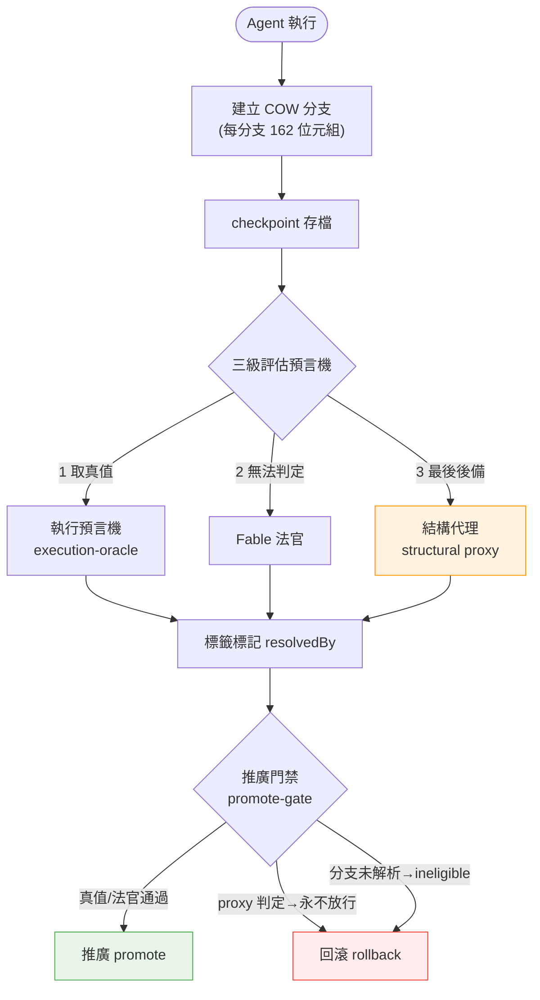
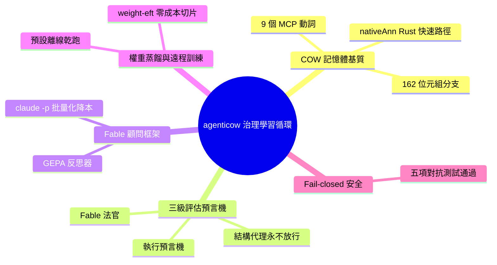

## v3.21.0 — agenticow governed learning loop (branch · test · judge · promote · rollback)

RuFlo v3.21.0 推出 agenticow 治理學習循環框架，將代理執行轉變為具完全供應鏈追蹤的決策治理迴圈。核心是 COW（Copy-on-Write）記憶體基質，提供 9 個 MCP 動詞（分支/檢查點/回滾/推廣+攝取/查詢/差分/譜系/狀態），每分支僅 162 字節開銷，原生 Rust 快速路徑，單一共用載入器。評估層採三級預言機架構：執行預言機→Fable 法官→結構代理，各層決策標籤 resolvedBy；推廣門禁由代理簽核且代理決無法清除。成本規律 Fable 顧問框架通過批量化將成本從 $1.56 降至 ~$0.02/項。支援權重蒸餾與遠程 GPU 訓練（預設離線乾跑，--execute --yes 解鎖），設計中所有控制流均採 fail-closed 原則。

### 重點
- agenticow COW 記憶基質 + 9 MCP 動詞，每分支 162 字節，原生 Rust 快速路徑，單一共用載入器
- 三級供應鏈追蹤預言機：執行預言機→Fable 法官→結構代理，各層標籤 resolvedBy，代理簽核 push-gate 不可被清除
- 成本規律 Fable 顧問（$1.56→~$0.02/項），權重蒸餾與遠程 GPU 訓練，所有控制流 fail-closed

**原文：** [ruflo-releases](https://github.com/ruvnet/ruflo/releases/tag/v3.21.0)

---

<!-- deep-analysis:begin -->
## 📌 摘要 (TL;DR)

- RuFlo v3.21.0 推出 **agenticow 治理學習循環**（governed learning loop），把代理執行變成「分支 → 測試 → 評判 → 推廣 → 回滾」、且每個決策都帶供應鏈追蹤（provenance）的迴圈。
- 核心是寫時複製（Copy-on-Write，簡稱 COW）記憶體基質（ADR-170），提供 9 個 MCP 動詞（branch / checkpoint / rollback / promote / ingest / query / diff / lineage / status），每個分支僅 162 位元組開銷，附 nativeAnn 的 Rust 原生快速路徑，啟動時間 0.12 秒。
- 評估採三級預言機（ADR-171）：執行預言機（execution-oracle）→ Fable 法官 → 結構代理（structural proxy），每個標籤標記 resolvedBy；由結構代理判定的標籤永遠無法通過推廣門禁（promote-gate）。
- Fable 顧問框架（ADR-172）以 claude -p 搭配 clean-cwd 與批量化，把單項成本從 $1.56 壓到約 $0.02（降幅約 98%）。
- 權重蒸餾與遠程 GPU 訓練（ADR-173）預設離線乾跑（dry-run），需 `--execute --yes` 才真正連線訓練。
- 通過對抗式 RC（release candidate）測試，所有控制流皆採故障關閉（fail-closed）；打包 agenticow 0.2.4 與 @ruvector/ruvllm 2.6.0。

## 🎯 核心概念

- **寫時複製記憶體基質**（Copy-on-Write memory substrate，簡稱 COW）：讓每個代理分支共享底層記憶、只在寫入時才複製，故單分支開銷僅 162 位元組。
- **MCP 動詞**（MCP verbs）：透過模型情境協定（Model Context Protocol，簡稱 MCP）暴露的 9 個操作，涵蓋分支、檢查點、回滾、推廣，以及攝取 / 查詢 / 差分 / 譜系 / 狀態。
- **供應鏈追蹤**（provenance）：為每個評估標籤記錄「由誰判定」（resolvedBy），形成可稽核的決策來源。
- **執行預言機 / 結構代理**（execution-oracle / structural proxy）：前者以實際執行結果為真值，後者是結構化的啟發式後備判斷。
- **推廣門禁**（promote-gate）：把分支結果併入主線前的關卡；由結構代理判定者永不放行。
- **故障關閉**（fail-closed）：任何不確定或缺乏授權的情況一律拒絕、退回離線，而非放行。
- **架構決策紀錄**（Architecture Decision Record，簡稱 ADR）：本版對應 ADR-170～173。

## 📖 整理分析

### 1. COW 記憶體基質與 9 個動詞
agenticow（ADR-170）是本版的記憶體底層，以寫時複製讓各代理擁有獨立分支卻共享底層資料，單分支只有 162 位元組開銷。它透過 MCP 暴露 9 個動詞：branch、checkpoint、rollback、promote，加上 ingest、query、diff、lineage、status；並提供 nativeAnn 的 Rust 原生快速路徑與單一共用載入器（one shared loader）。進階能力包含可選啟用（opt-in）的每代理分支、推測式分支併推（agenticow_speculate），以及供 autopilot 迴圈使用的檢查點 / 回滾關卡。

### 2. 三級評估預言機與決策譜系
評估層（ADR-171）以三級串接判定每次執行結果：先用執行預言機取真值，無法判定時交給 Fable 法官，再退回結構代理。每個標籤都標記 resolvedBy，形成可追溯的供應鏈，系統並產生因果失敗回執（causal failure receipts）。關鍵護欄是推廣門禁：由結構代理（proxy）解析出的標籤永遠無法過關，因此代理絕不能靠低可信度的後備判斷把變更推上主線。

### 3. Fable 顧問框架的成本紀律
Fable 顧問框架（ADR-172）以 claude -p 驅動評判，透過乾淨工作目錄（clean-cwd）與批量化（batching）控制成本，把單項成本從 $1.56 降到約 $0.02。框架同時含 judge（法官）與 GEPA 反思器（GEPA reflector）兩個角色，分別負責評判與反思式優化。

### 4. 權重蒸餾與遠程 GPU 訓練
weight-eft（ADR-173）提供零成本（$0）的蒸餾切片，涵蓋 export / plan / eval，以及 `neural distill train --remote` 的遠程 GPU 訓練。安全預設為離線乾跑（OFFLINE dry-run），真正執行需 `--execute --yes` 解鎖，並可選擇性開啟 `--preflight` 前置檢查。

### 5. Fail-closed 安全設計與工程指標
本版通過對抗式 RC 測試，五個情境全數故障關閉：推廣未解析分支 → 判為不合格（ineligible）；把 proxy 當真值（proxy-as-gold）→ 無法過關；未帶 `--execute --yes` 的 SSH → 離線/拒絕；未開啟 opt-in 的 Fable → 不呼叫；部分寫入後回滾 → 可還原。工程面打包 agenticow 0.2.4 與 @ruvector/ruvllm 2.6.0，沿用 ADR-150 的可選相依（optional-deps）與優雅降級，啟動 0.12 秒，並新增 CI lockfile 漂移防護（#2563）。

## 🧭 流程圖 / 架構圖

原文未附圖；以下依「分支 → 測試 → 三級評判 → 推廣門禁 → 回滾」的治理學習循環繪製：

## 🧠 Mindmap

<!-- deep-analysis:end -->
### 📄 原文內容

點此展開 / 收合

Turns agent execution into a governed learning loop with provenance on every decision. 
 New 
 
 agenticow COW memory substrate (ADR-170) — 9 MCP verbs (branch/checkpoint/rollback/promote + ingest/query/diff/lineage/status), 162-byte branches, nativeAnn Rust fast-path, one shared loader 
 Per-agent COW branches (opt-in), speculative branch-and-promote ( agenticow_speculate ), checkpoint/rollback gate for autopilot loops 
 Provenance-tiered evaluation oracle (ADR-171) — execution-oracle → Fable judge → structural proxy, each label tagged resolvedBy ; promote-gate (proxy can NEVER clear); causal failure receipts 
 Fable advisor harness (ADR-172) — cost-disciplined claude -p (clean-cwd + batching = $1.56→~$0.02/item); judge + GEPA reflector 
 weight-eft $0 distill slice + remote-GPU train (ADR-173) — export/plan/eval + neural distill train --remote (OFFLINE dry-run default, --execute --yes gated, --preflight opt-in) 
 
 Safety (adversarial RC pass — all fail-closed) 
 Promote unresolved branch → ineligible · proxy-as-gold → can't clear · SSH without --execute --yes → offline/refused · Fable without opt-in → no call · rollback after partial write → restores. 
 Bundles: agenticow 0.2.4, @ruvector/ruvllm 2.6.0. ADR-150 optional-deps + graceful degradation throughout. Startup 0.12s. New CI lockfile-drift guard ( #2563 ). 
 PRs: #2562 · ADRs 170-173

