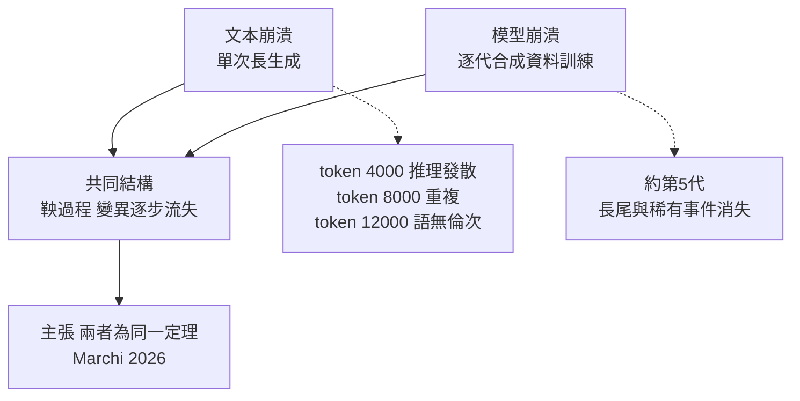
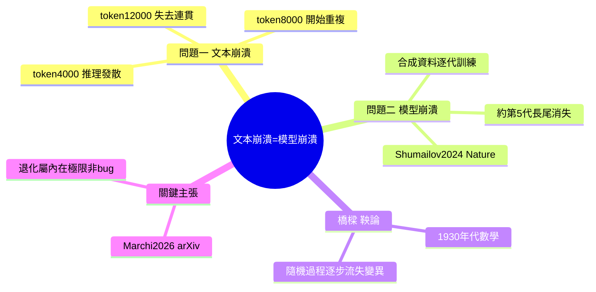

## Your Model Degrades at Token 4,000.

作者宣稱發現「文本崩潰」(context collapse) 與「模型崩潰」(model collapse) 是同一個現象，使用 1930 年代的鞅論(martingale theory) 連接兩者。文本崩潰指模型在生成約 4,000 tokens 後推理開始偏離、8,000 tokens 時重複自己；模型崩潰指在合成資料上訓練數代後稀有事件消失。該論文(Marchi 2026 年論文) 據稱首次證明這兩個看似不同的劣化問題本質上是一致的，為 AI 系統的內在限制提供了新的理論框架。

### 重點
- 文本崩潰與模型崩潰通過鞅論統一：兩者都源於分布退化的同一數學結構
- 模型劣化的具體徵兆：生成約 4,000 tokens 時推理開始偏離、8,000 tokens 時出現重複
- 模型崩潰在合成資料上訓練 5 代後，稀有事件完全消失，尾部分布崩潰

**原文：** [medium-tag-llm](https://swarnenduiitb2020i.medium.com/your-model-degrades-at-token-4-000-2b12cfaae350?source=rss------large_language_models-5)

---

<!-- deep-analysis:begin -->
## 📌 摘要 (TL;DR)

- 本文主張大型語言模型（large language model，LLM）的兩種退化——文本崩潰（context collapse）與模型崩潰（model collapse）——其實是「同一條定理的兩個名字」，過去沒人把它們連起來。
- 文本崩潰指單次長生成中品質逐步下滑：約 token 4,000 推理開始發散、token 8,000 出現重複、token 12,000 幾近語無倫次。
- 模型崩潰指用前一代模型產生的合成資料（synthetic data）反覆訓練後，分布逐代收窄、稀有事件與長尾消失，模型變得「更平庸、更笨」，約在第 5 代顯現；此現象由 Shumailov 等人 2024 年發表於《Nature》。
- 作者引用 Marchi 2026 年論文（arXiv:2601.00923），用 1930 年代的鞅論（martingale theory）主張把兩者證明為同一個數學結構。
- 若成立，代表這類退化是系統的內在極限，而非單純工程 bug——這是讀者該關注的重點。
- 需留意：這篇 Medium 文屬導讀性質，完整證明在被引論文中，公開段落並未展開鞅論的實際推導。

## 🎯 核心概念

- **文本崩潰（context collapse）**：同一次推理中，生成越長、輸出品質越差的現象。
- **模型崩潰（model collapse）**：一代代拿模型自己產生的資料再訓練，導致分布退化。
- **鞅（martingale）**：一種隨機過程，其下一步的期望值等於當前值；鞅收斂定理保證有界鞅幾乎必然收斂——這是文章用來連接兩問題的數學工具（此為背景說明）。
- **合成資料（synthetic data）**：由既有模型生成、而非取自真實世界的訓練資料。

## 📖 整理分析

### 1. 問題一：文本崩潰
文章以「Problem one」描述長生成的衰退曲線：推理在 token 4,000 附近開始偏離，token 8,000 時模型開始重複自己，到 token 12,000 幾乎失去連貫性。這對應使用者在長對話或長篇輸出中常見的品質下滑體感。

### 2. 問題二：模型崩潰
「Problem two」轉向訓練層面：當後續模型持續在前代模型產出的合成資料上訓練，資料分布會逐代變窄——用文章的話說是「稀有事件消失、長尾不見、模型變成更平庸更笨的版本」，大約 5 代內就會發生。此現象最早由 Shumailov 等人 2024 年於《Nature》系統描述。

### 3. 鞅論作為橋樑
文章的核心論點是：這兩個看似無關的問題共享同一種隨機過程結構，可用鞅論刻畫——生成的每個 token、或訓練的每一代，都是過程的一步，而變異／資訊在步進中單向流失。作者把此連結歸功於 Marchi 2026 年論文（arXiv:2601.00923），並回溯到 1930 年代的鞅數學。須誠實指出：公開可讀段落點出「鞅是連接的線索」，但並未展開完整推導。

### 4. 為何重要與該留意之處
若兩者真為同一定理，意義在於：長上下文退化與合成資料退化不是各自獨立的工程缺陷，而是同一內在極限的兩種表現——這會牽動長上下文設計，以及「用 AI 生成資料再訓練 AI」的整體路線。但也應保留判斷：這是單一論文的主張，尚未見廣泛複驗；本文為 Medium 導讀，具體數字與推導宜回到被引來源核對。

## 🧭 流程圖

## 🧠 Mindmap

<!-- deep-analysis:end -->
### 📄 原文內容

點此展開 / 收合

**Context collapse and model collapse are two names for one theorem. Nobody connected them until now.** Continue reading on Medium »

