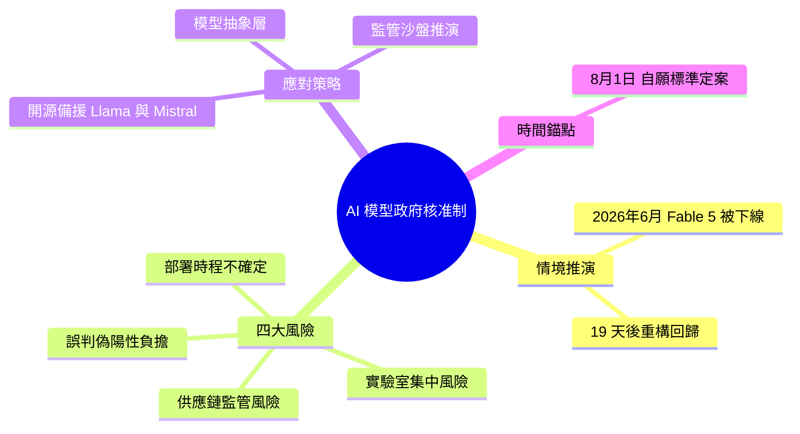

## Why Every AI Model Release Now Requires Government Approval — And What It Means for Your Team

美國政府自 2026 年 7 月起對前沿 AI 模型實施政府核准制，美國商務部曾將 Anthropic 的 Fable 5 暫停 19 天，發現越獄漏洞後才恢復上線。Fable 5 恢復時已非原產品：新增「特定設計的安全分類器以阻止越獄技術」，計費方式改為「超標準方案外的積分，僅限每週有限使用層級」。三項基礎設施風險隨之浮現：(1) 供應鏈監管風險—模型可遭突然暫停與重構；(2) 實驗室集中風險—主動配合監管者的實驗室獲企業信譽優勢；(3) 誤判問題—Fable 5 現阻止「符合越獄模式的合理程式除錯和編碼查詢」。建議：建立模型抽象層、備用開源方案、預留 30–50% 效能邊界、文件化模型依賴、應力測試監管情景。治理框架於 2026 年 8 月 1 日定案。

### 重點
- Anthropic Fable 5 遭政府暫停 19 天，恢復後計費與安全機制已修改
- AI 模型面臨供應鏈監管風險、實驗室集中風險、誤判導致功能受限
- 建議建立模型抽象層並維持開源備用方案，預留 30–50% 效能邊界

**原文：** [medium-tag-claude](https://medium.com/@kankit570/why-every-ai-model-release-now-requires-government-approval-and-what-it-means-for-your-team-3dd866a5bfa4?source=rss------claude-5)

---

<!-- deep-analysis:begin -->
## 📌 摘要 (TL;DR)

- 本文是一篇**情境推演**（speculative scenario），以「未來新聞」口吻書寫、設定時間為 2026 年 7 月，並非已發生的真實事件——作者用虛構情節示警前沿 AI 模型將進入「許可證時代」（permission slip era）。
- 核心情節：2026/6/12 美國商務部（U.S. Department of Commerce）下令 Anthropic 的虛構模型 Fable 5 下線，暫停 **19 天**，2026/7/1 才帶著修改重新上線。
- 回歸後的 Fable 5 已非原產品：新增擋越獄（jailbreak）技術的安全分類器（safety classifier，針對成功率 >99% 的漏洞）、加入身分驗證、計費改為每週有限使用層級（導入價約 2 美元／百萬 token），且誤判（false positive）率上升。
- 作者點出四大基礎設施風險：供應鏈監管風險、實驗室集中風險、誤判負擔、部署時程不確定。
- 為何該關注：把 AI 模型視為「穩定、可任意替換的輸入」的假設不再成立；團隊應為**監管不確定性**預先做架構設計。2026/8/1 為敘事中白宮「自願標準」（voluntary standards）的定案期限。

## 🎯 核心概念

- **前沿模型**（frontier model）：能力最強、最受監管關注的大型 AI 模型。
- **許可證時代**（permission slip era）：作者用語，指每次模型發布都須政府核准的新常態。
- **安全分類器**（safety classifier）：附加在模型上、用來偵測並攔截特定越獄或高風險請求的分類模型。
- **越獄**（jailbreak）：繞過模型安全限制、誘導其產出被禁內容的技術。
- **誤判 / 偽陽性**（false positive）：分類器把合理的除錯、編碼查詢誤認為攻擊而攔截或改道。
- **模型抽象層**（abstraction layer）：在應用與模型之間加一層介面，讓底層模型可替換而不必改核心邏輯。
- **五眼聯盟**（Five Eyes）：由 NSA、GCHQ、CSE、ASD、GCSB 組成的情報聯盟，文中對此議題發表評估。

## 📖 整理分析

### 1. 情境設定：許可證時代開場
文章以「未來已成定局」的敘事，虛構美國政府自 2026 年中對前沿模型實施政府核准制。除 Fable 5 外，還提到 Claude Sonnet 5、正接受「有條件核准」的 GPT-5.6、Google Gemini 系列，以及作為開源替代的 Llama 3、Mistral、DeepSeek，鋪陳一個「監管介入模型供給」的世界。

### 2. Fable 5 的 19 天：暫停與重構
關鍵情節是 2026/6/12 商務部下令 Fable 5 下線，19 天後（7/1）回歸。回歸版新增針對 >99% 成功率越獄技術的安全分類器、加入身分驗證、把計費改為每週有限使用層級（導入價約 2 美元／百萬 token）。作者強調：回來的已不是同一個產品——能力、計價、功能集都被監管重塑。

### 3. 四大基礎設施風險
作者歸納：(1) **供應鏈監管風險**——模型可被突然暫停、改價、降能或改功能，且無從協商；(2) **實驗室集中風險**——主動配合監管者的實驗室取得信譽優勢，選型可能變成「選關係」而非「選技術」；(3) **誤判負擔**——安全分類器把合理請求誤攔，增加延遲與成本；(4) **部署時程不確定**——政府審查可能拖過技術時程。

### 4. 給團隊的應對清單
建議包括：建立模型抽象層讓模型可替換；把開源方案（Llama、Mistral）當核心基礎設施備援；做多模型路由；文件化所有模型相依；壓力測試成本模型（假設漲價 50%、使用量突降）；跑「監管沙盤推演」（war games，如 3 週斷線、使用額度砍半）；設計優雅降級；並預留效能邊界（例：基準 50ms 延遲要規劃到 75ms、為 1000 req/s 尖峰預留額外容量）。

### 5. 定位提醒：這是推演，不是新聞
需明確：Fable 5、GPT-5.6、19 天暫停等皆為作者虛構，用於論證而非報導。其價值在於提前把「監管風險」納入 AI 基礎設施設計，2026/8/1 的自願標準期限則是敘事中的時間錨點。

## 🧭 流程圖 / 架構圖

虛構情節的事件時間線：

## 🧠 Mindmap

<!-- deep-analysis:end -->
### 📄 原文內容

點此展開 / 收合

The permission slip era just began. And nobody&#x2019;s talking about what it actually costs. Continue reading on Medium »

