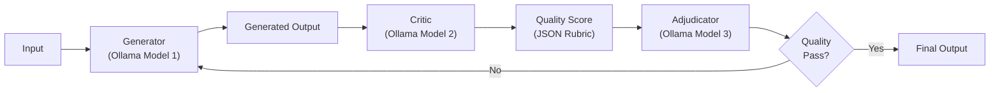

## Build a Self-Correcting AI Agent with LangGraph and Ollama

本文展示如何使用 LangGraph 與 Ollama 搭建完全本地運行的自修正 AI Agent。核心架構為三層迴路：Generator → Critic → Adjudicator，由三個獨立的 Ollama 模型協作執行。系統使用結構化 JSON 評分標準進行品質檢查，透過條件路由根據評分結果決定是否重新生成或通過。這種設計有助於提高本地 LLM 應用的輸出品質，同時避免依賴商業 API。

### 重點
- Generator → Critic → Adjudicator 三層迴路，三個獨立 Ollama 模型協作
- 使用 structured JSON rubric 進行自動品質評分與條件路由
- 完全本地運行，不依賴外部 API，降低成本並保護隱私

**原文：** [medium-tag-llm](https://generativeai.pub/build-a-self-correcting-ai-agent-with-langgraph-and-ollama-80c43f8f8f17?source=rss------large_language_models-5)

---

### 📄 原文內容

點此展開 / 收合

A fully local Generator &#x2192; Critic &#x2192; Adjudicator loop: three Ollama models, a structured JSON rubric, conditional routing, and a quality bar&#x2026; Continue reading on Generative AI »

