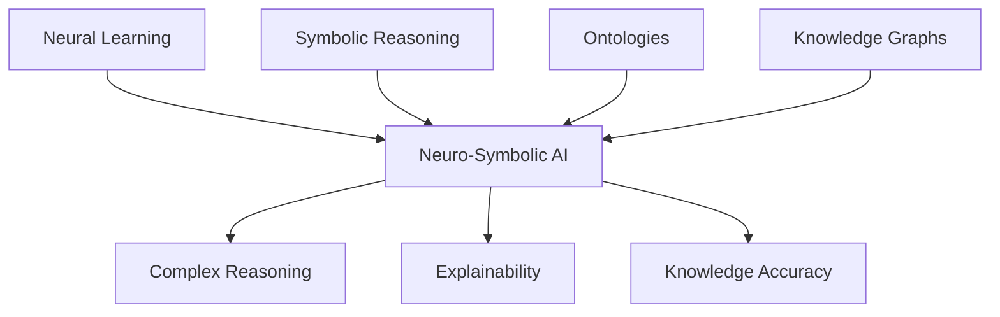

## Neuro-Symbolic AI: Why the Future of Artificial Intelligence Needs More Than Bigger Language Models

文章論述下一代 AI 系統的發展方向，主張單純擴大語言模型規模已不足以解決 AI 的根本挑戰。神經符號 AI 透過結合神經網路的學習能力與符號 AI 的邏輯推理、本體論 (ontologies) 與知識圖譜，能夠打造更可信、更可解釋、更具泛化能力的 AI 系統。這種混合架構有望在複雜推理、知識表示準確性與可信度方面超越純神經模型。

### 重點
- 神經符號 AI = neural learning + symbolic reasoning + ontologies + knowledge graphs
- 純粹擴大模型規模無法解決信任、可解釋性與泛化問題
- 混合架構在複雜推理、知識準確性方面優於單一神經模型

**原文：** [medium-tag-llm](https://medium.com/@dinabeysinghe/neuro-symbolic-ai-why-the-future-of-artificial-intelligence-needs-more-than-bigger-language-models-e4dcda920f16?source=rss------large_language_models-5)

---

### 📄 原文內容

點此展開 / 收合

The next generation of AI systems may emerge from combining neural learning with symbolic knowledge, reasoning, ontologies, and knowledge&#x2026; Continue reading on Medium »

