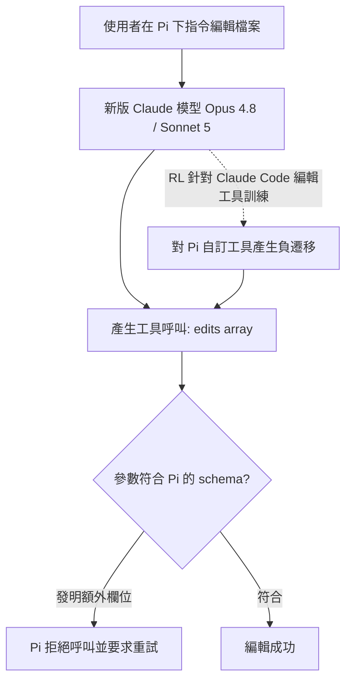
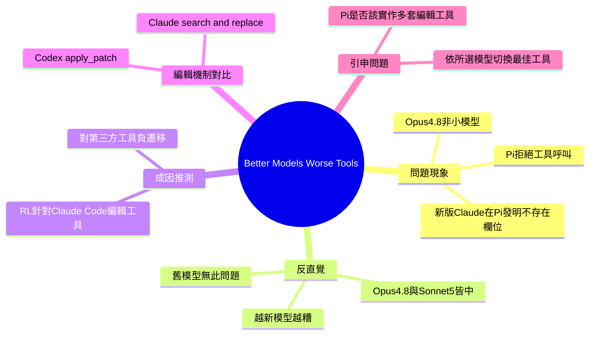

## Better Models: Worse Tools

Armin 發現新版 Claude 模型（Opus 4.8、Sonnet 5）在呼叫 Pi 編輯工具時會發明出不存在於 schema 的額外欄位，導致工具呼叫被拒。更令人驚訝的是這個問題在較新模型上惡化而非改善，暗示 Anthropic 針對 Claude Code 編輯工具的 RL 對齊訓練對其他自定義工具產生了負遷移。相對 Claude 使用的 search-and-replace 編輯，OpenAI Codex 採用 apply_patch 機制。議題：第三方編輯工具是否應實現多套編輯介面來相容不同模型的優化傾向？

### 重點
- SOTA 模型（Opus 4.8、Sonnet 5）在非 Claude Code 的工具上表現反而更差，違反一般的縮放定律預期
- 原因推論：Anthropic 針對 Claude Code search-and-replace 編輯的 RL 訓練造成模型對其他 tool schema 的負遷移
- 跨模型工具設計權衡：Claude 的 search-and-replace vs OpenAI Codex 的 apply_patch，模型對齊目標影響第三方整合體驗

**原文：** [simon-willison](https://simonwillison.net/2026/Jul/4/better-models-worse-tools/#atom-everything)

---

<!-- deep-analysis:begin -->
## 📌 摘要 (TL;DR)

- Armin Ronacher 在開發自己的編碼工具 Pi 時發現：較新的 Claude 模型（Opus 4.8、Sonnet 5）呼叫 Pi 的編輯工具時，會在巢狀的 `edits[]` 陣列裡憑空發明 schema 中不存在的欄位，導致工具呼叫被 Pi 拒絕並要求重試。
- 反直覺的重點：這個問題在**越新的模型上越嚴重**——Opus 4.8 與 Sonnet 5 都出現，但家族中較舊的模型都沒有。也就是說最先進（SOTA）的模型，在這個特定工具 schema 上反而比舊版更差。
- Armin 推測原因是新版 Anthropic 模型被特別（推測是透過強化學習 RL）訓練去更會用 Claude Code 內建的編輯工具，結果對第三方編碼工具（如 Pi）自訂的編輯工具產生負面遷移。
- Simon Willison 引申出一個實務問題：像 Pi 這樣的第三方編碼框架，是否該實作多套編輯工具，好針對使用者所選模型挑最合適的那一套？

## 🎯 核心概念

- **編碼框架/工具箱** (coding harness)：包在大型語言模型外層、負責讓模型讀寫檔案、執行編輯的應用程式，例如 Claude Code、OpenAI Codex、Pi。
- **工具呼叫** (tool use / tool call)：模型依照工具的 schema 產生結構化參數來呼叫外部函式；若參數不符 schema 就會被拒絕。
- **負遷移** (negative transfer)：為某一特定工具做的對齊訓練，反而讓模型在其他相似但不同的工具上表現變差。
- **搜尋取代 vs. apply_patch**：Claude 的編輯工具採 search and replace 機制；OpenAI Codex 則用 apply_patch 機制，OpenAI 曾表示其模型被訓練來有效使用 apply_patch。

## 📖 整理分析

### 1. 問題現象：模型發明不存在的欄位
Armin 在 hack Pi 時發現，較新的 Claude 模型呼叫 Pi 的編輯工具時，會在巢狀 `edits[]` 陣列裡塞入自己發明、schema 中並不存在的鍵值。值得注意的是，這不是 Haiku 或某個小模型的問題，而是發生在 Opus 4.8 這種旗艦模型上。實際的編輯內容通常是正確的，但參數格式對不上 schema，於是 Pi 直接拒絕該次工具呼叫並要求重試。

### 2. 反直覺點：越新越糟
模型偶爾產出格式錯誤的工具呼叫本身不稀奇，尤其是小模型。真正讓 Armin 意外的是這個問題「隨新模型惡化」——Opus 4.8 與 Sonnet 5 都出現，但家族中所有較舊的模型都沒有。換句話說，同一家族裡最先進的模型，在這個特定工具 schema 上的表現反而輸給它們的前輩。

### 3. 成因推測：Claude Code 專屬訓練的副作用
Armin 的假說是：較新的 Anthropic 模型被特別訓練（推測透過 RL）去更擅長使用 Claude Code 內建的編輯工具。這種針對性對齊帶來一個不幸的副作用——當模型面對其他編碼框架（如 Pi）自訂的編輯工具時，反而更容易用錯。等於是「為官方工具優化」擠壓了「泛用工具使用」的能力。

### 4. 對比：Claude 的 search-replace 與 Codex 的 apply_patch
文章點出兩家的編輯機制差異：Claude 的編輯工具走 search and replace，OpenAI 的 Codex 則採 apply_patch，且 OpenAI 過去公開談過他們如何訓練模型有效使用 apply_patch。這意味著不同模型各自被「調教」去適配特定的編輯介面，模型與工具介面之間存在隱性耦合。

### 5. 引申問題：第三方框架該實作多套工具嗎？
Simon 拋出結論性的疑問：既然模型會偏好自家生態的工具介面，像 Pi 這種第三方編碼框架，是否應該實作多套編輯工具，好在使用者選定某個底層模型時，切換到對該模型表現最佳的那一套？這揭示了模型能力提升與工具通用性之間的張力——模型變強，通用工具反而可能變難用。

## 🧭 流程圖 / 架構圖

## 🧠 Mindmap

<!-- deep-analysis:end -->
### 📄 原文內容

點此展開 / 收合

Better Models: Worse Tools 
Armin reports on a weird problem he ran into while hacking on Pi: 
 
 The short version is that newer Claude models sometimes call Pi’s edit tool with extra, invented fields in the nested edits[] array. And not Haiku or some small model: Opus 4.8. The edit itself is usually correct but the arguments do not match the schema as the model invents made-up keys and Pi thus rejects the tool call and asks to try again. 
 That alone is not too surprising as models emit malformed tool calls sometimes. Particularly small ones. What surprised me is that this is getting worse with newer Anthropic models as both Opus 4.8 and Sonnet 5 show it but none of the older models. In other words, the SOTA models of the family are worse at this specific tool schema than their older siblings. 
 
 Armin theorizes that this is because more recent Anthropic models have been specifically trained (presumably via Reinforcement Learning) to better use the edit tools that are baked into Claude Code. This has the unfortunate effect that other coding harnesses, such as Pi, may find that their own custom edit tools are more likely to be used incorrectly. 
 Claude's edit tool uses search and replace . OpenAI's Codex uses an apply_patch mechanism instead , and OpenAI have talked in the past about how their models are trained to use that tool effectively. 
 Does this mean third-party coding harnesses like Pi should implement multiple edit tools just so they can use the one with the best performance for the underlying model the user has selected?

 Tags: armin-ronacher , ai , openai , generative-ai , llms , anthropic , llm-tool-use , coding-agents , pi

