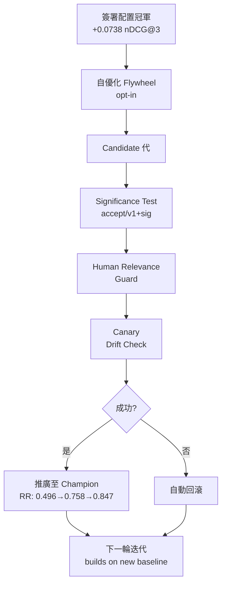

## v3.24.0 — Self-Learning Flywheel

ruflo v3.24.0 實現自學習 flywheel（合併 ADR-176 自優化 flywheel 和 ADR-177 簽署配置傳播），系統能在不斷改進自身檢索政策同時提供獨立可驗證的證據而非行銷宣傳。核心創新包括自動應用的已驗證檢索改善：Ed25519 + RVFA 簽署的配置冠軍在啟動時採用，失敗時 fail-closed，開箱即用相比之前調校基準提升 +0.0738 nDCG@3。自優化 flywheel（可選啟用）由背景 daemon 推動，每代候選在凍結的 held-out 集合上透過 accept/v1+sig 顯著性測試、human-relevance 防衛門卡、獨立 canary 檢驗三層把關；成功推廣時 champion 指標更新供下一輪迭代，勝利方案積累成 Ed25519 簽署、完全可獨立重播的譜系（git for operating policies）。實驗已驗證兩次真實且複合的顯著推廣（self-retrieval RR 由 0.496 → 0.758 → 0.847），人類相關度保持不變設計。

### 重點
- 簽署配置冠軍開箱提升 +0.0738 nDCG@3，基於人類標記相關度優化
- 自優化 flywheel 每代複合改善：significance test（accept/v1+sig）+ human-relevance guard + 獨立 canary 三層把關
- 已驗證真實複合推廣：self-retrieval RR 從 0.496 → 0.758 → 0.847，人類相關度平穩

**原文：** [ruflo-releases](https://github.com/ruvnet/ruflo/releases/tag/v3.24.0)

---

### 📄 原文內容

點此展開 / 收合

ruflo 3.24.0 — The Self-Learning Flywheel 
 ruflo can now improve one of its own operating policies over time and prove each improvement is real — not marketing. Merges #2572 (ADR-176 self-optimizing flywheel + ADR-177 signed config propagation). 
 📖 Full write-up (plain language + technical + usage + upgrade notes): https://gist.github.com/ruvnet/f8e2851fd307df5d5de7b5c70c37fa0c 
 What's new 
 
 Verified retrieval improvement, auto-applied to every install. A signed config champion (Ed25519 + RVFA) is adopted on startup, fail-closed on authenticity and suitability. Better retrieval defaults out of the box, +0.0738 nDCG@3 over the previously-tuned baseline. No re-init needed. 
 Self-optimizing flywheel (opt-in, $0 default). The background daemon compounds verified retrieval-policy improvements: each generation reads the persisted champion as baseline, gates a candidate on a frozen held-out with a significance test ( accept/v1+sig ) + human-relevance guard + a separate canary, and on promotion advances the champion so the next tick builds on it. Winners accumulate into a signed, independently-replayable lineage back to an immutable root (git-for-operating-policies). 
 Shadow-first / no auto-serve + drift canary. Promoted champions serve only after a one-generation shadow delay; a canary re-scores on the evolving store each tick and auto-rolls-back regressions. 
 Meta-learning. The optimizer biases its search toward policy axes with measured historical payoff. 
 Proof, not assertion. Receipt bundles replay independently without trusting our logs ; a CI guard keeps the shipped evidence valid on every PR. 
 
 Demonstrated live: two real, significant, compounding promotions (self-retrieval RR 0.496 → 0.758 → 0.847 ), human relevance preserved, zero human intervention. 
 
 Honest scope: the flywheel's compounding gains are on a self-supervised retrieval benchmark, gated so human-labeled relevance does not regress — not a claim that human relevance improved generation-over-generation (held flat by design). The auto-applied one-shot champion was tuned on human-labeled relevance. 
 
 Upgrade 
 npx ruflo@latest # or npx ruflo@3.24.0 
 Backwards-compatible / additive · signing keys unchanged · the flywheel is off unless RUFLO_HARNESS_LOOP=1 . 
 Packages: @claude-flow/cli@3.24.0 · claude-flow@3.24.0 · ruflo@3.24.0 
 🤖 Generated with RuFlo

