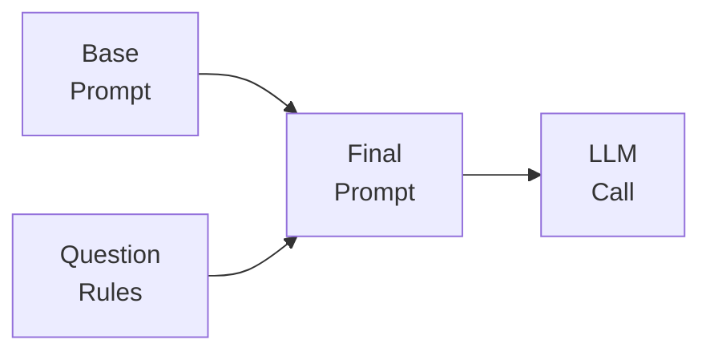

## Assemble Each RAG Generation Prompt from a Base Prompt Plus the Rules Each Question Needs

本文介紹企業文件智能系列的 RAG(檢索增強生成) 提示詞組裝方法：由固定基礎提示詞、針對每類問題的特定規則、以及一個調度器註冊表組成。該調度器負責將解析後的問題類型轉換為對應的類型化 LLM 呼叫，避免為每個問題重新編寫完整提示詞。此設計模式透過分離關注點(base + rules + dispatcher)，提升了企業文件系統的一致性、可維護性和類型安全性。

### 重點
- RAG 提示詞三層架構：base prompt(固定) + per-question rules(派發式) + dispatcher registry(類型路由)
- Dispatcher 將解析的問題類型映射到對應規則，產生類型化 LLM 呼叫，實現提示詞模組化
- 適用企業文件智能系統，提升一致性、可維護性和類型安全

**原文：** [medium-towards-data-science](https://towardsdatascience.com/assemble-each-rag-generation-prompt-from-a-base-prompt-plus-the-rules-each-question-needs/)

---

### 📄 原文內容

點此展開 / 收合

Enterprise Document Intelligence [Vol.1 #8B] - A fixed BASE, the rules each question needs, one registry: the dispatcher that turns a parsed question into a typed LLM call 
 The post Assemble Each RAG Generation Prompt from a Base Prompt Plus the Rules Each Question Needs appeared first on Towards Data Science .

