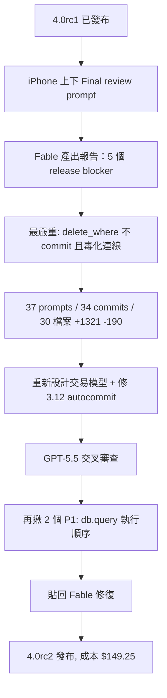
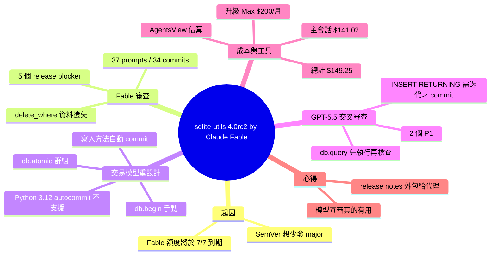

## sqlite-utils 4.0rc2, mostly written by Claude Fable (for about $149.25)

Simon Willison 使用 Claude Fable 進行 sqlite-utils 4.0 穩定版發布前的最終審查，模型在 37 次提示後發現 5 個「release blocker」，包括 delete_where() 導致連接中毒與資料遺失的嚴重 bug。經過 34 次提交、跨 30 個檔案的 1,321 行程式碼變更，核心重新設計了交易處理模型—每個寫入方法現在都自動在各自的交易中執行並在返回前提交。隨後 GPT-5.5 的獨立審查又發現 2 個 P1 級問題。整個工作耗時 $149.25（主會話 $141.02 + 多個代理）。

### 重點
- delete_where() bug 會導致連接 in_transaction=True 並毒化後續操作，導致資料遺失—Fable 自動發現，人工未察覺
- 新交易模型：每個寫入方法（insert、upsert、delete、delete_where、transform 等）自動提交，無需手動 commit()；僅在需要群組操作或手動控制時使用 db.atomic() 或 db.begin()
- 多模型交叉審查：Claude Fable 主開發 + GPT-5.5 驗證，相比單一模型更能覆蓋邊界情況；成本透明化使用 AgentsView 計算 ($149.25 合理成本)

**原文：** [simon-willison](https://simonwillison.net/2026/Jul/5/sqlite-utils-fable/#atom-everything)

---

<!-- deep-analysis:begin -->
## 📌 摘要 (TL;DR)

- Simon Willison 在 4.0 穩定版發布前，用 Claude Fable（claude-fable-5）做最終審查，開場 prompt 是在 iPhone 上透過 Claude Code for web 下的：「Final review before shipping a stable 4.0 release」。
- Fable 找出 5 個「release blocker」，最嚴重的是 `delete_where()` 從不 commit 且會「毒化」連線導致資料遺失——刪一筆資料後，連同後續插入的 row 50 與整張表 u 在關閉連線後全部消失。
- 整個過程歷經 37 次 prompt、34 次 commit、跨 30 個檔案的 +1,321 / -190 行變更，核心是重新設計交易模型：每個寫入方法都在自己的交易中執行並於返回前提交。
- 完成後再讓 OpenAI 的 GPT-5.5（Codex Desktop, xhigh）獨立審查，又揪出 2 個 P1 問題，都與 `db.query()` 先執行 SQL 再檢查是否回傳 row 的順序有關。
- 全部（未補貼）估計成本 $149.25，主會話 $141.02，其餘為多個子代理；Simon 為此把 Claude Max 從 $100/月升到 $200/月，趕在 7/7「Fablepocalypse」前用完額度。

## 🎯 核心概念

- **Claude Fable**（claude-fable-5）：Anthropic 提供給 Max 訂閱者、即將於 7/7 起需付全額 API 費的模型，本文的主要開發代理。
- **release blocker**：會阻擋穩定版發布的嚴重問題；因 Simon 遵循語意化版本（SemVer），破壞性變更必須在 major 版一次修好，故最終審查特別重要。
- **交易模型**（transaction model）：本次 RC 的招牌新功能，規範寫入何時自動 commit。
- **Fablepocalypse**：作者對 7/7 Fable 政策變更（Max 訂閱者也要付全額 API 成本）的戲稱。
- **AgentsView**：透過 `uvx agentsview` 執行、能用 `session list --include-children` 估算單一 session 花費的工具。

## 📖 整理分析

### 1. 那個會吃掉資料的 bug
`Table.delete_where()`（`db.py:2948`）用裸的 `self.db.execute()` 跑 DELETE，卻沒有 `atomic()` 包裹，對比正確處理的 `Table.delete()`。結果連線被留在 `in_transaction=True` 狀態，之後每次 `atomic()` 都走 savepoint 分支而永遠不 commit。Simon 端到端重現：刪掉 id=0、插入 id=50、再對另一張表 u 寫入，關閉後重開——刪除、row 50、以及整張表 u 全部消失，只剩 `[0, 1, 2]`。作者慶幸沒出貨，但也指出這頂多是能在 4.0.1 修的 bug，而非會逼出 5.0 的設計缺陷。

### 2. 重新設計的交易模型
新 RC 補上完整交易文件，核心是：`insert()`、`upsert()`、`update()`、`delete()`、`delete_where()`、`transform()`、`create_table()` 等所有寫入方法，都在各自的交易中執行並於返回前提交；`db.execute()` 的寫入語句一執行完就 commit。使用者永遠不必呼叫 `commit()`，也不必關閉資料庫來持久化。只有兩種情況要管交易：想把多個寫入綁成全成或全敗時用 `db.atomic()`；自行以 `db.begin()` 管理交易時，函式庫絕不會替你 commit 你開的交易。

### 3. Python 3.12 autocommit 的坑
審查文件時（作者認為先讀文件變更是理解改動的好方法），Simon 注意到 `db.atomic()` 與自動 per-method 交易只支援 Python 預設交易模式；用 Python 3.12+ 的 `sqlite3.connect(..., autocommit=True/False)` 建立的連線不被支援，因為 `commit()` 與 `rollback()` 行為不同。實測「行為不同」等於幾乎整個測試套件失敗，於是他與模型合作，讓這個差異不至於破壞函式庫，最終改為在傳入此類連線時直接拋 `TransactionError`。

### 4. 讓 GPT-5.5 交叉審查
Simon 坦言以前覺得「一個模型審另一個模型」有點迷信可笑，但實際上真的有用，如今他習慣讓 Anthropic 最強模型審 OpenAI 的成果、反之亦然。他對 Codex Desktop + GPT-5.5 xhigh 下 prompt：「Review changes since the last RC. Also confirm that the changelog is up-to-date.」結果揪出兩個 P1：其一，`db.query("update ...")` 會先 `execute()` 自動 commit 該寫入，之後才因非 row 語句拋 `ValueError`——更新已生效；其二，`db.query("insert ... returning ...")` 只在回傳的 generator 被完整耗盡後才 commit，若不迭代或用 `next(...)` 會讓交易懸空、關閉時被回滾，與 changelog、docs 承諾矛盾。把這段貼回新的 Fable session，兩個 finding 都被實驗確認並修復。

### 5. 成本與工作方式
作者發現越難的任務反而越能「一心多用」：代理有時需要 churn 10-15 分鐘，他就去看 Half Moon Bay 的美國國慶遊行，偶爾用手機下一步 prompt。成本方面，他用 AgentsView 算出總計 $149.25：主會話（claude-fable-5）$141.02、API-surface sweep 代理 $2.40、交易/atomic 審查代理 $2.39、post-rc1 commit 審查 $1.72、migrations 審查 $1.40、prompt 計數代理（claude-opus-4-8）$0.32。他自省應更多利用便宜模型的子代理。release notes 也交給 Fable 寫，理由是這類文字「無聊、可預測、準確」，且 changelog 的 commit 歷史剛好成了每個變更的精簡摘要。

## 🧭 流程圖 / 架構圖

## 🧠 Mindmap

<!-- deep-analysis:end -->
### 📄 原文內容

點此展開 / 收合

I wrote about the sqlite-utils 4.0rc1 release a couple of weeks ago. Since we only have Claude Fable on our Max subscriptions for a few more days, I decided to see if it could help me get to a 4.0 stable release that I felt truly comfortable about, since I try to keep to SemVer and like my incompatible major versions to be as rare as possible. 
 I started with this prompt, in Claude Code for web on my iPhone: 
 
 Final review before shipping a stable 4.0 release - very important to spot any last minute things that would be a breaking change if we fix them later 
 
 Here's that initial report it created for me. There were some significant problems that I hadn't myself encountered yet - 5 that Fable categorized as "release blockers". Here's the worst of the bunch: 
 
 1. delete_where() never commits and poisons the connection (data loss) 
 Table.delete_where() ( sqlite_utils/db.py:2948 ) runs its DELETE via a bare self.db.execute() with no atomic() wrapper — compare Table.delete() at db.py:2944 , which wraps correctly. The connection is left in_transaction=True , so every subsequent atomic() call takes the savepoint branch ( db.py:430-440 ) and never commits either. 
 Reproduced end-to-end: 
 db = sqlite_utils . Database ( "dw.db" )
 db [ "t" ]. insert_all ([{ "id" : i } for i in range ( 3 )], pk = "id" )
 db [ "t" ]. delete_where ( "id = ?" , [ 0 ]) # conn.in_transaction is now True 
 db [ "t" ]. insert ({ "id" : 50 })
 db [ "u" ]. insert ({ "a" : 1 })
 db . close ()
 # Reopen: rows are [0, 1, 2] — the delete, row 50, AND table u are all gone. 
 
 That's a really bad bug! Very glad I didn't ship that, although at least it would have been a bug I could fix in a 4.0.1 point release, not a design flaw that would force a 5.0. 
 Over the course of 37 prompts, 34 commits and +1,321 -190 code changes over 30 separate files, we worked through the entire set of feedback in turn, making several other design improvements along the way. 
 A weird thing about coding agents is that harder tasks like this one actually provide more opportunity to do other things at the same time, since the agent sometimes needs 10-15 minutes to churn away on a new task. I went out to enjoy the Half Moon Bay 4th of July parade, occasionally checking in and prompting the next step for Fable from my phone. 
 Full details in the PR and this shared transcript . I switched to my laptop for the final review, which I conducted through GitHub's PR interface. 
 The most significant changes relate to transaction handling, which was the signature new feature in the earlier RC . The new RC now includes comprehensive documentation on the new transaction model, the intro to which I'll quote here in full: 
 
 Every method in this library that writes to the database - insert() , upsert() , update() , delete() , delete_where() , transform() , create_table() , create_index() , enable_fts() and the rest - runs inside its own transaction and commits it before returning. Your changes are saved to disk as soon as the method call finishes: 
 db = Database ( "data.db" )
 db . table ( "news" ). insert ({ "headline" : "Dog wins award" })
 # The new row is already saved - no commit() required 
 The same applies to raw SQL executed with db.execute() - a write statement is committed as soon as it has run. 
 You never need to call commit() , and you do not need to close the database to persist your changes. There are exactly two situations where you need to think about transactions: 
 
 
 You want to group several write operations together, so they either all succeed or all fail - use db.atomic() . 
 
 
 You are managing a transaction yourself with db.begin() , in which case nothing is committed until you commit - the library will never commit a transaction you opened. 
 
 
 
 In reviewing Fable's documentation - I find that reviewing the documentation edits first is an excellent way to build an initial understanding of what has changed - I spotted this detail : 
 
 db.atomic() and the automatic per-method transactions are designed for connections in Python's default transaction handling mode. Connections created with the Python 3.12+ sqlite3.connect(..., autocommit=True) or autocommit=False options are not supported, because commit() and rollback() behave differently on those connections. 
 
 I admit I hadn't thought about how sqlite-utils would react to the more recent autocommit setting , added in Python 3.12. It turns out "behave differently on those connections" equated to almost the entire test suite failing, so I worked with the model to ensure that this difference would not break how the library works. 
 And a final review by GPT-5.5 
 I used to think that the idea of having one model review the work of another was somewhat absurd - it felt weirdly superstitious. The problem is it really does work - I've started habitually having Anthropic's best model review OpenAI's work and vice versa, because I've had that turn up interesting results often enough to be valuable. 
 I prompted Codex Desktop and GPT-5.5 xhigh with the following: 
 
 Review changes since the last RC. Also confirm that the changelog is up-to-date. 
 
 Which was enough to turn up two issues worth investigating: 
 
 Findings 
 
 [P1] sqlite_utils/db.py:663 db.query() now rejects non-row statements only after calling db.execute() , and sqlite_utils/db.py:705 auto-commits those writes first. So db.query("update ...") raises ValueError but the update is already committed. That is a surprising side effect for a method documented as “can only be used with SQL that returns rows.” 
 [P1] sqlite_utils/db.py:672 INSERT ... RETURNING through db.query() only commits after the returned generator is fully exhausted. db.query("insert ... returning ...") without iteration, or common next(db.query(...)) usage, leaves the transaction open and the write can be rolled back on close. This contradicts docs/changelog.rst:15 and docs/python-api.rst:232 , which say it takes effect without iteration. 
 
 
 I pasted that into a fresh Fable session, which ran some experiments to confirm the problem: 
 
 Both findings were confirmed. db.query() called self.execute() first, which auto-commits writes, and only then checked cursor.description — so db.query("update ...") committed the update before raising ValueError . And the INSERT ... RETURNING commit lived at the end of the returned generator, so it never fired unless you exhausted the iterator — next(db.query(...)) or an un-iterated call left the transaction open, contradicting what the changelog and docs promise. 
 
 Here's the PR with the fix, and the full Claude Code transcript . Reviewing this code helped me build a better mental model of the edge cases of SQLite transaction semantics! 
 For an estimated (unsubsidized) cost of $149.25 
 I upgraded to the Claude Max $200/month plan (I was previously on $100/month) to increase my Fable allowance for the remaining time until the July 7th Fablepocalypse , when even Claude Max subscribers will have to pay full API cost for the model. 
 I was curious as to how much this would have cost me if I had been paying those costs directly. At first I thought those numbers weren't available to me since I had run the work remotely using Claude Code for web, and then I realized I could run AgentsView inside that existing session to get that cost estimate! 
 
 Run "uvx agentsview --help" and then use that tool to calculate the cost of this session 
 
 Claude figured out how to use the session list --include-children command and came out with the following: 
 
 
 
 Transcript 
 Model 
 Cost 
 
 
 
 
 Main session 
 claude-fable-5 
 $141.02 
 
 
 API-surface sweep agent 
 claude-fable-5 
 $2.40 
 
 
 Transactions/atomic review agent 
 claude-fable-5 
 $2.39 
 
 
 Post-rc1 commits review agent 
 claude-fable-5 
 $1.72 
 
 
 Migrations review agent 
 claude-fable-5 
 $1.40 
 
 
 Prompt-counting agent 
 claude-opus-4-8 
 $0.32 
 
 
 Total 
 
 $149.25 
 
 
 
 I'm very glad I'm on that subscription! I really should have followed my own advice and leaned more heavily into subagents with cheaper models. 
 Here's what claude.ai/settings/usage is showing me right now: 
 
 I have several other major Fable-driven projects on the go right now as well, with the goal of hitting 100% on that Fable bar just in time for the price increase. 
 The full release notes for sqlite-utils 4.0rc2 
 Here are the full release notes for the RC. I had Fable add these to an "Unreleased" section of the changelog as each change landed, reviewing them as it went. This has the neat side effect that the commit history of the changelog acts as a concise summary of each of the changes that went into the release. 
 In the past I've had a policy of writing release notes by hand, but honestly these are better than I would have created myself. Release notes are a great example of writing that I'm OK to outsource to agents because they need to be boring, predictable and accurate. 
 
 Breaking changes: 
 
 Write statements executed with db.execute() are now committed automatically, unless a transaction is already open in which case they join it. Previously they opened an implicit transaction that stayed open until something committed it - writes appeared to work when read on the same connection but were silently rolled back when the connection closed. Code that relied on rolling back uncommitted db.execute() writes should use the new db.begin() method to open an explicit transaction first. The transaction model is documented in full at Transactions and saving your changes . 
 
 db.query() now executes its SQL as soon as it is called, rather than waiting until the returned generator is first iterated. Rows are still fetched lazily during iteration. SQL errors are now raised at the call site, statements such as INSERT ... RETURNING are executed and committed immediately without needing to iterate over their results, and passing a statement that returns no rows - previously a silent no-op - now raises a ValueError recommending db.execute() instead. A statement rejected this way is rolled back before the error is raised, so it has no effect on the database. 
 Python API validation errors now raise ValueError instead of AssertionError . Previously invalid arguments - such as create_table() with no columns, transform() on a table that does not exist, or passing both ignore=True and replace=True - were rejected using bare assert statements, which are silently skipped when Python runs with the -O flag. Code that caught AssertionError for these cases should catch ValueError instead. 
 
 table.upsert() and table.upsert_all() now raise PrimaryKeyRequired if a record is missing a value for any primary key column, or has a value of None for one. Previously such records - which can never match an existing row - were quietly inserted as brand new rows, or triggered a confusing KeyError after the insert had already taken place. 
 
 db.enable_wal() and db.disable_wal() now raise a sqlite_utils.db.TransactionError if called while a transaction is open. Previously they would silently commit the open transaction as a side effect of changing the journal mode, breaking the rollback guarantee of db.atomic() and of user-managed transactions. 
 The View class no longer has an enable_fts() method. It existed only to raise NotImplementedError , since full-text search is not supported for views - calling it now raises AttributeError instead, and the method no longer appears in the API reference. The sqlite-utils enable-fts command shows a clean error when pointed at a view. 
 The no-op -d/--detect-types flag has been removed from the insert and upsert commands. Type detection has been the default for CSV/TSV data since 4.0a1, so the flag did nothing - invocations using it should simply drop it. --no-detect-types remains available to disable detection. 
 
 Database() now raises a sqlite_utils.db.TransactionError if passed a connection created with the Python 3.12+ sqlite3.conn

[... truncated for safety ...]

