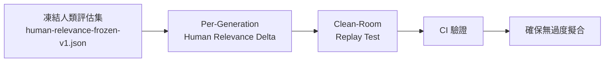

## v3.25.0 — Anti-overfitting proofs + Lattice embedder tier

ruflo v3.25.0 實現完整的反過度擬合驗證機制，確保檢索政策的自我改進可被獨立證明而非依賴行銷用語。首先，凍結人類標記的評估集（.claude/eval/human-relevance-frozen-v1.json），透過 hash 固定和防篡改機制作為改善的紅藍線基準。其次，每代生成的收據中納入 human-relevance delta（deltas.humanRelevance 欄位），使「自檢索向上、人類相關度平穩」的過度擬合模式在 flywheel status 中可視化而不會隱藏在日誌裡。第三，實現 clean-room 重播接納測試（scripts/replay-generation.mjs），在離線環境下以收據單獨重播已推廣生成，hash 完全相同，集成到 CI 流程中確保驗證的有效性。此外該版本包含 Lattice WASM embedder tier（但後續 v3.25.1 已更正為 inactive），upgrade 後 embeddings 行為與 v3.24.0 完全保持一致。

### 重點
- 凍結人類標記評估集（.claude/eval/human-relevance-frozen-v1.json）作為不變基準，防止評估集洩漏或篡改
- Per-generation human-relevance delta 使過度擬合模式可視化於 flywheel status，而非隱藏在日誌
- Clean-room 重播接納測試（accept/v1+sig）能在離線環境獨立驗證任何生成，hash 完全相同，集成 CI

**原文：** [ruflo-releases](https://github.com/ruvnet/ruflo/releases/tag/v3.25.0)

---

### 📄 原文內容

點此展開 / 收合

ruflo 3.25.0 — Anti-overfitting proofs (+ an inactive Lattice embedder seam) 
 Anti-overfitting ( #2580 ) — real, shipped 
 
 Frozen public human-labeled eval set ( .claude/eval/human-relevance-frozen-v1.json ) — hash-pinned, tamper-evident; the red/blue anchor the flywheel must never regress. 
 Per-generation human-relevance deltas in every receipt ( deltas.humanRelevance ) — so "self-retrieval up, human relevance flat → OVERFITTING" is visible in flywheel status , not hidden. 
 Clean-room replay acceptance test ( scripts/replay-generation.mjs ) — replay a promoted generation from its receipt alone: identical hashes, re-run accept/v1+sig , offline (network trapped). Wired into CI. 
 
 ⚠️ Correction — the "Lattice WASM embedder tier" ( #2581 ) is INACTIVE 
 The earlier notes for this release overstated it. There is no @ruvector/lattice-wasm package (npm 404), and no "Lattice" embedder package exists in the ruvector ecosystem. What shipped is a fail-closed, optional adapter seam that dynamically imports an (env-configurable) package name and degrades to ruvector-ONNX → hash when it is absent — which it always is today. It is therefore dormant / no-op and causes no regression, but it is NOT a working multi-model embedder. The models referenced (bge / qwen3-0.6b / paraphrase-miniLM) exist only in a Rust ONNX example, not a publishable package. A follow-up will either remove the seam or wire it to a real embedder. 
 Net for users: upgrade for the anti-overfitting proofs; embeddings behave exactly as in 3.24.0 (ruvector ONNX where available). 
 Additive · backwards-compatible · fail-closed. npx ruflo@latest .

