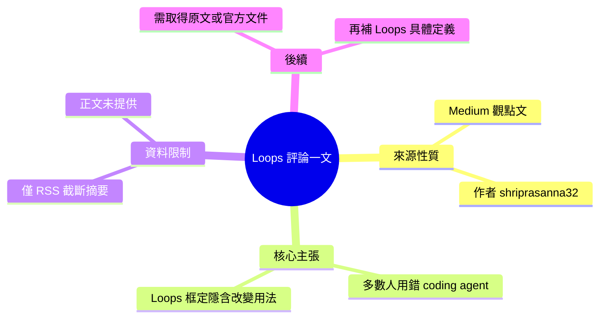

## Anthropic Just Dropped a Banger on “Loops” and It Quietly Changes How You Should Use Your Coding...

Anthropic Claude Code 團隊發布了名為「Loops」的新框架，重新定義了開發者應如何使用 AI 編碼代理。作者指出大多數人目前仍在錯誤地使用編碼 agent，而此框架改變了實踐方式。該發布對編碼工作流程帶來隱含但重要的影響。

### 重點
- 「Loops」是 Anthropic Claude Code 團隊的新框架/思維模式
- 指出編碼 agent 使用者的常見誤區與正確的操作方式
- 改變編碼 agent 與開發者的互動範式

**原文：** [medium-tag-claude](https://medium.com/@shriprasanna32/anthropic-just-dropped-a-banger-on-loops-and-it-quietly-changes-how-you-should-use-your-coding-3ce79ebc395f?source=rss------claude-5)

---

<!-- deep-analysis:begin -->
## 📌 摘要 (TL;DR)

- 這是 Medium 作者（帳號 shriprasanna32）針對 Anthropic Claude Code 團隊「Loops」框定所寫的**個人評論**，屬觀點/評析類文章，而非官方技術公告。
- 作者的核心論點：目前大多數人仍在**錯誤地使用編碼代理（coding agent）**，而 Claude Code 團隊對「Loops」的重新框定，隱含（quietly）改變了應有的使用方式。
- ⚠️ **重要提醒**：本則輸入僅含 RSS 截斷摘要（標題＋一句導言「Continue reading on Medium »」），**正文並未包含在提供的資料中**。因此以下無法還原文章對「Loops」的具體定義、機制、範例或數據。

## 📖 整理分析

### 1. 可確認的資訊
從輸入能確認的僅有：文章主題是 Claude Code 團隊對「Loops」的新框定（new framing）；作者以第一人稱給出「honest take」；作者主張多數人用錯了編碼代理。至於 Loops 的實際定義、運作方式、對照範例與效益，皆未出現在提供的 `body_md` 中。

### 2. 為何無法進一步深入
輸入的 `body_md` 內容只有標題與一行導言，這是典型的 Medium RSS 全文截斷。基於「寧可空白，不可捏造」原則，本整理**不會虛構** Loops 的技術細節、benchmark 數字或 Anthropic 的官方說法，以免產生與原文不符的內容。

### 3. 建議下一步
若要產出完整的深度整理，需先取得下列任一一手來源：
- Medium 原文全文（作者對「Loops」的實際論述）。
- Anthropic / Claude Code 團隊關於「Loops」框架的官方文件或部落格。
取得後再重新分析，才能填補「Loops 是什麼、為何改變工作流程、如何實踐」這些關鍵段落。

## 🧠 Mindmap

<!-- deep-analysis:end -->
### 📄 原文內容

點此展開 / 收合

My honest take on the Claude Code team&#x2019;s new framing &#x2014; and why I think most people are still using their coding agent wrong. Continue reading on Medium »

