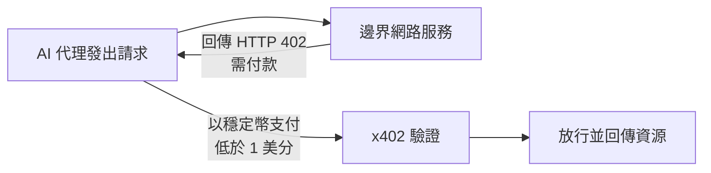
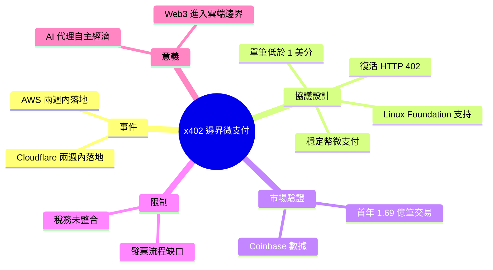

## Cloudflare and AWS Embed x402 Agent Payments at the Edge

Cloudflare 與 AWS 在兩週內相繼在全球邊界網路部署 x402 穩定幣微支付協議。該開放協議（由 Linux Foundation 支持）復活 HTTP 402 Payment Required 狀態碼，用於代理間點對點支付，交易成本低於 1 美分。Coinbase 數據顯示第一年達 1.69 億筆交易，驗證市場需求。然而企業級稅務與發票流程尚未整合，可能限制傳統企業採用。此舉將 Web3 支付能力引入傳統雲基礎設施邊界層，為 AI 代理的自主經濟奠定基礎。

### 重點
- x402 協議雙邊部署：Cloudflare 與 AWS 在兩週內同步上線，標誌開放協議的快速採用
- 交易成本極低：子美分成本實現 1.69 億年交易量的高頻代理支付能力
- 企業集成缺口：稅務與發票系統尚未內置，企業採用仍需解決合規與會計流程

**原文：** [infoq-main](https://www.infoq.com/news/2026/07/cloudflare-aws-x402-micropayment/?utm_campaign=infoq_content&utm_source=infoq&utm_medium=feed&utm_term=global)

---

<!-- deep-analysis:begin -->
## 📌 摘要 (TL;DR)

- Cloudflare 與 AWS 在兩週內相繼把 **x402** 穩定幣（stablecoin）微支付（micropayment）協議部署進各自的全球邊界網路（edge network），讓兩大雲端基礎設施同時具備代理支付能力。
- x402 是由 Linux Foundation 支持的開放協議，重新啟用長年閒置的 **HTTP 402 Payment Required** 狀態碼，用於代理對服務（agent-to-service）之間的支付，單筆交易成本低於 1 美分。
- Coinbase 數據顯示第一年累積 **1.69 億筆交易**，作者 Steef-Jan Wiggers 以此佐證市場需求的真實性。
- 明顯限制在於：企業級的稅務與發票（tax and invoicing）流程尚未整合，可能拖慢傳統企業的採用。
- 值得關注的原因：這代表 Web3 支付能力被引入傳統雲端的邊界層，為 AI 代理的自主經濟建立底層金流管道。

## 🎯 核心概念

- **x402**：一套開放的鏈上微支付協議，名稱取自它所復活的 HTTP 402 狀態碼，讓機器與服務之間可自動完成付款。
- **HTTP 402 Payment Required**：HTTP 規範中長期保留、幾乎未被實際使用的狀態碼；x402 賦予它「請先付款才能取得資源」的實際語意。
- **穩定幣微支付（stablecoin micropayment）**：以價值錨定的穩定幣進行極小額付款，本文強調單筆成本低於 1 美分，適合高頻小額場景。
- **邊界網路（edge network）**：Cloudflare、AWS 等雲端業者遍布全球的節點層，把支付驗證放在此處可貼近請求發生的位置。
- **代理對服務支付（agent-to-service payment）**：AI 代理在存取 API 或服務時自動付費，無需人工介入刷卡或開帳號。

## 📖 整理分析

> 說明：原文為 InfoQ 的短篇新聞（news item），正文僅提供摘要級資訊。以下分析嚴格依據原文所述事實，並輔以 HTTP 402 與微支付的公開背景知識協助理解，未加入原文未提及的具體數字或日期。

### 1. 兩大雲廠兩週內同步落地
原文指出 Cloudflare 與 AWS 在兩週的間隔內，分別把 x402 微支付整合進自家邊界網路。兩家業界龍頭在如此短時間內採用同一協議，是本則新聞的核心事件，象徵此標準正快速從實驗走向主流基礎設施。

### 2. 復活 HTTP 402 的協議設計
x402 的技術核心是重新啟用 HTTP 402 Payment Required 狀態碼——這個狀態碼在 HTTP 規範中被保留多年卻幾乎沒有實務用途。透過它，服務端可回傳「需付款」訊號，讓發起請求的代理以穩定幣完成支付，單筆成本壓在 1 美分以下，這正是高頻機器交易所需的成本結構。

### 3. 交易量驗證需求
原文引用 Coinbase 的數據：協議上線第一年累積 1.69 億筆交易。作者以此作為「市場需求真實存在」的佐證，而非僅是概念驗證。此規模顯示自動化、小額、高頻的機器付款場景確有實際使用量。

### 4. 企業採用的稅務與發票缺口
原文明確點出未解的限制：企業級的稅務與發票流程尚未與 x402 整合。對需要合規記帳、開立發票與稅務申報的傳統企業而言，這道缺口可能成為採用障礙，也是後續生態需要補齊的一環。

### 5. 對 AI 代理經濟的意義
將 Web3 的支付能力嵌入 Cloudflare、AWS 的邊界層，意味著金流機制被放在最貼近 AI 代理發出請求的位置。這為代理自主付費取用服務、進而形成自主經濟（autonomous economy）奠定了基礎設施層的前提。

## 🧭 流程圖 / 架構圖

以下依原文描述的 HTTP 402 付款機制繪製概念流程（示意，非原文原圖）：

## 🧠 Mindmap

<!-- deep-analysis:end -->
### 📄 原文內容

點此展開 / 收合

Cloudflare and AWS both implemented x402 stablecoin micropayments at their edge networks within two weeks. The open protocol under the Linux Foundation revives HTTP 402 for agent-to-service payments with sub-cent transaction costs. Coinbase reports 169 million transactions in year one. Enterprise tax and invoicing gaps remain unresolved. By Steef-Jan Wiggers

