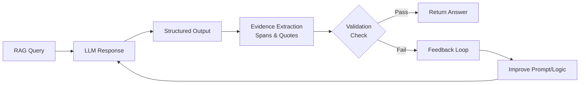

## Validating the RAG Answer Before the User Sees It: Spans, Quotes, and the Feedback Loop

本文為《企業文件智能》專欄第 8 期，提出 RAG 系統驗證的新框架。作者關鍵主張：「結構化輸出只是驗證的起點，不是終點」。系統需在答案展示給用戶前，透過提取 span 與引用文本（quotes）來追蹤證據來源，並透過反饋迴路機制持續改進驗證邏輯。該方法特別適合需要可追溯性與透明度的企業應用。相比單純返回結構化 JSON，這套框架將驗證責任往前推進，從答案生成階段就開始把關。

### 重點
- 結構化輸出不等於完成驗證；需進一步提取 span、quotes 追蹤證據來源
- 「接受未找到」(accept not-found) 優於硬行提供錯誤答案或幻覺內容
- 反饋迴路允許系統在用戶看到答案前持續改進，提升可信度

**原文：** [medium-towards-data-science](https://towardsdatascience.com/validating-the-rag-answer-before-the-user-sees-it-spans-quotes-and-the-feedback-loop/)

---

### 📄 原文內容

點此展開 / 收合

Enterprise Document Intelligence [Vol.1 #8C] - Structured output is the start of validation, not the end: check the evidence, accept not-found, loop the feedback 
 The post Validating the RAG Answer Before the User Sees It: Spans, Quotes, and the Feedback Loop appeared first on Towards Data Science .

