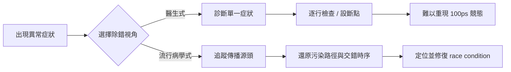
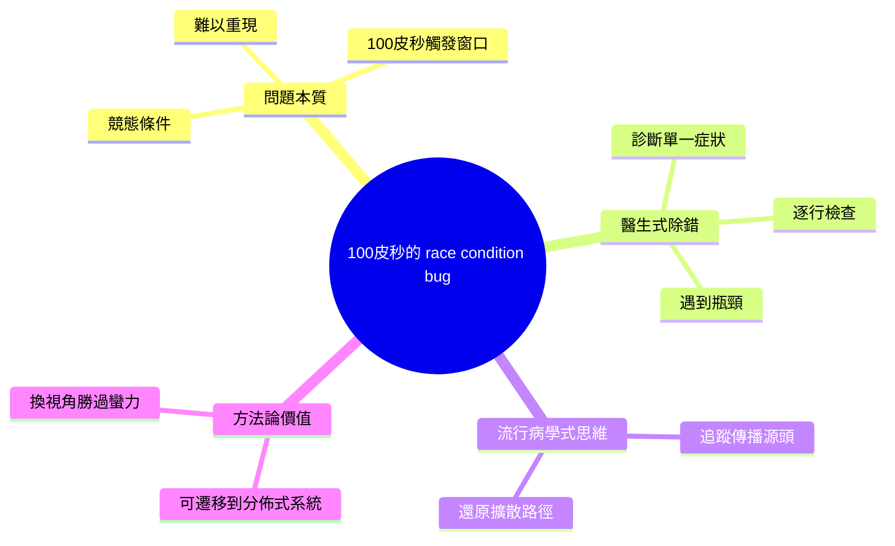

## OpenAI's bug that hid inside a 100-picosecond window

ByteSized Design 文章分析 OpenAI 工程團隊發現並修復的一個極難追蹤的競態條件 bug，該問題隱藏在 100 皮秒的時間窗口內。團隊採用了流行病學思維（epidemiological thinking）而非傳統逐行除錯法——即改變視角，從「診斷單一症狀」轉變為「追蹤根本傳播路徑」。這種方法論適用於分佈式系統中的複雜 debugging，代表了系統工程思想的創新應用，超越了 OpenAI 的具體案例。

### 重點
- 競態條件隱藏在 100 皮秒的極窄時間窗口，傳統除錯無法捕捉
- OpenAI 採用流行病學方法論（追蹤根源傳播）成功定位 bug 根源
- 思維方法轉變——從醫學診斷轉為流行病追蹤，可推廣至複雜分佈式系統

**原文：** [substack-byte-sized-design](https://read.bytesizeddesign.com/p/openais-bug-that-hid-inside-a-100)

---

<!-- deep-analysis:begin -->
## 📌 摘要 (TL;DR)

- ByteSized Design（電子報 read.bytesizeddesign.com）分析 OpenAI 工程團隊如何找出並修復一個藏在 **100 皮秒（picosecond）時間窗口** 內的競態條件（race condition）bug。
- 核心轉變：團隊停止「像醫生一樣除錯」（診斷單一症狀、逐行檢查），改用「像流行病學家一樣思考」（epidemiological thinking）——去追蹤問題的傳播路徑與源頭。
- 100 皮秒 = 0.1 奈秒，比現代 CPU 單一時脈週期還短，意味這個 bug 只在極罕見的並行時序交錯下才觸發，用傳統斷點 / log 幾乎無法穩定重現。
- 方法論重點：面對分佈式系統中難重現的複雜 bug，**換視角（從症狀到傳播鏈）比更用力逐行 debug 更有效**，這套思路可遷移到 OpenAI 案例之外。
- 註：本次可取得的原文內容僅有標題、副標與既有摘要，以下整理聚焦於文章揭示的核心方法論，未臆測未被提及的實作細節（哪個系統、哪段程式碼、實際觸發機制）。

## 🎯 核心概念

- **競態條件（race condition）**：程式行為取決於多個並行操作（執行緒 / 程序 / 請求）誰先誰後執行的時序，當交錯順序「剛好」對上時才會出錯的 bug。
- **流行病學式除錯（epidemiological thinking）**：借用流行病學追查疫情的思路——不只治單一病患的症狀，而是找出「零號病人」與傳播鏈；對應到 debug 就是追蹤錯誤如何從源頭在系統中擴散。
- **100 皮秒窗口（100-picosecond window）**：觸發此 bug 的時序縫隙只有約 0.1 奈秒，這種極短的並行競爭窗口讓問題難以重現與觀測。

## 📖 整理分析

### 1. 醫生式除錯的極限
副標把傳統除錯比喻為「像醫生看病」：針對當下症狀對症下藥、逐行檢查程式碼、設斷點嘗試重現。但面對只在 100 皮秒交錯下才浮現的競態條件，症狀本身難以穩定重現，逐行法容易陷入「抓不到現場」的死胡同。

### 2. 改用流行病學家的視角
文章主張把視角從「診斷單一症狀」轉為「追蹤根本傳播路徑」。流行病學家關心的是傳染源、傳播媒介與擴散模式；對應到系統，就是找出錯誤的資料 / 狀態從哪個源頭產生、又經由哪條路徑污染了下游。

### 3. 為何競態條件特別適合此法
觸發窗口只有 100 皮秒，代表 bug 依賴罕見時序才會發生。而並行 bug 有個常見特性：一旦加上 log 或斷點來觀測，往往會改變時序、讓問題消失（俗稱 heisenbug，此為並行除錯的普遍現象，非文中明言）。改用傳播鏈思維，可以繞過「必須重現現場」的限制，改從系統層級推理可能的交錯與污染路徑。

### 4. 方法論的可遷移性
這套「換視角」的做法不限於 OpenAI 這一個案例。既有摘要指出，它適用於分佈式系統中各種難重現的複雜 debugging，代表一種系統工程思維的創新應用——把單點診斷升級為對整體傳播路徑的追蹤。

## 🧭 兩種除錯視角對比

## 🧠 Mindmap

<!-- deep-analysis:end -->
### 📄 原文內容

點此展開 / 收合

How OpenAI stopped debugging like a doctor and started thinking like an epidemiologist and caught a race condition in the process.

