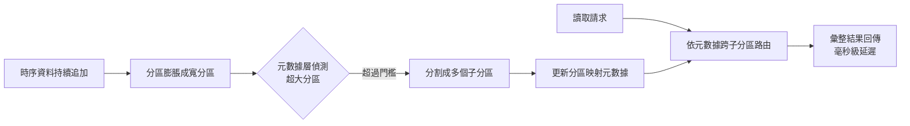
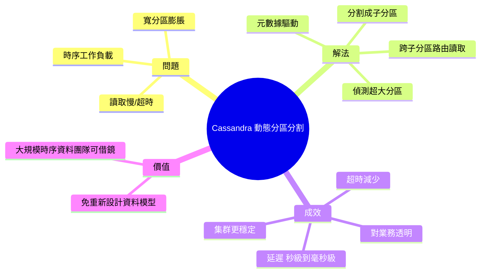

## Netflix Cuts Cassandra Read Latency from Seconds to Milliseconds with Dynamic Partition Splitting

Netflix 工程師為 Apache Cassandra 引入動態分割分區（dynamic partition splitting）技術，針對時序工作負載中的寬分區問題。該元數據驅動方案自動檢測超大分區，將其分割為更小單位，並跨子分區路由讀取請求。部署結果顯著：讀取延遲從秒級下降至毫秒級、超時情況明顯減少、整體集群穩定性提升，同時對用戶業務透明。此優化對管理大規模時序數據的公司具有直接實用價值。

### 重點
- 動態分割分區：元數據驅動自動檢測與分割超大分區，避免人工幹預
- 效能躍進：讀取延遲從秒級 → 毫秒級，超時率顯著下降
- 透明部署：對上層應用無感知，無須修改業務程式碼

**原文：** [infoq-main](https://www.infoq.com/news/2026/07/netflix-cassandra-partition/?utm_campaign=infoq_content&utm_source=infoq&utm_medium=feed&utm_term=global)

---

<!-- deep-analysis:begin -->
## 📌 摘要 (TL;DR)

- Netflix 工程師 Leela Kumili 為 Apache Cassandra 導入「動態分區分割」（dynamic partition splitting），專門處理時序工作負載（time series workload）中的寬分區（wide partition）問題。
- 此方案為元數據驅動（metadata-driven）：自動偵測超大分區、把它切成更小的子單位，並將讀取請求跨子分區（child partition）路由。
- 部署後 Netflix 回報：讀取延遲從「秒級」下降到「毫秒級」、超時（timeout）減少、整體集群（cluster）穩定性提升。
- 整個優化對上層業務保持透明（transparency）——應用端不需改動即可受惠。
- 對於任何在 Cassandra 上管理大規模時序資料的團隊，這是可直接借鏡的實務工程手法。

## 🎯 核心概念

- **動態分區分割**（dynamic partition splitting）：在執行期自動把過大的分區拆成多個較小分區的機制，而非靠人工重新設計資料模型。
- **寬分區**（wide partition）：單一分區鍵（partition key）下累積過多列（row）或過大資料量，導致讀取變慢、記憶體與 GC 壓力上升。
- **元數據驅動**（metadata-driven）：以一層中繼資料記錄「哪個原始分區被切成哪些子分區」，讀取時據此決定要查詢哪些子分區。
- **時序工作負載**（time series workload）：資料隨時間持續往同一分區追加（如觀看紀錄、事件日誌），是造成分區無限膨脹的典型場景。

## 📖 整理分析

### 1. 問題：寬分區拖垮讀取效能
Cassandra 依分區鍵把資料分散到節點。但在時序場景中，資料會隨時間不斷追加到相同分區，使該分區持續膨脹。過寬的分區在讀取時需掃描大量資料，造成延遲飆高、超時，並對記憶體與垃圾回收（GC）造成壓力，最終影響整個集群穩定性。這正是 Netflix 要解決的痛點。

### 2. 做法：偵測 → 分割 → 路由
根據原文，Netflix 的方案分三步：先自動「偵測」超大分區；再把它「分割」成更小的子單位；最後在讀取時將請求「跨子分區路由」。整套流程以元數據為核心——系統維護原始分區與子分區之間的映射關係，讓查詢知道該去哪些子分區取資料，再彙整結果回傳。

### 3. 結果：秒級到毫秒級
原文明確給出的成效是：讀取延遲由「seconds」降至「milliseconds」、超時情況減少、集群穩定性改善。關鍵是這一切對業務端「維持透明」——應用程式不必改寫查詢或資料模型，就能享有效能提升，降低了導入成本與風險。

### 4. 為什麼值得關注
寬分區是 Cassandra 使用者長期的共通難題，傳統解法多半得在建模階段就人工設計分桶（bucketing）策略，事後補救困難。Netflix 把「分割」變成執行期可動態、自動處理的能力，對所有在 Cassandra 上跑大規模時序資料的組織具有直接參考價值。

> 註：本文原始報導篇幅精簡，上述關於寬分區成因與 Cassandra 分區機制的技術背景，屬 Cassandra 領域的通用知識補充；原文未提供具體百分比或分割閾值等細節。

## 🧭 流程圖 / 架構圖

## 🧠 Mindmap

<!-- deep-analysis:end -->
### 📄 原文內容

點此展開 / 收合

Netflix engineers introduced dynamic partition splitting for Cassandra to address wide partitions in time series workloads. The metadata-driven approach detects oversized partitions, splits them smaller units, and routes reads across child partitions. Netflix reported lower read latency from seconds to milliseconds, reduced timeouts, and improved cluster stability while maintaining transparency. By Leela Kumili

