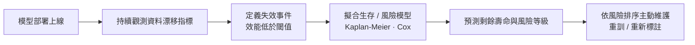
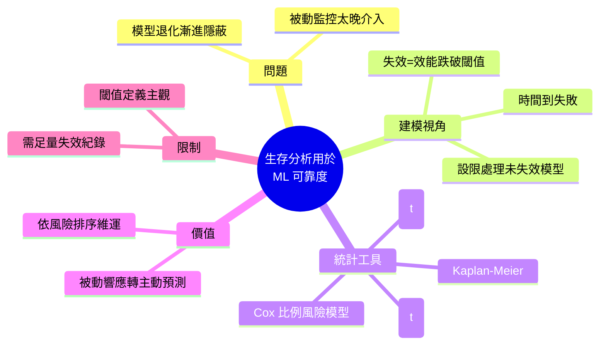

## Survival Analysis for Data Drift and ML Reliability

Towards Data Science 發表《生存分析用於數據漂移與 ML 可靠性》，提出將機器學習模型退化現象建模為「時間到失敗」（time-to-failure）問題。該方法引入統計學中的生存分析（survival analysis）框架來預測模型性能下降的時間點與風險等級，有助於產品團隊提前介入維護決策。這一框架將質量保證從被動響應轉為主動預測，對長期運營的 ML 系統具有實踐意義。

### 重點
- 將 ML 模型退化視為生存分析中的時間到失敗問題，實現量化風險評估
- 預測模型性能邊界，提早觸發維護與重新訓練決策
- 數據漂移對模型可靠性的影響可通過統計方法量化與追蹤

**原文：** [medium-towards-data-science](https://towardsdatascience.com/survival-analysis-for-data-drift-and-ml-reliability/)

---

<!-- deep-analysis:begin -->
## 📌 摘要 (TL;DR)

- Towards Data Science 文章《Survival Analysis for Data Drift and ML Reliability》提出：把機器學習模型的效能退化建模為「時間到失敗」（time-to-failure）問題，改用統計學的生存分析（survival analysis）框架來處理。
- 核心思路是把每個上線模型當成「受試個體」，將「效能跌破閾值」視為失效事件，藉此估計模型的預期可用壽命與失效風險等級。
- 此框架能將品質保證從被動響應（等指標掉了才重訓）轉為主動預測，讓維運團隊提前排程介入。
- ⚠️ 透明說明：本則來源僅提供標題與一句摘要（RSS 摘錄），並無原文正文、程式碼或具體數據。以下整理結合「原文標題與副標所陳述的論點」與「生存分析的通用統計知識」，不含原文的具體實驗結果或工具細節。

## 🎯 核心概念

- **生存分析 (survival analysis)**：統計學中分析「事件發生前經過多少時間」的方法，源自醫學存活率與工程可靠度研究。
- **時間到失敗 (time-to-failure)**：關注點從「會不會失敗」轉為「多久後失敗」，是本文對模型退化的核心建模視角。
- **資料漂移 (data drift)**：線上資料分布隨時間偏離訓練資料，是模型效能下降的主因。
- **風險函數 (hazard function)**：在存活到某時點的條件下，下一刻發生失效的瞬時機率。
- **設限 (censoring)**：觀測期內尚未失效的樣本（模型仍正常運作），生存分析能正確利用這類未完成的觀測。
- **Cox 比例風險模型 (Cox proportional hazards model)**：以協變量（如漂移指標）解釋失效風險的半參數模型。
- **Kaplan-Meier 估計量 (Kaplan-Meier estimator)**：非參數估計生存曲線的常用方法。

## 📖 整理分析

### 1. 問題：模型退化漸進且隱蔽
機器學習模型上線後，隨著真實世界資料分布改變（資料漂移），準確率會逐步下滑。傳統監控多屬被動——等指標掉到閾值以下才告警並重訓，往往已造成業務損失。本文把「模型何時會失效」定義為 time-to-failure 問題，試圖提前量化風險。

### 2. 核心類比：模型失效等同事件發生
把每個部署中的模型視為一個受試個體，「失效事件」定義為效能指標跌破可接受閾值，「時間」即從部署到失效所經過的時長。仍正常運作、尚未觸及閾值的模型屬於設限資料；生存分析能自然處理這種「尚未發生但仍在觀測」的情況，避免只看已失效樣本所造成的統計偏誤。

### 3. 生存分析的統計工具
生存分析提供生存函數 S(t)（存活超過 t 的機率）與風險函數 h(t)（瞬時失效率）。Kaplan-Meier 可畫出模型群體的生存曲線；Cox 比例風險模型則能把資料漂移量、特徵分布差異等作為協變量，量化各因子如何抬高失效風險，進而估計個別模型的剩餘可用壽命。

### 4. 從被動監控到主動預測
一旦能估出風險等級與預期失效時間，維運就從「事後救火」轉為「事前排程」。產品團隊可依風險高低排序，決定哪些模型優先重訓或優先蒐集新標註資料，把有限的重訓與標註資源投在最可能先失效的模型上。

### 5. 適用前提與限制（此為分析／推論）
此段為套用生存分析到 ML 可靠度的通用考量，非原文明列：需要累積足量的歷史失效紀錄才能擬合可靠模型；失效閾值的定義主觀且依業務而定；Cox 模型的「比例風險」等統計假設未必總成立。實務上仍需搭配持續的漂移監控與驗證。

## 🧭 流程圖 / 架構圖

## 🧠 Mindmap

<!-- deep-analysis:end -->
### 📄 原文內容

點此展開 / 收合

Treating model degradation as a time-to-failure problem 
 The post Survival Analysis for Data Drift and ML Reliability appeared first on Towards Data Science .

