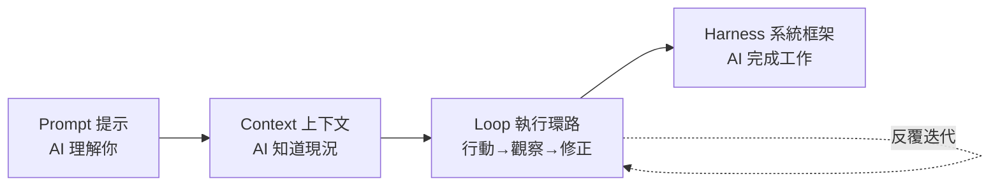
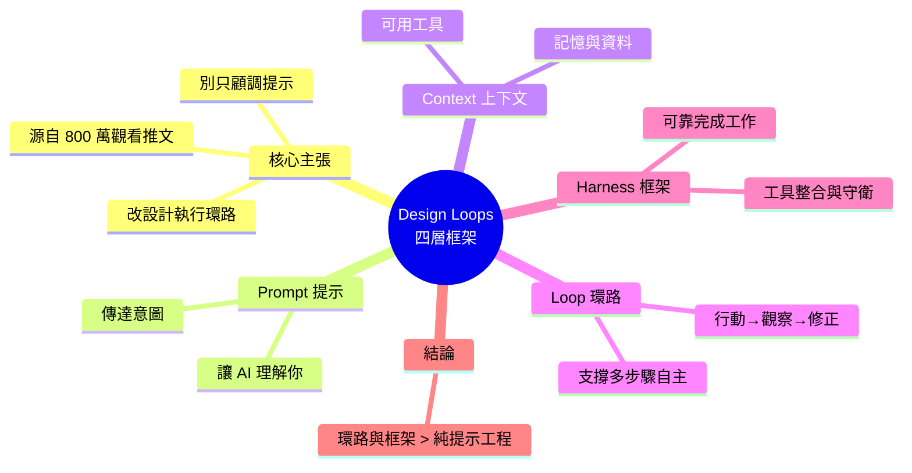

## “Stop Prompting Your Agents. Design Loops.” — Unpacking the Idea Behind an 8-Million-View Tweet

文章深入探討了一則獲得 800 萬次瀏覽的高人氣貼文背後的核心架構設計思想。作者提出停止被動「提示 AI 代理」，轉而應該「設計完整的執行環路」這一核心主張。文章介紹了四層遞進的架構框架：Prompt（提示詞）→ Context（上下文）→ Loop（執行環路）→ Harness（系統框架），這四個層次映射了從「AI 理解你」到「AI 完成工作」的完整進程。框架強調環路設計和系統框架對 agentic AI 的重要性遠超單純的提示工程優化。這個架構觀點為開發者重新定義了 AI 代理系統的設計優先級。

### 重點
- 四層遞進框架：Prompt（提示）→ Context（上下文）→ Loop（環路）→ Harness（框架），從輸入到系統的完整演進
- 設計轉向：從被動的「提示工程」轉向主動的「環路和框架設計」是構建高效 AI 代理的關鍵
- 架構原則：環路設計（自動執行、反饋迴圈）和系統框架（約束、監控）的重要性超過單一提示的優化

**原文：** [medium-tag-claude](https://medium.com/@coolercoder/stop-prompting-your-agents-design-loops-unpacking-the-idea-behind-an-8-million-view-tweet-b08dc3348308?source=rss------claude-5)

---

<!-- deep-analysis:begin -->
## 📌 摘要 (TL;DR)

- 本文拆解一則累積 **800 萬次瀏覽**的爆紅推文，其主張是「**別再只顧著提示你的 AI 代理，去設計環路（Design Loops）**」。
- 核心轉向：把注意力從「調提示詞（prompt engineering）」提升到「設計整套執行環路與系統框架」。
- 提出四層遞進框架：**Prompt → Context → Loop → Harness**，四個字串起「AI 理解你」到「AI 完成工作」的完整路徑。
- 作者的觀點是：對 agentic AI 而言，環路（loop）與框架（harness）的設計，重要性遠超過單純優化提示詞。
- 讀者價值：這是一個重新排序 AI 代理系統設計優先級的心智模型，適合正在從「聊天機器人」邁向「自主代理」的開發者。

## 🎯 核心概念

- **提示**（Prompt）：你給模型的指令本身，決定它是否「理解你要什麼」。
- **上下文**（Context）：餵給模型的背景資訊、記憶、資料與可用工具，決定它「知道什麼、握有哪些材料」。
- **執行環路**（Loop）：行動 → 觀察 → 修正的反覆循環，讓 AI 能自主推進任務，而不是「一問一答」就結束。
- **系統框架**（Harness）：包住環路的整套外層系統——工具整合、守衛與約束、錯誤處理與狀態管理，決定 AI 能否「真正把事情做完」。

## 📖 整理分析

### 1. 從提示工程到環路設計
這則 800 萬觀看的推文之所以引發共鳴，在於它點破一個常見誤區：多數人把 AI 代理的成敗押在「提示詞寫得夠不夠好」。作者主張，提示只是最表層的一環；真正決定代理能否交付結果的，是它背後那個會反覆運行的執行環路，以及承載這個環路的系統框架。

### 2. 四層框架：Prompt → Context → Loop → Harness
文章的骨幹是這四個層次的遞進關係。它們不是彼此替代，而是層層疊加：先有清楚的提示（AI 理解你），再補足上下文（AI 知道現況），接著設計環路（AI 能反覆行動），最後由框架收束（AI 安全地完成工作）。這條線索對應了作者所說「從 AI that understands you 到 AI that finishes the job」的完整旅程。

### 3. 每一層在做什麼
Prompt 解決「意圖傳達」；Context 解決「資訊供給」，涵蓋記憶、檢索到的資料與工具清單；Loop 解決「自主推進」，讓代理在行動後觀察結果、判斷是否要再做一次；Harness 則解決「可靠交付」，透過工具串接、防呆與狀態控制，把前三層包成一個能穩定運轉的系統。愈往後的層次，愈接近「工程系統」而非「文字技巧」。

### 4. 為何環路與框架勝過單純調提示
作者的立場是：提示的邊際效益會遞減，而環路與框架的投入才是規模化的關鍵。一次性回答再漂亮，也無法讓代理跨越多步驟任務；只有當你把「反覆嘗試、觀察、修正」變成系統內建能力，AI 才會從「會聊天」進化到「會做完」。這也是為什麼標題要人「停止提示、開始設計環路」。

> 註：本文原文為 Medium 付費全文，此處以標題、四層框架關鍵字與既有摘要為基礎，聚焦還原其核心心智模型；文中未出現的具體數據、工具名稱或作者身分不做臆測。

## 🧭 流程圖 / 架構圖

## 🧠 Mindmap

<!-- deep-analysis:end -->
### 📄 原文內容

點此展開 / 收合

Prompt, Context, Loop, Harness &#x2014; four words that map the entire road from &#x201c;AI that understands you&#x201d; to &#x201c;AI that finishes the job.&#x201d; Here&#x2019;s&#x2026; Continue reading on Medium »

