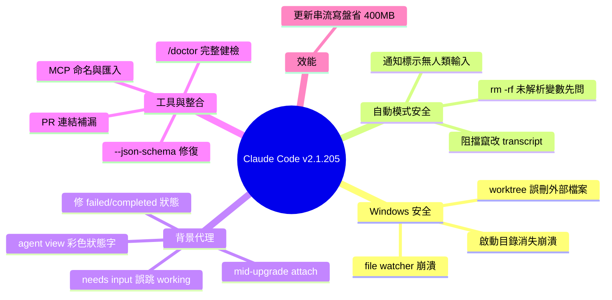

## v2.1.205

Claude Code 2.1.205 版本發佈，包含 20+ 項 bug 修復與改進。核心修復涵蓋 JSON Schema 驗證問題、Windows worktree 移除邊界情況（NTFS junction/symlink 導致刪除 worktree 外文件）、background agents 狀態管理異常（failed/completed 狀態未更新、mid-upgrade 時 attach 錯誤）、以及 MCP 伺服器命名問題。性能方面，自動更新下載改為流式磁盤寫入，將峰值內存使用降低約 400MB。自動模式改進了安全性，在執行 rm -rf 時若變量無法解析則先詢問用戶。代理視圖增強了 session 與 PR 鏈接顯示，改用彩色狀態字與分類標題替代原始工具調用文本。新增 /doctor 命令作為完整設置檢查工具。

### 重點
- 流式磁盤寫入優化：自動更新內存峰值使用降低 ~400MB（從內存緩衝改為流式寫入磁盤）
- Background agents 狀態管理修復：解決 failed/completed 狀態不更新、mid-upgrade attach 錯誤等邊界情況
- Windows worktree 刪除保護：修復 NTFS junction 或目錄 symlink 導致誤刪 worktree 外文件的問題

**原文：** [claude-code-releases](https://github.com/anthropics/claude-code/releases/tag/v2.1.205)

---

<!-- deep-analysis:begin -->
## 📌 摘要 (TL;DR)

- Claude Code **v2.1.205** 是一次以修復為主的釋出，涵蓋 **20+ 項 bug fix 與改進**，重點在背景代理（background agents）、Windows 檔案系統安全與自動模式（auto mode）安全性。
- 修掉一個高風險 Windows 資料遺失問題：worktree 內若存在 **NTFS junction 或目錄符號連結（directory symlink）**，移除 worktree 時會誤刪 worktree 外部的檔案。
- 自動更新的二進位下載改為**串流寫入磁碟（stream to disk）**，不再全部緩衝在記憶體，讓更新程式的峰值記憶體用量降低約 **400 MB**。
- 自動模式安全升級：執行 `rm -rf` 時若變數無法從上下文解析，會先詢問使用者；背景任務通知也會明確標示「未經人類輸入」，防止在 transcript 裡偽造核准被當真執行。
- `/doctor` 升級為完整的環境健檢工具，可診斷並修復問題，`/checkup` 為其別名。

## 🎯 核心概念

- **背景代理 (background agents)**：可在背景長時間執行、以 `SendMessage` 續跑的自動化 agent，在 agent 清單與 Remote Control 面板中呈現狀態。
- **工作樹 (worktree)**：Git 的多工作目錄機制，讓同一個 repo 可同時 checkout 多個分支到不同資料夾。
- **NTFS junction / 目錄符號連結 (directory symlink)**：Windows 上指向其他路徑的目錄捷徑，遍歷刪除時若不判斷會「穿透」到連結目標。
- **模型情境協定 (Model Context Protocol，簡稱 MCP)**：Claude 連接外部工具/伺服器的協定，本版涉及伺服器命名與匯入的修正。

## 📖 整理分析

### 1. Windows 檔案系統安全修復
最嚴重的一項是 Windows worktree 移除會誤刪 worktree 外檔案——當 worktree 內含 NTFS junction 或 directory symlink 時，刪除邏輯會沿著連結刪到外部路徑。此外也修掉兩個 Windows 崩潰：啟動目錄在指令執行中被刪除／鎖定／卸載時的崩潰，以及檔案監看器（file watcher）在目錄掃描仍進行中被關閉導致的崩潰。

### 2. 自動模式與 transcript 安全
新增自動模式規則，阻擋竄改 session transcript 檔案。自動模式在對「無法從上下文解析的變數」執行 `rm -rf` 前會先詢問，避免誤刪。背景任務通知現在會明確聲明「沒有發生任何人類輸入」，防止 transcript 中被偽造的核准（fabricated approvals）被誤當成真實授權而執行。

### 3. 背景代理狀態與 agent view
修正多個狀態管理錯誤：以 `SendMessage` 續跑後，agent 仍卡在「failed」或「completed」；agent 回合若不含可讀文字，狀態會從「needs input」錯誤跳回「working」；以及背景代理在升級重啟途中（mid-upgrade）執行 `claude attach` 會報錯，現在改為等待其恢復。agent view 也重新設計：每列改以**彩色狀態字**加上分類器產生的標題（classifier-written headline）取代原始工具呼叫文字，被阻擋（blocked）的 session 展開時會顯示完整狀態與確切的詢問內容；同時修掉列表略微溢出畫面時，畫面上移一行導致標頭被裁切的問題。web 與 mobile 的 Remote Control 面板則透過在每次成員變更時轉發完整任務狀態，解決背景任務顯示過時「Running」的問題。

### 4. JSON Schema、PR 連結與 MCP
`--json-schema` 過去在 schema 無效時會靜默輸出非結構化結果，且使用 `format` 關鍵字的 schema 會被拒絕，本版皆已修復。session 對 PR 的連結補上兩種缺漏：一是 Bash 呼叫輸出超過 30K 行內上限（inline limit）時建立的 PR 未被連結；二是新增支援——編輯、合併、留言或推送到既有 PR 的 session 現在也會在 `claude agents` 中連結該 PR。MCP 方面，`claude mcp add-from-claude-desktop` 遇到含不支援字元的伺服器名稱不再卡住，會回報無效名稱並繼續匯入其餘伺服器；同時預留「Claude Browser」與「Claude Preview」兩個 MCP 伺服器名稱（配合 Claude Desktop 面板改名），使用者自訂伺服器不得再佔用這兩個名稱。

### 5. 效能、工具與其他修正
自動更新下載改為串流寫入磁碟，峰值記憶體降低約 400 MB。`/doctor` 升級為可診斷並修復問題的完整健檢工具，`/checkup` 成為別名。其餘修正包含：在 `--max-turns` 上限結束回合時送出的訊息不再被靜默丟失；外掛 LSP 伺服器初始化失敗不再阻擋另一個外掛處理相同副檔名的有效 LSP 伺服器；專案 verify skills 只在文件化指令變更時才重寫（而非每次 session）；以及 Cowork VM 模式的本地 agent session 在 CLI 2.1.203+ 上以「Not logged in · Please run /login」啟動失敗的問題。

## 🧠 Mindmap

<!-- deep-analysis:end -->
### 📄 原文內容

點此展開 / 收合

What's changed 
 
 Added an auto mode rule that blocks tampering with session transcript files 
 Fixed --json-schema silently producing unstructured output when the schema was invalid, and schemas using the format keyword being rejected 
 Fixed a message sent while Claude was working being silently lost when the turn ended at the --max-turns limit 
 Fixed Windows worktree removal deleting files outside the worktree when an NTFS junction or directory symlink existed inside it 
 Fixed background agents staying shown as "failed" or "completed" in the agent list after being resumed with SendMessage 
 Fixed background jobs flipping from "needs input" back to "working" in the agent list when the agent's turn contained no readable text 
 Fixed claude attach erroring when a background agent was mid-upgrade restart instead of waiting for it to come back 
 Fixed session-to-PR linking missing a PR created in a Bash call whose output exceeded the 30K inline limit 
 Fixed claude mcp add-from-claude-desktop getting stuck when a server name contains unsupported characters; invalid names are now reported and remaining servers still import 
 Fixed a plugin LSP server that fails to initialize preventing a valid LSP server from another plugin handling the same file extension 
 Fixed a Windows crash when the directory Claude was launched from is deleted, locked, or unmounted while a command is running 
 Fixed a crash when a file watcher was closed while a directory scan was still in flight 
 Fixed project verify skills being rewritten on every session instead of only when a documented command changed 
 Fixed the agent view rendering one line too high and clipping its header when the job list slightly overflowed the screen 
 Fixed background tasks in the web and mobile Remote Control panels showing stale "Running" status by forwarding full task state on every membership change 
 Improved auto mode to ask before running rm -rf on a variable it can't resolve from context 
 Auto-update binary downloads now stream to disk instead of buffering in memory, cutting the updater's peak memory usage by roughly 400 MB 
 Background task notifications now explicitly state that no human input has occurred, preventing fabricated in-transcript approvals from being acted on 
 Improved agent view: sessions that edit, merge, comment on, or push to an existing PR now link it in claude agents 
 Improved agent view: rows now show a colored state word and a classifier-written headline instead of raw tool call text, and the peek opens with full status including the exact ask for blocked sessions 
 /doctor is now a full setup checkup that can diagnose and fix issues; /checkup is its alias 
 Reserved the "Claude Browser" MCP server name (alongside "Claude Preview") ahead of the Claude Desktop pane rename; user-configured MCP servers can no longer register under either name 
 Fixed Cowork VM-mode local-agent sessions failing to start with "Not logged in · Please run /login" on CLI 2.1.203+

