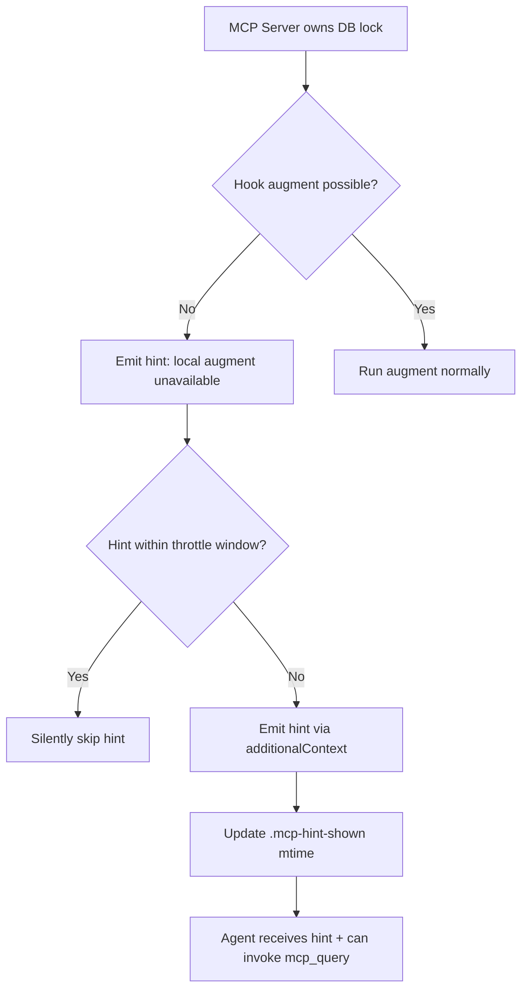

## rc/1408bfbffe69422e7db3f004d1cbc556b1634c41: fix(hook): emit MCP query hint when server owns DB lock (#2396) (#2397)

GitNexus MCP query hint 機制深度設計與實現文檔。當 GitNexus MCP server 持有 LadybugDB 寫鎖時，PreToolUse hook 無法執行本地圖增強（LadybugDB 單寫入者限制）。新機制不再無聲跳過（前行為），而是發出條件性 hint：「local augment is unavailable」+ 條件「if the GitNexus MCP tools are live in this session，請使用 mcp__gitnexus__query」，適用於 confirmed server-owned、serve-only-owned、fail-closed/timeout 三路徑。節流機制：per-repo `.gitnexus/.mcp-hint-shown` mtime 標記配合 GITNEXUS_MCP_HINT_THROTTLE_MS（預設 10min）實現每窗口最多一次 hint，防止 ~2x query 放大與 context 膨脹。實現分佈三份 hook 副本（claude.cjs、claude-plugin.js、antigravity.cjs），具 source-level byte-identity 漂移檢查、adversarial pattern JSON escaping 測試、macOS 平台驗證。由 Claude Opus 4.8（1M context）協作編寫。

### 重點
- MCP query hint 條件與措詞調整：在 confirmed-owner、serve-owner、fail-closed 三路徑上均發出，但措詞根據實際狀態調整（避免虛假宣稱「knowledge graph is live」），導向正確的 MCP 工具調用
- 節流策略：per-repo mtime 標記實現 GITNEXUS_MCP_HINT_THROTTLE_MS（預設 10min）窗口限制，最多每窗口一次 hint，防止 ~2x query 放大及 context 膨脹；best-effort 設計任何 fs error 回退發射，確保 hint 不因標記失敗而丟失
- 三副本同步機制：buildMcpQueryHint 和 shouldEmitMcpHint 字節完全一致驗證跨所有平台；測試涵蓋 adversarial pattern JSON escaping，確保 additionalContext JSON envelope 完整性

**原文：** [gitnexus-releases](https://github.com/abhigyanpatwari/GitNexus/releases/tag/rc%2F1408bfbffe69422e7db3f004d1cbc556b1634c41)

---

### 📄 原文內容

點此展開 / 收合

# rc/1408bfbffe69422e7db3f004d1cbc556b1634c41: fix(hook): emit MCP query hint when server owns DB lock (#2396) (#2397)

fix(hook): emit MCP query hint when server owns DB lock ( #2396 ) 
 
 When the GitNexus MCP server holds the lbug write lock, the PreToolUse hook's CLI augment cannot run (LadybugDB is single-writer) and previously skipped silently — disabling graph augmentation in the most common deployment (server online). Since the same session already has the MCP query tool live, the owner branch now emits an additionalContext hint pointing the agent at mcp__gitnexus__query for that pattern, via the same sanctioned stdout channel the augment-success path uses (Codex-safe, #2369 ). 
 Rejected the alternative of having the hook query the server: it runs over stdio (no port/pipe from the separate hook process) and cross-process read-only access can't coexist with the write lock — both are large architecture changes. Applied to all three gated hook copies (claude .cjs, claude-plugin .js, antigravity .cjs); the cursor hook has no owner gate and is untouched. The stderr augment skipped: MCP server owns DB diagnostic stays GITNEXUS_DEBUG-gated ( #1913 ). Owner-path tests flipped from stdout-empty to hint-present. 
 Co-Authored-By: Claude Opus 4.8 (1M context) noreply@anthropic.com 
 
 fix(hook): reword MCP-query hint to be conditionally truthful ( #2396 ) 
 
 The #2396 owner branch emits the hint on every DB-owner path — a confirmed 
 gitnexus mcp owner, a gitnexus serve owner, and the fail-closed/timeout 
paths (the probe collapses timeout and owned to one boolean). The old text 
claimed "Knowledge graph is live via the MCP server" and named 
mcp__gitnexus__query unconditionally, which is untrue on a fail-closed probe 
where no server is confirmed and misdirecting for a serve-only owner 
(review C2/C4). 
 Reword the hint (byte-identical across all three hook copies) to state that 
local augment is unavailable and to condition the MCP call on the tools 
actually being live ("if the GitNexus MCP tools are live in this session"). 
This is truthful on every owner path; the needles the assertions rely on 
(mcp__gitnexus__query, query, search_query, the pattern) are preserved. 
 Fix the 10 stale owner/fail-closed unit tests that still asserted empty 
stdout (review C1, the macOS platform-sensitive 2/3 blocker): flip them to 
assert the hint via parseHookOutput, keep their stderr/GITNEXUS_DEBUG 
expectations, and rename the two 'SILENTLY' titles. The GITNEXUS_DEBUG='' 
owner-hint case is restored (the PR's new loop only covered '0'/'false'). 
Probe and its white-box tests untouched. 
 Co-Authored-By: Claude Opus 4.8 (1M context) noreply@anthropic.com 
 
 fix(hook): de-orphan the JSDoc in the claude hook copy ( #2396 ) 
 
 The #2396 change inserted buildMcpQueryHint between the pre-existing 
"PreToolUse handler" JSDoc and handlePreToolUse, orphaning that doc onto the 
helper and leaving handlePreToolUse undocumented (review C5). Move the helper 
(with its own doc) above the handler doc so the "PreToolUse handler" comment 
again precedes handlePreToolUse, matching the clean plugin copy. Pure move; no 
behavior change. 
 Co-Authored-By: Claude Opus 4.8 (1M context) noreply@anthropic.com 
 
 fix(hook): throttle the MCP-owner hint to once per repo per window ( #2396 ) 
 
 Previously the hint emitted on every qualifying search while a GitNexus process 
owned the DB, so an owner-locked session (the common deploy) was nudged toward 
the MCP query tool on every Grep/Glob/Bash — context bloat and ~2x query 
amplification (review C3). 
 Add shouldEmitMcpHint(gitNexusDir) to all three hook copies: a per-repo 
.gitnexus/.mcp-hint-shown mtime marker emits the hint at most once per window. 
Window via GITNEXUS_MCP_HINT_THROTTLE_MS (default 10min; 0/invalid disables). 
Best-effort — any fs error falls back to emitting, so the hint is never lost to 
a marker failure. The stderr skip diagnostic still fires regardless (only the 
hint is throttled). 
 Tests: hookEnv disables the throttle by default (gitNexusDir is shared across 
the suite, so a marker would otherwise throttle sibling owner tests); a dedicated 
macOS-lane test sets a real window and asserts emit-then-throttle with the marker 
gating it. 
 Co-Authored-By: Claude Opus 4.8 (1M context) noreply@anthropic.com 
 
 docs(hook): README reflects the MCP-owner query hint, not a silent skip ( #2396 ) 
 
 The 'Hook augmentation/notifications are silently skipped' section still 
described the MCP-server-owns-DB path as a silent augmentation skip (review 
docs finding). That path now hands the agent a conditional MCP-query hint via 
additionalContext (throttled per repo). Reword the section to describe the hint 
and its GITNEXUS_MCP_HINT_THROTTLE_MS throttle, and keep the GITNEXUS_DEBUG 
stderr-diagnostic guidance. No CHANGELOG edit (owned at release time). 
 Co-Authored-By: Claude Opus 4.8 (1M context) noreply@anthropic.com 
 
 test(hook): guard hint-copy drift + pattern JSON-escaping ( #2396 ) 
 
 Two gaps the review flagged (R7): 
 
 Drift guard: buildMcpQueryHint and shouldEmitMcpHint are triplicated across 
the three hook copies with no shared module. A source-level byte-identity 
check (runs on every platform, unlike the macOS-only owner tests) fails if any 
copy diverges — the institutional pattern the repo already uses for mirrored 
hook metadata. 
 Escaping: an adversarial Grep pattern (embedded quote + newline) must not 
break the additionalContext JSON envelope. A macOS-lane owner test drives the 
real hook with such a pattern and asserts parseHookOutput still yields valid 
JSON containing the literal characters (JSON.stringify escapes them). 
 
 Co-Authored-By: Claude Opus 4.8 (1M context) noreply@anthropic.com 
 
 Co-authored-by: Claude Opus 4.8 (1M context) noreply@anthropic.com

