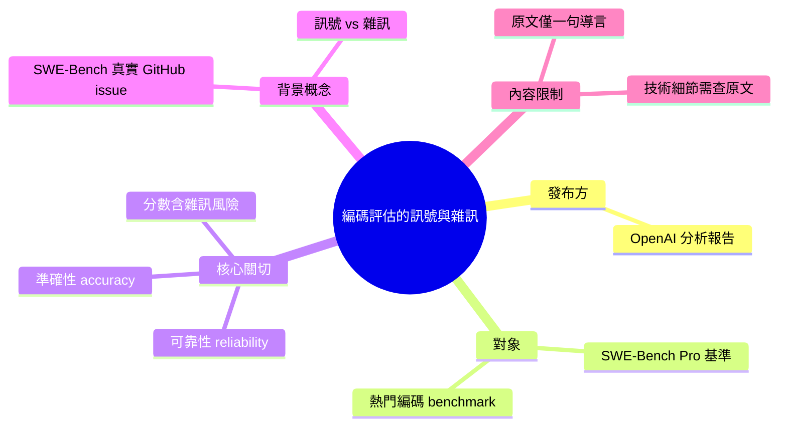

## Separating signal from noise in coding evaluations

OpenAI 發佈分析報告，指出廣為使用的 SWE-Bench Pro 編碼基準測試存在重大缺陷。該報告質疑了 SWE-Bench Pro 在評估 AI 模型編碼能力上的可靠性與準確性。這引發了業界對現有 AI 編碼評估基準有效性的廣泛關注。詳細的技術發現、問題根源與改進建議未在現有摘要中展開。

### 重點
- SWE-Bench Pro 基準測試存在可靠性與準確性問題
- 對 AI 模型編碼能力評估的信效度產生質疑

**原文：** [openai-blog](https://openai.com/index/separating-signal-from-noise-coding-evaluations)

---

<!-- deep-analysis:begin -->
> ⚠️ **內容完整性說明**：本次擷取到的原文（`body_md`）僅包含標題與一句導言，並未包含 OpenAI 這份分析的具體技術發現、問題根源與改進建議。為遵守「不捏造」原則，以下整理只還原原文明確陳述的內容，並補充可查證的背景知識，不會虛構 OpenAI 的實際結論。若需細節，請點原文連結。

## 📌 摘要 (TL;DR)

- OpenAI 發布一則名為〈Separating signal from noise in coding evaluations〉（在編碼評估中區分訊號與雜訊）的分析。
- 該分析指出廣泛使用的編碼基準 **SWE-Bench Pro** 存在問題（issues），可能影響評估結果。
- 核心關切是：這些問題會削弱該基準在衡量 AI 模型編碼能力時的**可靠性（reliability）與準確性（accuracy）**。
- 對讀者的意義：若熱門基準本身有瑕疵，各家模型的「編碼能力排行」可能部分反映的是雜訊而非真實能力。
- ⚠️ 原文導言僅一句話，具體是哪些缺陷、如何量化、OpenAI 建議如何修正，**未在擷取內容中出現**，無法在此展開。

## 🎯 核心概念

- **SWE-Bench**：一套以真實 GitHub issue 為題目、要求模型自動產出修補程式（patch）並通過原專案測試的軟體工程基準，用來衡量 AI 解決真實程式問題的能力。*（此為公開背景知識，非本篇原文陳述。）*
- **SWE-Bench Pro**：SWE-Bench 的進階／加難版本，題目難度與工程情境更貼近真實開發，常被拿來比較各家前沿模型的編碼表現。*（背景補充，本篇原文未描述其設計細節。）*
- **訊號與雜訊（signal vs. noise）**：標題隱含的主張——基準分數中真正代表模型能力的部分（訊號）需要與測試設計缺陷、資料問題等干擾（雜訊）分離開來。

## 📖 整理分析

### 1. 原文實際陳述的內容
原文明確表達的只有一件事：OpenAI 的一份新分析（a new analysis）發現 SWE-Bench Pro 這個熱門編碼基準存在問題，並因此對「用它評估 AI 模型」的可靠性與準確性提出疑慮。導言未列出任何數字、案例或具體缺陷類型。

### 2. 為什麼「基準有缺陷」值得關注
編碼基準的分數是業界比較模型（如各家前沿模型的 SWE-Bench 得分）的主要依據之一。若基準本身在題目品質、測試判定、資料污染或評分方式上有系統性問題，則排行榜的高低差可能無法真實反映能力差距。標題「區分訊號與雜訊」正是點出此風險，但**具體是哪一類問題，原文擷取內容並未說明**。

### 3. 內容限制與後續查證
本篇整理受限於來源只提供標題＋一句摘要，因此無法忠實還原 OpenAI 的方法論、發現數據與建議。要獲得完整結論，需回到原文（openai.com/index/separating-signal-from-noise-coding-evaluations）閱讀正文與圖表。任何超出上述一句話的「技術細節」都應視為尚未取得，而非本文能提供的資訊。

## 🧠 Mindmap

<!-- deep-analysis:end -->
### 📄 原文內容

點此展開 / 收合

A new analysis from OpenAI reveals issues in SWE-Bench Pro, a popular coding benchmark, raising concerns about reliability and accuracy in evaluating AI models.

