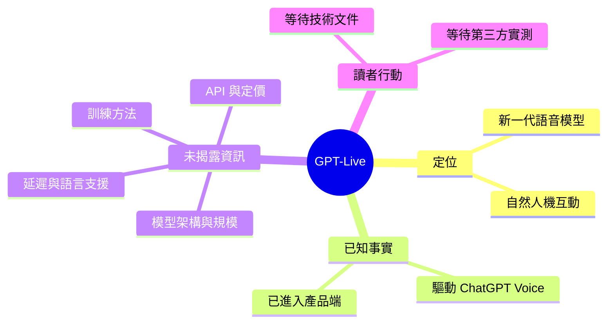

## Introducing GPT-Live

OpenAI 推出 GPT-Live，新一代語音模型產品，用於實現自然流暢的人機交互體驗。GPT-Live 已集成到 ChatGPT Voice 中，驅動其語音對話功能。這代表了 OpenAI 在語音 AI 能力上的最新進展，是基礎模型家族的重要擴展。產品的技術架構、模型規模、訓練方法與功能邊界的詳細信息未披露。

### 重點
- 新產品：GPT-Live 新一代語音模型
- 應用場景：ChatGPT Voice 語音交互
- 核心特性：自然人機互動能力

**原文：** [openai-blog](https://openai.com/index/introducing-gpt-live)

---

<!-- deep-analysis:begin -->
## 📌 摘要 (TL;DR)

- OpenAI 發布 **GPT-Live**，官方定位為「新一代語音模型」（a new generation of voice models），主打自然的人機語音互動（natural human-AI interaction）。
- GPT-Live 目前已用於驅動 **ChatGPT Voice**，也就是 ChatGPT 的語音對話功能。
- ⚠️ 原文為極短的公告（實質僅一句話），**未揭露**模型架構、參數規模、訓練方法、延遲、支援語言、上線區域或定價等任何技術細節。
- 對讀者而言：這是 OpenAI 語音 AI 產品線的品牌化與升級訊號，但要評估實際能力，仍需等待後續的技術文件、模型卡或第三方實測。

## 🎯 核心概念

- **GPT-Live**：OpenAI 新一代語音模型，訴求「自然的人機互動」。
- **ChatGPT Voice**：ChatGPT 的語音對話功能，官方表示現由 GPT-Live 驅動。

## 📖 整理分析

### 1. 公告內容極為精簡
本篇原文僅有一句話：「A new generation of voice models for natural human-AI interaction, now powering ChatGPT Voice.」除了「新一代語音模型」與「已驅動 ChatGPT Voice」兩項事實外，沒有提供任何可量化的規格或功能說明。因此本整理不對其效能、延遲或多語支援等做任何數字性描述，以免捏造。

### 2. 已知的兩項事實
可確認的資訊只有兩點：一是 GPT-Live 被 OpenAI 定位為「voice models」（語音模型）系列的新一代；二是它「now powering ChatGPT Voice」，即已實際部署於 ChatGPT 的語音對話。這代表 GPT-Live 並非純研究預告，而是已進入產品端的模型。

### 3. 尚未揭露的關鍵資訊
以下項目在原文中**完全缺席**，讀者在做採用或比較決策時需特別留意：模型規模與架構、訓練資料與方法、端到端延遲、支援語言數量、與前代語音方案的差異、開放的 API／SDK 存取方式、以及計費與可用地區。（這段為對缺口的整理，非推測其答案。）

### 4. 合理的脈絡推論（標註為推論）
**這是推論**：從命名「Live」可推測其重點在即時、低延遲的即時對話體驗；而「powering ChatGPT Voice」暗示它是消費端語音功能的底層引擎。但在 OpenAI 釋出更多資料前，這些僅屬合理猜測，不應視為事實。

## 🧠 Mindmap

<!-- deep-analysis:end -->
### 📄 原文內容

點此展開 / 收合

A new generation of voice models for natural human-AI interaction, now powering ChatGPT Voice.

