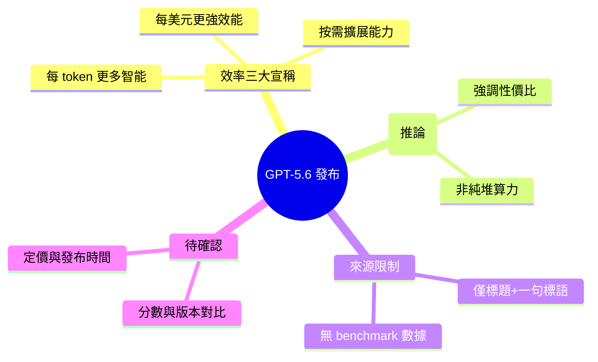

## GPT-5.6: Frontier intelligence that scales with your ambition

OpenAI 發布 GPT-5.6 官方介紹，強調三個核心優勢：(1) 每 token 的智能密度提升（more intelligence from every token），(2) 單位成本的性能改善（stronger performance per dollar），(3) 可按需擴展的能力層級。這些改進旨在為用戶在最困難的工作場景中提供更高效和經濟的 AI 支持。

### 重點
- 每 token 智能密度提升
- 性能成本比改善（performance per dollar）
- 按需能力擴展的設計

**原文：** [openai-blog](https://openai.com/index/gpt-5-6)

---

<!-- deep-analysis:begin -->
> ⚠️ 依據說明：本則來源（OpenAI 官方頁面）目前僅含**標題與一句行銷標語**，未提供任何 benchmark 分數、發布日期、定價或架構細節。以下整理嚴格依據原文與 brief 摘要，不補入未經證實的數字；標示「推論」處為分析判斷而非原文事實。

## 📌 摘要 (TL;DR)

- OpenAI 發布 GPT-5.6 官方介紹頁，主標語為「隨你的企圖心而擴展的前沿智能」（Frontier intelligence that scales with your ambition）。
- 官方主打三項核心宣稱：每個 token 產出更多智能（more intelligence from every token）、每一美元換得更強效能（stronger performance per dollar）、可按需取用更多能力（more capability on demand）。
- 這則來源的實際文字量極少，僅有標題與一句 tagline，**沒有給出任何可驗證的效能數據、版本對比或技術規格**。
- 值得讀者關注的方向：三項宣稱都圍繞「效率」（token 效率、成本效率、彈性擴展），而非單純堆疊算力——實際數據需待官方完整頁面或第三方測試釋出後確認。

## 🎯 核心概念

- **每 token 智能密度（more intelligence from every token）**：在相同 token 消耗下，模型產出更高品質或更多有效資訊的能力。
- **每美元效能（performance per dollar）**：以單位花費衡量的實際任務表現，強調成本效益而非原始算力。
- **按需能力（capability on demand）**：依任務難度動態取用不同能力層級（brief 摘要將其描述為「可按需擴展的能力層級」）。

## 📖 整理分析

### 1. 來源內容的實際範圍
本則原文僅有兩行：標題與一句 tagline「More intelligence from every token, stronger performance per dollar, and more capability on demand for your hardest work.」原文未附任何 benchmark 表格、模型卡、發布日或價格。因此本整理無法（也不應）提供具體分數對比——這是誠實標註，避免捏造數字。

### 2. 三大宣稱拆解
第一項「每個 token 更多智能」訴求推理密度提升；第二項「每美元更強效能」訴求成本效益；第三項「按需更多能力」訴求可依最困難工作（hardest work）動態擴展。三者共同構成「效率三角」，是這次官方訊息的全部可辨識內容。

### 3. 定位與策略訊號（推論）
**這是推論**：三項宣稱都以「效率 / 每單位產出」為框架，而非強調「絕對更聰明」，暗示 OpenAI 這次的行銷重點放在**單位 token 與單位成本的性價比**，以及讓使用者按需求選擇能力層級。此判斷僅來自標語措辭，並非原文明述的策略聲明。

### 4. 尚待確認的資訊
以下項目在來源中**完全缺失**，需等待官方完整頁面或獨立評測補齊：具體 benchmark（如 SWE-Bench、程式 / 推理測試）分數、與前代 GPT-5.x 的量化對比、context 長度、定價（每百萬 token 成本）、發布 / 開放時間、API 與產品線可用性。在取得這些資料前，任何效能提升幅度都無法量化。

## 🧠 Mindmap

<!-- deep-analysis:end -->
### 📄 原文內容

點此展開 / 收合

More intelligence from every token, stronger performance per dollar, and more capability on demand for your hardest work.

