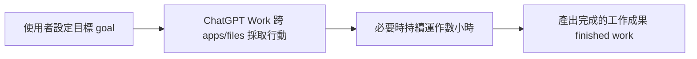
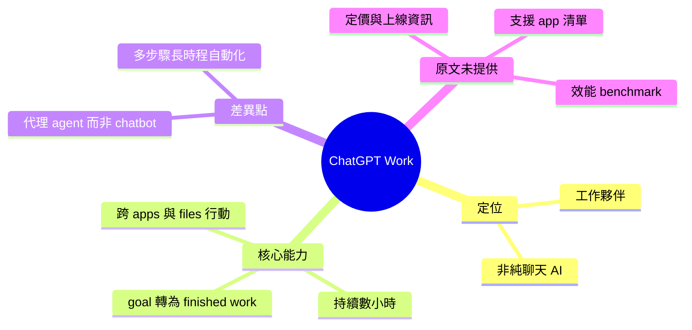

## ChatGPT is now a partner for your most ambitious work

OpenAI 推出 ChatGPT Work，一個能夠跨應用和文件採取行動的 agent 產品。該 agent 可在一個項目上工作數小時，將目標自動轉化為完成的工作成果。相比傳統對話式 AI，ChatGPT Work 強調多步驟、長時間的任務自動化和跨系統整合能力。

### 重點
- ChatGPT Work 是可跨應用和文件操作的 agent
- 支持數小時級別的長時間項目工作
- 自動將目標轉化為完成的工作成果

**原文：** [openai-blog](https://openai.com/index/chatgpt-for-your-most-ambitious-work)

---

<!-- deep-analysis:begin -->
## 📌 摘要 (TL;DR)

- OpenAI 發布 **ChatGPT Work**，定位為能「跨應用程式與檔案採取行動」的代理（agent），而非只回覆文字的對話式 AI。
- 官方點名的核心能力有三：可跨你的 apps 與 files 採取行動、必要時能在同一個專案上持續運作「數小時」、以及把一個目標（goal）自動轉化為完成的工作成果（finished work）。
- 對讀者的意義：這代表 OpenAI 把 ChatGPT 的敘事從「聊天助手」推向「長時程、多步驟的自主工作夥伴」。
- ⚠️ 誠實說明：本則原文為極短公告（正文僅一句核心描述），下方整理嚴格依官方公布文字，未提及的細節（定價、支援的具體 app 清單、效能 benchmark、上線時間）原文並未提供，本文不做臆測。

## 🎯 核心概念

- **代理（agent）**：能自主規劃並執行多步驟行動的 AI 系統，而非僅產出單次回覆。
- **跨應用行動（take action across your apps and files）**：可操作使用者的多個應用程式與檔案，作業範圍不再局限於聊天視窗。
- **完成的工作成果（finished work）**：以「交付結果」為目標，而非只提供建議或草稿。

## 📖 整理分析

### 1. 從對話助手到工作夥伴
原文標題直接把 ChatGPT 定位為「你最有野心工作的夥伴（a partner for your most ambitious work）」。相較過去以問答與生成內容為主的體驗，這裡的關鍵詞是 **take action**（採取行動）與 **finished work**（完成的成果），敘事重心從「回答」轉向「執行並交付」。

### 2. 官方明確點名的三項能力
依正文那句描述，可拆出三個可驗證的宣稱：一是**跨系統行動**——在使用者的多個 apps 與 files 之間操作；二是**長時程持續性**——必要時可在一個專案上停留數小時（stay with a project for hours if needed）；三是**目標導向自動化**——輸入一個 goal，輸出被轉化為完成的工作。這三點共同構成 agent 相對於傳統 chatbot 的差異。

### 3. 原文尚未提供的資訊
這則公告本質上是一句話的產品定位宣示。它沒有交代 ChatGPT Work 支援哪些具體應用、如何取得檔案存取權限、安全與權限控管機制、可用地區、定價方案，也沒有任何量化的成功率或 benchmark。因此對於「它實際能做到什麼程度」，需等待 OpenAI 後續的完整文件或實測才能判斷，本文不對這些空白做補完。

## 🧭 流程圖 / 架構圖

以下流程僅根據原文那句描述（goal → 跨 apps/files 執行 → 數小時 → finished work）繪製，非額外推測：

## 🧠 Mindmap

<!-- deep-analysis:end -->
### 📄 原文內容

點此展開 / 收合

ChatGPT Work is an agent that can take action across your apps and files, stay with a project for hours if needed, and turn a goal into finished work.

