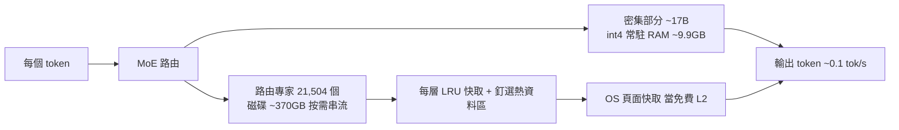
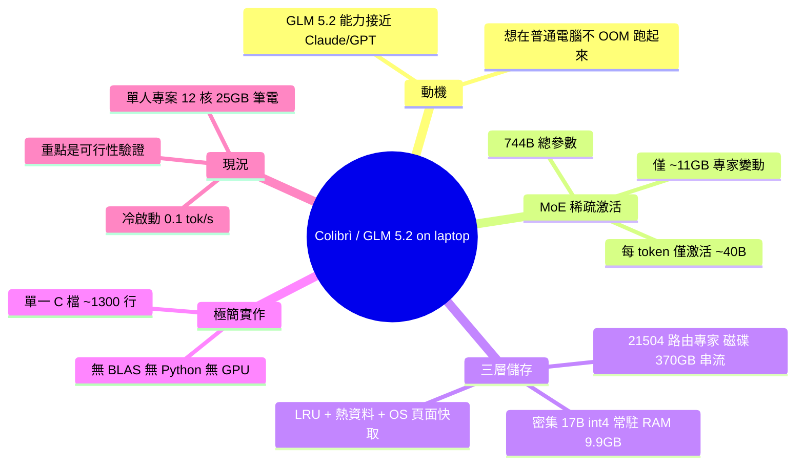

## Show HN: Getting GLM 5.2 running on my slow computer

開發者利用 int4 量化技術和 MoE 動態激活機制，成功在 32GB RAM 的普通筆記本上運行 GLM 5.2 模型，並創建了開源專案 Colibrì。該 744B 參數的模型設計巧妙，每個 token 僅激活約 40B 參數，顯著降低推理所需內存。模型架構分三層存儲：密集部分 (~17B 參數) 以 int4 格式驻留 RAM 中 (~9.9GB)，21,504 個路由專家 (~370GB) 存儲於磁盤並按需流式傳輸，配合 LRU 緩存和 OS 頁面緩存進行多層優化。整個推理引擎實現為單個 C 文件 (~1,300 行)，無 BLAS 依賴、無 Python 運行時、無 GPU 需求，體現了極高的工程效率。冷啟動速度雖低至 0.1 tok/s（受筆記本性能限制），但驗證了大型 MoE 模型在資源受限環境中的實用可行性。

### 重點
- MoE 動態激活設計：744B 參數模型僅激活 ~40B 參數/token，通過稀疏計算大幅降低推理內存需求
- 分層存儲架構：密集部分 int4 驻 RAM (~9.9GB) + 路由專家流式磁盤 (~370GB) + LRU 緩存 + OS 頁面緩存，充分利用多層存儲層級
- 輕量實現方案：純 C (~1,300 行)，無額外依賴與 GPU 需求，單人在資源受限環境驗證，降低部署與移植成本

**原文：** [hackernews](https://github.com/JustVugg/colibri)

---

<!-- deep-analysis:begin -->
## 📌 摘要 (TL;DR)

- 開發者 JustVugg 發布開源專案 **Colibrì**，成功在一台 12 核心、25GB RAM 的普通筆電上跑起 744B 參數的 GLM 5.2 模型（開場自述用的是 32GB RAM 的機器）。
- 核心是混合專家（Mixture-of-Experts，MoE）的稀疏激活：744B 總參數，但每個 token 僅激活約 40B，其中只有約 11GB（路由專家部分）會在 token 之間變動。
- 採三層儲存：密集部分（~17B 參數）以 int4 常駐 RAM（~9.9GB）；21,504 個路由專家（~370GB）放在磁碟按需串流，搭配 LRU 快取與 OS 頁面快取。
- 整個推理引擎是**單一 C 檔案**（`c/glm.c`，約 1,300 行）加少量標頭檔，無 BLAS、無 Python runtime、無 GPU。
- 冷啟動速度僅 0.1 tok/s，作者坦言速度不是重點，目的是驗證「大型 MoE 模型在資源受限環境仍跑得起來」的可行性。

## 🎯 核心概念

- **混合專家 (Mixture-of-Experts, MoE)**：模型內含大量「專家」子網路，每個 token 只路由激活其中一小部分，因此總參數可以極大但單次推理計算量很小。
- **int4 量化 (int4 quantization)**：把權重壓成 4-bit 整數，大幅降低記憶體佔用（作者用來把密集部分壓到 ~9.9GB）。
- **密集部分 (dense part)**：注意力、共享專家、嵌入層等每次都會用到的參數（~17B），常駐 RAM。
- **路由專家 (routed experts)**：按 token 動態選用的專家，數量龐大（21,504 個），放磁碟串流讀取。
- **LRU 快取 (Least Recently Used cache) 與 OS 頁面快取**：多層快取機制，把磁碟上的專家用「當免費 L2 快取」的方式加速重複存取。

## 📖 整理分析

### 1. 起心動念：能不能在普通電腦跑
作者試用 GLM 5.2 後，認為其能力與安全性接近 Claude 或 GPT，感到驚訝。接著產生兩個問題：「像我這樣的普通電腦跑得動嗎？」以及「會不會直接 OOM（記憶體不足）？」於是借助 agents 開始實驗，把模型轉成 int4、研究 MTP 用法，並嘗試為長上下文實作 DSA。

### 2. MoE 的稀疏激活是關鍵
 Colibrì 的核心洞察在於：一個 744B 的 MoE 模型，每個 token 其實只激活約 40B 參數，而這 40B 中真正會「換來換去」的路由專家只佔約 11GB。這意味著大部分權重在單步推理中是閒置的，不必全部塞進 RAM——這是能在筆電上運行的前提。

### 3. 三層儲存架構
作者把模型拆成三層來管理記憶體：**密集部分**（注意力、共享專家、嵌入，約 17B 參數）以 int4 常駐 RAM，約佔 9.9GB；**21,504 個路由專家**（75 個 MoE 層 × 256 專家，加上 MTP head，每個 int4 約 19MB，合計約 370GB）存在磁碟，按需串流讀取。串流搭配每層 LRU 快取、可選的釘選熱資料區（pinned hot-store），以及作業系統頁面快取充當免費的第二層快取。

### 4. 極簡工程實作
整個推理引擎被實作為**單一 C 檔案** `c/glm.c`（約 1,300 行）加上少量標頭檔。刻意不依賴 BLAS 線性代數庫、執行期不需要 Python、也不需要 GPU。作者說明不用 GPU 的原因很直接——他自己沒有這類硬體，因此也無法在比自己筆電更強的機器上測試。

### 5. 效能現實與定位
這是一個單人專案，全程在 12 核心、25GB RAM 的筆電上撰寫與測試，文中所有數字都是作者在家能量測的上限。冷啟動速度只有 0.1 tok/s，速度顯然不實用，但作者強調重點是「過程」與「不計代價讓它跑起來」的驗證。他開放歡迎任何回饋，也歡迎有人加入專案。

## 🧭 架構圖

## 🧠 Mindmap

<!-- deep-analysis:end -->
### 📄 原文內容

點此展開 / 收合

A few days ago I found myself trying out GLM 5.2 and was really positively impressed. The capabilities and security I was getting from this LLM are similar to those I&#x27;ve gotten from models like Claude or GPT, and this really surprised me. But then I thought, &quot;I wonder how it would work on a normal computer like mine,&quot; and above all, &quot;I wonder if it would work without going into OOM on a computer like mine.&quot; So I started working with the help of agents to test this possibility. I started converting the model to int4, understanding MTP usage, and if possible implementing DSA for long context. How it responds in int4 and whether the quality is maintained or not. Until I got to the point, on my computer with 32GB of RAM, I was able to communicate with GLM 5.2 with times that, of course, aren&#x27;t high in cold start, but even then, we&#x27;re talking about 0.1 tok&#x2F;s, but that wasn&#x27;t important to me. The important thing was the journey to reach this goal. I just wanted it to work at all costs, even slowly. So I created Colibrì, which was born from a very simple idea, to be honest, but tested in every way, where a 744B Mixture-of-Experts model activates only ~40B parameters per token—and only ~11 GB of those change from token to token (the routed experts). So: The dense part (attention, shared experts, embeddings—~17B params) stays resident in RAM at int4 (~9.9 GB); The 21,504 routed experts (75 MoE layers × 256 experts + the MTP head, ~19 MB each at int4) live on disk (~370 GB) and are streamed on demand, with a per-layer LRU cache, an optional pinned hot-store, and the OS page cache as a free L2. The engine is a single C file (c&#x2F;glm.c, ~1,300 lines) plus small headers. No BLAS, no Python at runtime, no GPU.No GPU or serious hardware because I don&#x27;t have that hardware so I can&#x27;t test it on hardware that is more powerful than my computer.Colibrì is a one-person project, written and tested entirely on a 12-core laptop with 25 GB of RAM — the numbers above are the ceiling of what I can measure at home. Any feedback is welcome! (and if anyone wanted to participate in the project I would be delighted) Repo: https:&#x2F;&#x2F;github.com&#x2F;JustVugg&#x2F;colibri

