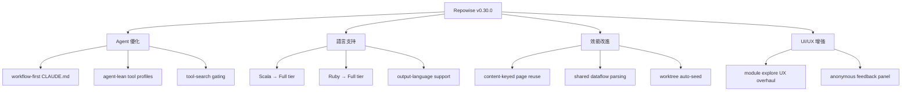

## v0.30.0

Repowise v0.30.0 發布多項 agent 友善與效能優化。重點包括 workflow-first CLAUDE.md 支持、agent-lean 工具配置檔案、MCP payload 精度提升，以及 Scala 和 Ruby 語言支持升級至完整層級。模組圖視覺化重構引入 settled layout 和分層節點資訊；內容雜湊快取機制（content-keyed page reuse）實現跨執行的頁面重用，降低重複生成成本。新增 formatBytes / formatPercent 格式化工具與匿名回饋面板。

### 重點
- Workflow-first CLAUDE.md 與 agent-lean tool profile：架構轉向代理優先設計（#742, #744）
- 內容雜湊快取（content-keyed page reuse）跨執行避免重複生成，降低計算成本（#757）
- Scala / Ruby 升級到 Full tier，LanguageNodeMap + 性能方言完整支持（#745, #749）

**原文：** [repowise-releases](https://github.com/repowise-dev/repowise/releases/tag/v0.30.0)

---

### 📄 原文內容

點此展開 / 收合

# v0.30.0

What's Changed 
 
 docs: restructure and refresh user-facing documentation by @RaghavChamadiya in #741 
 feat(mcp): payload precision and workflow-first CLAUDE.md by @RaghavChamadiya in #742 
 feat(hooks): SessionStart context block, safe-pipeline distill rewrites, doctor registration check by @RaghavChamadiya in #743 
 feat(mcp): agent-lean tool profile, tool-search gating, registry-pinned docs by @RaghavChamadiya in #744 
 feat(ui): add formatBytes and formatPercent formatters by @Ayush7614 in #680 
 feat(health): promote Scala to Full tier (LanguageNodeMap + perf dialect) by @RaghavChamadiya in #745 
 feat(cli): allow seeding worktree index from base branch by @paarthsikka in #655 
 fix(update): persist decay_only staleness and recompute total_pages from the DB by @RaghavChamadiya in #748 
 feat(cli): auto-seed git worktrees from their base checkout by @RaghavChamadiya in #747 
 feat(health): promote Ruby to Full tier (LanguageNodeMap + perf dialect) by @RaghavChamadiya in #749 
 feat(workspace): detect socket contracts by @joptimus in #710 
 feat(stats): biggest commit, longest streak, dependencies, most-imported award by @RaghavChamadiya in #752 
 feat(graph): module explore UX overhaul - settled layout, externals toggle, layered node info by @RaghavChamadiya in #754 
 feat(health): share one dataflow parse per file across consumers by @RaghavChamadiya in #755 
 feat(generation): first-class output-language support for generated docs by @RaghavChamadiya in #756 
 fix(upgrade): sync bundled changelog with docs by @RaghavChamadiya in #762 
 fix(workspace): make cross-repo co-change a bounded session-share signal by @RaghavChamadiya in #758 
 fix(health): count TS object-literal shorthand properties as reads by @RaghavChamadiya in #759 
 feat(generation): reuse unchanged pages across runs via file content hash by @swati510 in #757 
 fix(health): stop flagging reachable code as unreachable in the dataflow CFG by @RaghavChamadiya in #760 
 feat(web): anonymous feedback panel in dashboard by @RaghavChamadiya in #763 
 release: v0.30.0 — content-keyed page reuse, output languages, worktree auto-seed by @swati510 in #764 
 
 New Contributors 
 
 @paarthsikka made their first contribution in #655 
 
 Full Changelog : v0.29.0...v0.30.0

