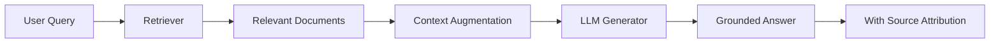

## Everything About RAG — Part 1 - Basics of RAG

『Everything About RAG』是一個系列教程文章，本篇為第一部分，標題『Basics of RAG』明確定位為基礎教程。RAG 全稱為檢索增強生成，文章闡述其核心機制：chatbot 利用可信知識庫提供答案，相比純 LLM 生成的結果更準確且可追溯到具體來源。RAG 技術透過檢索真實文檔、增強上下文、再進行生成的流程，有效解決了傳統 LLM 的幻覺 / 虛構問題。本篇適合初接觸此技術的讀者。

### 重點
- RAG chatbot 基於可信知識庫生成答案，相比純 LLM 生成更準確且可追溯到來源
- RAG 解決 LLM 幻覺問題的核心方法：檢索真實文檔 → 增強上下文 → 生成回答

**原文：** [medium-tag-llm](https://sid-sharma1990.medium.com/everything-about-rag-part-1-basics-of-rag-c5f0272a5977?source=rss------large_language_models-5)

---

### 📄 原文內容

點此展開 / 收合

---large_language_models-5"
author: "Sandeep Sharma"
published_at: 2026-07-10T13:56:45+00:00
fetched_at: 2026-07-10T22:51:49.084600+00:00
content_hash: "375a13d15dca54fa202d7e094ebe54539117ef7b0243e2821851fbe4381bc94d"
lang: en
caption_quality: None
raw: true
topics: []
---

# Everything About RAG — Part 1 - Basics of RAG

See how a RAG chatbot uses trusted knowledge to deliver more accurate, grounded and source-based answers. Continue reading on Medium »

