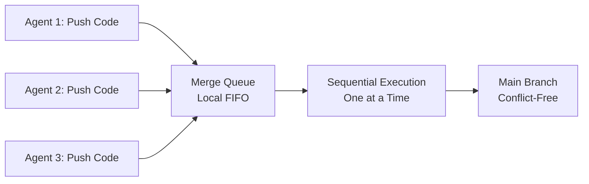

## Make Your Agents Take Turns Pushing Code

Claude Code 最新推出 Merge Queue 工具，這是一個免費的本地部署合併佇列系統。該工具專為 coding agents 工作流設計，核心功能是強制多個 agents 在推送程式碼時順序執行（輪流推送），而非並發推送導致的衝突和 race condition。文章強調『it still runs locally』，表示系統無需依賴外部雲端服務，所有協調和佇列管理都在本地執行。這是 Claude 生態中支持多 agent 協作開發工作流的關鍵基礎設施，簡化了團隊或多 agent 環境下的代碼推送協調。

### 重點
- Claude Code Merge Queue 免費工具，本地部署無外部依賴
- 強制 coding agents 順序推送程式碼，避免並發衝突和 race condition
- 多 agent 協作開發的關鍵基礎設施

**原文：** [medium-tag-claude](https://itnext.io/make-your-agents-take-turns-pushing-code-3a8958b56f5b?source=rss------claude-5)

---

### 📄 原文內容

點此展開 / 收合

---claude-5"
author: "Jesse Heaslip"
published_at: 2026-07-10T22:35:14+00:00
fetched_at: 2026-07-10T22:51:49.433533+00:00
content_hash: "026e4f214826617fe4a3e6bb6e5bf039f3abd9eb5c916dc76bc5ad76bf6c41fa"
lang: en
caption_quality: None
raw: true
topics: []
---

# Make Your Agents Take Turns Pushing Code

tl;dr &#x2014; Claude Code Merge Queue is a free, local merge queue that forces your coding agents to take turns when they push &#x2014; it still runs&#x2026; Continue reading on ITNEXT »

