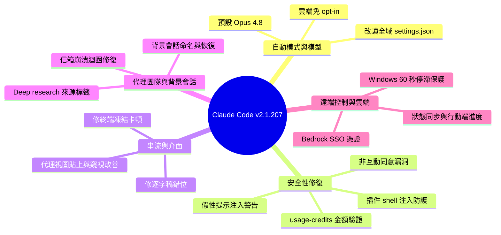

## v2.1.207

Claude Code 發布 v2.1.207，包含超過 20 項修復和改進。首先，Auto mode 現在在 Bedrock、Vertex AI、Foundry 等平台上默認啟用，用戶無需手動 opt-in，但可通過設置禁用。其次，修復了流式傳輸很長的列表、表格或代碼塊時的終端凍結和按鍵延遲問題，這對於處理大型代碼生成任務至關重要。第三，修復了遠端管理設置的嚴重漏洞 — 設置被永久記錄為用戶已同意，但實際上未顯示安全對話，以及虛假提示注入警告。第四，改進了代理視圖交互，包括粘貼文本的折疊展開、會話窺視顯示等待時間。第五，更改默認模型為 Claude Opus 4.8，並修復代理團隊中的崩潰循環、後臺會話狀態丟失、遠端控制會話恢復等多個關鍵問題。最後，新增了插件配置安全檢查，禁止在 shell 形式命令中使用 ${user_config.*}（shell 注入防護）。

### 重點
- v2.1.207 修復流式傳輸長內容時的終端凍結和按鍵延遲；Auto mode 現在在 Bedrock、Vertex AI、Foundry 上默認啟用
- 修復遠端管理設置同意流程漏洞、虛假提示注入警告、代理團隊崩潰循環、後臺會話狀態丟失與遠端控制恢復
- 預設模型切換到 Claude Opus 4.8；新增插件配置安全檢查，禁止 shell 形式命令中的 ${user_config.*}

**原文：** [claude-code-releases](https://github.com/anthropics/claude-code/releases/tag/v2.1.207)

---

<!-- deep-analysis:begin -->
## 📌 摘要 (TL;DR)

- Claude Code 發布 **v2.1.207**，一次帶來 20 多項修復與調整，重點集中在安全性、串流效能與代理團隊（agent teams）穩定性。
- **自動模式（Auto mode）** 現在於 Bedrock、Vertex AI、Foundry 上免除 `CLAUDE_CODE_ENABLE_AUTO_MODE` opt-in 即可使用，改用設定中的 `disableAutoMode` 關閉；同時 Bedrock、Vertex、AWS 上的 Claude Platform 預設模型升為 **Claude Opus 4.8**。
- 修復多個嚴重安全漏洞：非互動執行（`claude -p`、SDK）的遠端受管設定會在**未顯示安全同意對話框**下被永久記錄為已同意；插件 shell-form 命令中的 `${user_config.*}` 現被拒絕以防 shell 注入。
- 修復串流很長的清單、表格、段落或程式碼區塊時**終端凍結、按鍵延遲**的問題，對大型程式碼生成任務很關鍵。
- 代理團隊修掉一個「每秒重複報錯直到手動刪除信箱檔」的崩潰迴圈；背景會話與遠端控制（Remote Control）的多項恢復與狀態同步問題也一併修正。

## 🎯 核心概念

- **自動模式（Auto mode）**：讓 Claude Code 較自主地執行任務的模式，本版在雲端平台改為免 opt-in。
- **代理團隊（agent teams）**：多個背景代理協作的機制，透過信箱（mailbox）訊息互通。
- **遠端控制（Remote Control）**：從手機 / 網頁監看與操作桌面 App 所主持會話的功能。
- **提示注入（prompt injection）**：外部內容試圖竄改模型指令的攻擊；本版修掉誤報。
- **Shell 注入（shell injection）**：把使用者設定值直接插入 shell 命令字串造成的注入風險。
- **工作樹（worktree）**：Git 讓同一 repo 檢出多個工作目錄的功能。

## 📖 整理分析

### 1. 自動模式與預設模型調整

自動模式在 Bedrock、Vertex AI、Foundry 上不再需要 `CLAUDE_CODE_ENABLE_AUTO_MODE` 才能開啟，要停用改設 `disableAutoMode`。同時自動模式**不再從 repo 內的 `.claude/settings.local.json` 讀取 `autoMode`**，一律改讀 `~/.claude/settings.json`，避免專案層設定影響全域行為。此外 Bedrock、Vertex 及 AWS 上的 Claude Platform **預設模型改為 Claude Opus 4.8**。

### 2. 一組重要的安全性修復

本版處理數個安全問題：非互動執行（`claude -p`、SDK）的遠端受管設定，過去會在**從未彈出安全同意對話框**的情況下被永久記錄為「已同意」，現已修正；由良性的系統自動對話更新觸發的**假性提示注入警告**也不再誤報。插件層面，hooks / monitors / MCP `headersHelper` 的 shell-form 命令中使用 `${user_config.*}` 現被拒絕（shell 注入修補）—hooks 應改用 exec 形式（args 陣列）或 `$CLAUDE_PLUGIN_OPTION_<KEY>`，monitors 與 headersHelper 則在腳本內部讀值。插件選項值（`pluginConfigs`）也不再從專案層 `.claude/settings.json` 讀取，只信任使用者層、`--settings` 與受管設定。最後，`/usage-credits` 金額輸入不再把格式錯誤的值（例如貼上的時間戳）默默截成數字，改為直接報錯，且**超過 $1,000 需鍵入確認**。

### 3. 串流效能與介面體驗

修復了串流內容包含很長的清單、表格、段落或程式碼區塊時，**終端凍結、按鍵輸入延遲**的問題；另一個修復是回應串流結束後**逐字稿跳到答案起點之上**的錯位。代理視圖（agent view）也有兩項改善：再次貼上相同文字現在會展開折疊的 `[Pasted text #N]` 佔位符，而非新增第二個；被阻擋的會話窺視（peek）現在會**先顯示問題本身**，並以文字化的過期時鐘（如 `waiting 3m`）取代重複顯示同一時間戳。

### 4. 代理團隊與背景會話穩定性

代理團隊中一個崩潰迴圈被修掉：畸形的隊友信箱訊息會導致**每秒重複報錯，直到手動刪除信箱檔**才停止。背景會話方面，透過接受計畫而自動命名的會話，現在會在代理視圖列上正確顯示該名稱；進入 git worktree 的背景會話在冷重啟後從代理清單恢復時**不再空白**。深度研究（Deep research）執行時把 Fetch 階段每個代理標記為「unknown」的問題也已修正—晶片標籤現在顯示來源主機名稱。

### 5. 遠端控制與雲端平台修復

遠端控制在連線從網路中斷或憑證刷新後恢復時，**任務狀態更新遺失**的問題已修正；由桌面 App 主持的遠端控制會話，現在能在手機與網頁上顯示背景代理與工作流程進度。雲端平台方面，Bedrock 過去每次 API 請求都向 IAM Identity Center 索取新的 AWS SSO 憑證的問題已修；Windows 上當 AWS 憑證解析卡住（例如 `credential_process` 卡死）造成的無限期掛起，現在會由 **60 秒停滯保護**觸發而非永久等待。其餘還包含：自動更新器覆寫 `~/.local/bin/claude` 自訂啟動腳本 / 符號連結（`/doctor` 現會回報外部受管啟動器）、`cd` 複合命令僅重導向到 `/dev/null` 時仍索取權限、`extensions.worktreeConfig` 殘留在 `.git/config`（破壞 `tea` 等 go-git 工具），以及 rules globs、skill 路徑、`.ignore`、`.worktreeinclude` 中畸形括號樣式破壞檔案讀取等問題。

## 🧠 Mindmap

<!-- deep-analysis:end -->
### 📄 原文內容

點此展開 / 收合

What's changed 
 
 Auto mode is now available without CLAUDE_CODE_ENABLE_AUTO_MODE opt-in on Bedrock, Vertex AI, and Foundry; disable via disableAutoMode in settings 
 Fixed the terminal freezing and keystrokes lagging while streaming responses containing very long lists, tables, paragraphs, or code blocks 
 Fixed remote managed settings from a non-interactive run ( claude -p , the SDK) being permanently recorded as consented without ever showing the security consent dialog 
 Fixed spurious prompt-injection warnings triggered by benign system-generated conversation updates 
 Fixed the auto-updater overwriting a custom launcher script or symlink at ~/.local/bin/claude on every release; /doctor now reports an externally managed launcher 
 Fixed compound commands with cd prompting for permission when the only output redirect was to /dev/null 
 Fixed the transcript jumping above the start of the answer when a response finishes streaming 
 Fixed extensions.worktreeConfig being left in the repo's .git/config (breaking go-git tools like tea ) after the last worktree.sparsePaths worktree was removed 
 Fixed malformed bracket patterns in rules globs, skill paths, .ignore , and .worktreeinclude breaking file reads, file suggestions, and worktree creation 
 Fixed a crash loop in agent teams where a malformed teammate mailbox message caused repeated errors every second until the mailbox file was manually deleted 
 Fixed background sessions auto-named by accepting a plan not showing that name on their agent-view row 
 Fixed background sessions that entered a git worktree resuming blank after a cold reopen from the agent list 
 Fixed Remote Control task status updates being lost when the connection recovered from a network interruption or credential refresh 
 Fixed Remote Control sessions hosted by the desktop app not showing background agent and workflow progress on mobile and web 
 Fixed Deep research runs labeling every Fetch-phase agent "unknown" — chips now show the source hostname 
 Fixed Bedrock repeatedly requesting fresh AWS SSO credentials from IAM Identity Center on every API request 
 Improved agent view: pasting the same text again now expands the collapsed [Pasted text #N] placeholder instead of adding a second one 
 Improved agent view: blocked session peeks now lead with the question and show a worded staleness clock ( waiting 3m ) instead of the same timestamp twice 
 Changed Bedrock, Vertex, and Claude Platform on AWS to default to Claude Opus 4.8 
 Changed auto mode to no longer read autoMode from .claude/settings.local.json (repo-resident); use ~/.claude/settings.json instead 
 Fixed an indefinite hang on Windows when AWS credential resolution stalls (e.g. a stuck credential_process ): the 60-second stall guard now fires instead of waiting forever. 
 Plugin hooks/monitors/MCP headersHelper: ${user_config.*} in shell-form commands is now rejected (shell-injection fix). Hooks: use exec form ( args array) or $CLAUDE_PLUGIN_OPTION_&lt;KEY&gt; ; monitors and headersHelper: read the value inside the script (config file or the server's env block). 
 Plugin option values ( pluginConfigs ) are no longer read from project-level .claude/settings.json ; only user, --settings , and managed settings are honored 
 Fixed /usage-credits amount inputs silently stripping malformed values (e.g. a pasted timestamp) to digits; malformed amounts are now rejected with an error, and amounts over $1,000 require a typed confirmation

