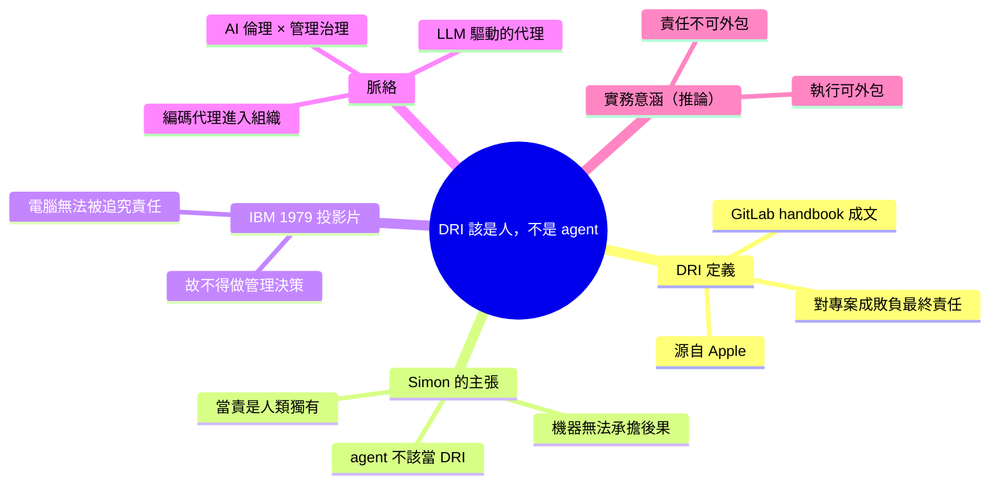

## Directly Responsible Individuals (DRI)

Simon Willison 探討 Directly Responsible Individuals (DRI) 這個源自 Apple、在 GitLab 等公司推行的管理原則——即「對特定專案、倡議或活動的成功或失敗最終負責的人」。他提出在 LLM 賦能的 agent 時代，AI agent 不應該被指定為任何專案的 DRI，因為「人能對自己的行動負責，機器無法」。文中引用 IBM 1979 年訓練投影片的經典論述：「電腦永遠無法被追究責任，因此電腦絕不應該做管理決策。」這一觀點在 AI 企業應用和組織治理快速發展的當下尤其相關。

### 重點
- DRI（Directly Responsible Individual）為 Apple 創立、GitLab 推行的管理制度，明確單一人對成敗負責，但不應套用於 AI agent
- AI agent 無法承擔「終極責任」，因此不能作為專案 DRI，需保有人類決策責任層
- IBM 1979 年即提出「電腦無法被究責，故不應做管理決策」的原則——仍適用於現代 LLM 時代

**原文：** [simon-willison](https://simonwillison.net/2026/Jul/12/directly-responsible-individuals/#atom-everything)

---

<!-- deep-analysis:begin -->
## 📌 摘要 (TL;DR)

- Simon Willison 在找「直接負責人」（Directly Responsible Individual，簡稱 DRI）的定義時，發現最好的說明出自 **GitLab handbook**；這個詞最早源自 **Apple**，指「對某個特定專案、倡議或活動的成敗負最終責任的人」。
- 他的核心主張：**AI agent 永遠不該被指定為專案的 DRI**——當責（accountability）是人類獨有的，因為人能為自己的行動負責，機器不能。
- 他把這個立場接回 **IBM 1979 年那張著名的教育訓練投影片**：「電腦永遠無法被追究責任，因此電腦絕不可以做管理決策。」（A computer can never be held accountable, therefore a computer must never make a management decision.）
- 這是一則典型的 Simon 短評（link blog），篇幅極短但直指要害：在大量導入 LLM 驅動的代理（LLM-powered agents）與編碼代理（coding agents）的組織裡，**責任歸屬（who is on the hook）不能隨著執行工作一起外包給模型**。
- 文章標籤涵蓋 `management`、`ai-ethics`、`coding-agents`，說明作者是把它當作「AI 倫理 × 組織治理」的交叉議題在談。

## 🎯 核心概念

- **直接負責人 (Directly Responsible Individual, DRI)**：對一個專案 / 倡議 / 活動的成功或失敗負最終責任的那一個人（原文引用 GitLab handbook 的定義）。
- **當責 (accountability)**：不只是「做這件事」，而是「事情出錯時由你承擔後果」——Simon 認為這正是機器無法具備的性質。
- **LLM 驅動的代理 (LLM-powered agents)**：能自主執行多步驟任務的 AI 系統，是本文討論「能不能當 DRI」的對象。

## 📖 整理分析

### 1. DRI 的出處：Apple 起源、GitLab 成文

Simon 明說他是「去找一個 DRI 的定義」，而**他找到最好的版本在 GitLab handbook**。文中提到這個術語**起源於 Apple**，用來指稱那位「對特定專案、倡議或活動的成敗負最終責任」的人。原文並未進一步展開 GitLab 的實作細節，只是把它當作可靠的定義來源引用。這個詞的重點不是「誰做最多事」，而是「名字被寫在那格上的人是誰」。

### 2. 主張：agent 不能是 DRI

這篇的論點只有一句話，但立場非常明確——Simon 表示他最近一直在思考 DRI 這個詞**在 LLM 驅動的代理如何嵌入人類組織的脈絡下**代表什麼，而他的結論是：**「我不認為 agent 應該被視為任何專案的 DRI。」** 理由是 DRI 對他而言「有種獨屬於人類的特質」（feels uniquely human），因為**人類可以為自己的行動承擔責任，機器不行**。

值得注意的是：他反對的是把 agent 放在**責任位置**上，而不是反對 agent 去做事。原文並沒有主張 agent 不能執行專案工作、寫程式或做決策建議。

### 3. IBM 1979：一句 47 年前的老警語

Simon 在文末補上一個註腳，把讀者導向 **IBM 1979 年那張傳奇的訓練投影片**，上面寫著：「電腦永遠無法被追究責任，因此電腦絕不應該做管理決策。」這句話的邏輯結構其實就是一個乾淨的三段論——**責任 → 前提；無法被追責 → 不得握有決策權**。Simon 引用它，等於是在說：今天大家爭論「AI 能不能做決策」的問題，資訊產業在四十多年前就已經給過一個以「課責性」為判準的答案，而這個判準並沒有因為模型變強而失效。

### 4. 為什麼這則短評值得留意（延伸推論）

> 以下屬於推論，不是原文明說的內容。

原文本身只是一則 link blog（連結短評），沒有給出組織該怎麼落地的具體流程。但把它放進當前的工程實務脈絡看，它其實提供了一條很實用的分界線：**agent 可以承擔多少執行工作是效率問題，但「誰在事故報告上簽名」始終是治理問題**。當團隊開始讓編碼代理自主開 PR、改 schema、部署服務時，這條線決定了出事時的追溯路徑是否存在——如果一個變更的 DRI 欄位填的是模型名稱，那實際上等於沒有人負責。

## 🧠 Mindmap

<!-- deep-analysis:end -->
### 📄 原文內容

點此展開 / 收合

Directly Responsible Individuals (DRI) 
I went looking for a definition of "Directly Responsible Individuals" and the best I found was in the GitLab handbook. Apparently the term originated at Apple, where it's used to describe the person who is "ultimately accountable for the success or failure of a specific project, initiative, or activity". 
 I've been thinking about this term recently in the context of LLM-powered agents and how they fit into human organizations. I don't think an agent should ever be considered the DRI for a project - that's something that feels uniquely human to me, because humans can take accountability for their actions where machines cannot. 
 (See also IBM's legendary 1979 training slide that states "A computer can never be held accountable, therefore a computer must never make a management decision.")

 Tags: apple , management , ai , gitlab , generative-ai , llms , ai-ethics , coding-agents

