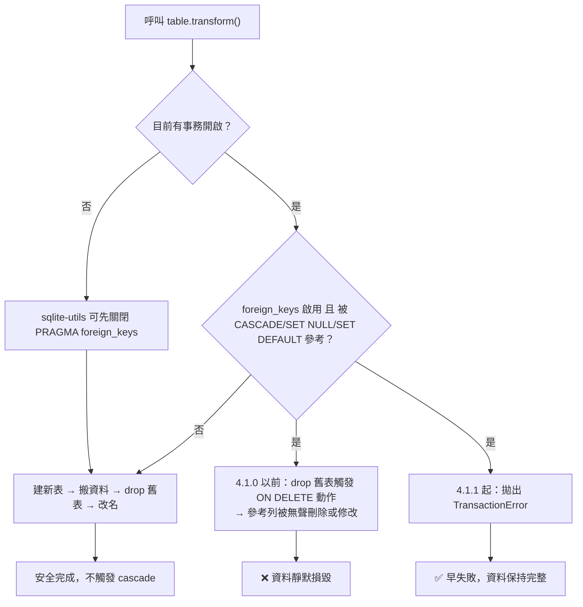
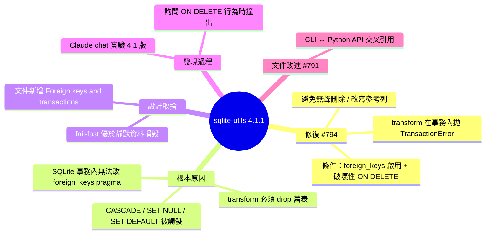

## sqlite-utils 4.1.1

sqlite-utils 4.1.1 發布，核心修復為 edge case：`table.transform()` 在事務打開、`PRAGMA foreign_keys` 啟用、且表被有破壞性 ON DELETE 操作（CASCADE、SET NULL、SET DEFAULT）的 foreign key 參考時，現在會拋出 `TransactionError`（#794）。背景：SQLite 無法在事務內改變 foreign_keys pragma，導致 transform 刪除舊表時可能無聲地觸發 cascade 動作，刪除或修改關聯行。這個修復由 Claude chat 實驗 4.1 發布時發現。次要改進為 CLI 和 Python API 文件互相交叉參考（#791）。

### 重點
- `table.transform()` 現拋 `TransactionError` 當 foreign_keys pragma 啟用且存在 ON DELETE 級聯時，防止無聲資料損失
- SQLite 事務中無法改變 foreign_keys pragma，故 transform 時若刪舊表會觸發關聯 cascade — 需顯式防護
- Bug 由 Claude 與 4.1 版本互動實驗中發現，展現 LLM 輔助測試的價值

**原文：** [simon-willison](https://simonwillison.net/2026/Jul/12/sqlite-utils/#atom-everything)

---

<!-- deep-analysis:begin -->
## 📌 摘要 (TL;DR)

- Simon Willison 發布 **sqlite-utils 4.1.1**，主要內容是一個資料安全相關的 edge case 修復（issue #794）。
- `table.transform()` 現在會在下列情況拋出 `TransactionError`：呼叫時已有事務（transaction）開啟、`PRAGMA foreign_keys` 為啟用狀態、且該表被帶有破壞性 `ON DELETE` 動作（`CASCADE`、`SET NULL`、`SET DEFAULT`）的外鍵（foreign key）參考。
- 問題根源：SQLite 不允許在事務內變更 `foreign_keys` pragma，導致 transform 過程中「drop 舊表」這一步可能觸發 cascade 動作，**無聲地刪除或修改參考該表的資料列**。
- 這個 bug 是「一般的 Claude chat」在實驗 4.1 版、回答一個關於 `ON DELETE` 的問題時發現的——LLM 在探索式使用中反向替維護者找出 bug 的實例。
- 次要改動（#791）：CLI 文件與 Python API 文件現在互相交叉引用，CLI 章節連到對應的 Python 函式，Python 章節連回對應的 CLI 指令。

## 🎯 核心概念

- **表結構轉換** (`table.transform()`)：sqlite-utils 用來改變既有表 schema（改欄位型別、改名、刪欄位等）的方法；因為 SQLite 的 `ALTER TABLE` 能力有限，它的做法是建新表、搬資料、**drop 舊表**、再改名。
- **外鍵開關** (`PRAGMA foreign_keys`)：SQLite 決定是否強制執行外鍵約束的開關。關鍵限制是：**在事務開啟中無法變更這個 pragma**（原文明言 "The pragma cannot be changed inside a transaction"）。
- **破壞性 ON DELETE 動作**（destructive `ON DELETE` actions）：`CASCADE`（連帶刪除參考列）、`SET NULL`（把外鍵欄位設為 NULL）、`SET DEFAULT`（設為預設值）——這三種在父表列被刪除時會反過來改動子表資料。
- **`TransactionError`**：sqlite-utils 這次新增的防呆錯誤，寧可讓操作直接失敗，也不要讓使用者在不知情下損失資料。

## 📖 整理分析

### 1. 危險是怎麼發生的

`transform()` 的實作必然包含「drop 舊表」這一步。正常情況下 sqlite-utils 可以先把 `foreign_keys` 關掉再執行搬遷，drop 舊表就不會觸發任何 cascade。但如果呼叫者**已經自己開了一個事務**，SQLite 就不讓程式再去動 `foreign_keys` pragma；於是在外鍵仍然啟用的狀態下 drop 舊表，SQLite 會忠實地執行 `ON DELETE CASCADE` / `SET NULL` / `SET DEFAULT`——參考這張表的其他表資料被連帶刪除或改寫，而使用者只是想改個欄位型別。

### 2. 修復方式：早失敗，不要無聲損毀

4.1.1 的處理不是「想辦法繞過去」，而是在偵測到這組危險條件（事務開啟 + `foreign_keys` 啟用 + 有破壞性 `ON DELETE` 參考）時直接拋 `TransactionError`。這是典型的 fail-fast 資料安全設計：靜默的資料遺失遠比一個明確的例外難查。原文同時指向文件新增的 "Foreign keys and transactions" 章節說明細節與替代做法（release note 本身未列出具體步驟）。

### 3. 這個 bug 的發現途徑值得注意

Simon 明說：這是「regular Claude chat」在試玩 4.1 版、要回答一個關於 `ON DELETE` 的問題時發現的。也就是說，LLM 在做探索式驗證（跑一個 transform、觀察外鍵行為）時撞出了維護者自己沒踩到的 edge case。對開發者的啟示：把 LLM 當成一種「隨機探索的模糊測試器」去玩自己剛發布的函式庫，可能比只讀 code review 更容易翻出邊界情況。

### 4. 文件交叉引用（#791）

第二項改動針對 sqlite-utils 長年的雙介面問題：它同時有 CLI 工具與 Python API，過去兩份文件各自獨立。現在 CLI 章節會連到等價的 Python API 功能，Python API 章節也會連回對應的 CLI 指令，降低使用者在兩種用法間切換時的查找成本。

## 🧭 流程圖

## 🧠 Mindmap

<!-- deep-analysis:end -->
### 📄 原文內容

點此展開 / 收合

Release: sqlite-utils 4.1.1 
 Mainly a fix for an edge case that regular Claude chat spotted while experimenting with the 4.1 release to answer a question about ON DELETE. 
 
 
 table.transform() now raises a TransactionError if called while a transaction is open with PRAGMA foreign_keys enabled and the table is referenced by foreign keys with destructive ON DELETE actions - CASCADE , SET NULL or SET DEFAULT . The pragma cannot be changed inside a transaction, so previously dropping the old table as part of the transform could fire those actions and silently delete or modify referencing rows. See Foreign keys and transactions for details and workarounds. ( #794 ) 
 The CLI and Python API documentation now cross-reference each other: CLI sections link to the equivalent Python API functionality and Python API sections link back to the corresponding CLI command. ( #791 ) 
 
 
 
 
 Tags: sqlite , sqlite-utils

