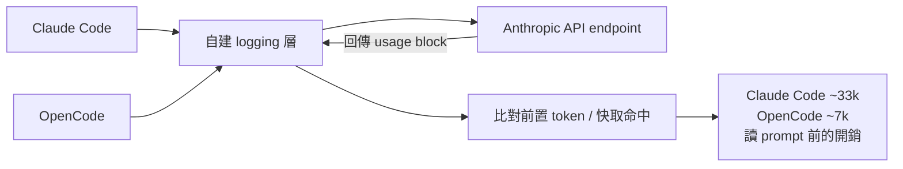
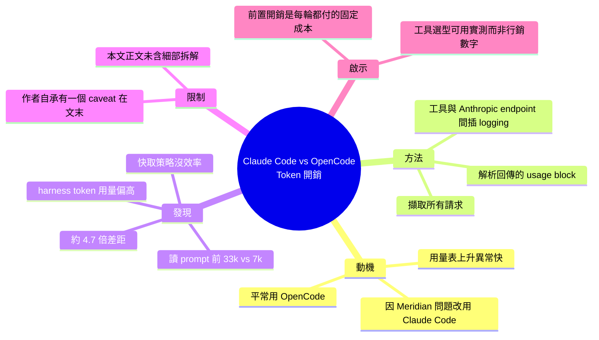

## Claude Code sends 33k tokens before reading the prompt; OpenCode sends 7k

針對編程輔助 AI 工具的資源消耗進行對比研究。實驗測試發現，Claude Code 在執行使用者程式碼前，即預先消耗 33,000 tokens 初始化，而同等條件下 OpenCode 僅需 7,000 tokens，相差 4.7 倍。此差異反映出 Claude Code 的 cache strategy 和 harness token 使用方式存在設計低效。研究方法是在 Anthropic API endpoint 上游插入日誌層，完整捕捉兩個工具的所有請求和返回的 usage blocks，數據可靠。對 token 成本敏感的開發團隊而言，此發現對工具選型決策有直接實務意義；長期累積使用下，成本差異會被顯著放大。

### 重點
- Claude Code 初始化 overhead 達 33k tokens，是 OpenCode 7k 的 4.7 倍
- 低效率根源於 cache strategy 和 harness token 使用設計缺陷
- 基於 request logging at Anthropic endpoint 的可靠實驗數據

**原文：** [hackernews](https://systima.ai/blog/claude-code-vs-opencode-token-overhead)

---

<!-- deep-analysis:begin -->
## 📌 摘要 (TL;DR)

- 標題主張：**Claude Code 在真正讀到使用者 prompt 之前，就已經送出約 33,000 tokens；OpenCode 同樣情境下只送出約 7,000 tokens**，差距約 4.7 倍。
- 這項研究起於「軼事觀察」：作者團隊平常用 OpenCode，因為 Meridian 出問題而被迫改用 Claude Code 一段時間，發現用量表（usage meter）上升的速度明顯快得多。
- 為了把直覺變成數據，他們在**代理式編程工具與 Anthropic API endpoint 之間插入一層 logging**，完整攔截所有請求與回傳的用量區塊（usage block）。
- 結論（作者用字為 unambiguously，即毫無疑義）：Claude Code 在**快取策略（cache strategy）**與**代理框架 token 用量（harness token usage）**兩方面都比 OpenCode 沒效率得多。
- 作者自承有「一個但書（caveat）」放在文章結尾——但該但書內容不在本次擷取到的正文中，因此無法在此重述。
- 對成本敏感的團隊：這是工具選型的直接依據，因為前置開銷（overhead）會在每一輪對話中重複累積、被長時間使用放大。

## 🎯 核心概念

- **代理框架開銷（harness token usage）**：AI 編程工具在使用者的提問之外，自行注入的系統提示、工具定義、環境資訊等 token；使用者不會直接看到，但要付費。
- **快取策略（cache strategy）**：Anthropic API 支援 prompt caching，命中快取的 token 計價遠低於未快取 token；框架若把可快取的前綴切壞或頻繁重寫，帳單就會膨脹。
- **用量區塊（usage block）**：Anthropic API 回應中回報 input / output / cache read / cache write token 數的欄位，是本研究的量測依據。
- **代理式編程工具（agentic coding tool）**：本研究比較的兩個對象是 **Claude Code**（Anthropic 官方）與 **OpenCode**（開源替代）。

## 📖 整理分析

### 1. 起點是帳單，不是 benchmark
作者團隊的日常工具是 OpenCode，只因為 Meridian 出狀況而「被迫」轉用 Claude Code 一段時間。在這段期間，他們注意到用量表跑得比平常快「非常多」。這是純軼事性的初步證據（anecdotal evidence），也是整篇研究的動機——他們決定用實測數據驗證這個直覺。

### 2. 方法：在工具與 API 之間插一層 log
量測方式不是靠工具自己回報，而是**在代理式編程工具與 Anthropic endpoint 中間加上 logging 層**，攔下所有送出的請求，並記錄 API 回傳的 usage block。這種 proxy 式量測的好處是繞過工具的自我統計，直接看「線上實際傳了什麼、Anthropic 實際計了多少」，兩個工具用同一把尺量。

### 3. 發現：差距出在前置開銷與快取
標題給出的核心數字是 **33k vs 7k tokens**——在使用者的 prompt 被讀取之前就已經送出的量。作者把成因歸到兩個面向：**快取策略**與**代理框架 token 用量**。換句話說，問題不只是「系統提示比較長」，還包括這些前置內容有沒有被有效快取重用。

（註：本次擷取到的正文只包含前言段落，並未包含逐項的 token 拆解表格或每輪請求的分佈數據；上述 33k / 7k 來自文章標題，細部拆分請以原文為準。）

### 4. 作者自己標了一個但書
前言最後明確寫著「with one caveat (toward the end of the post)」——作者知道這個比較有一個需要限定的條件，並把它放在文末。這個但書的具體內容不在可取得的正文中，**在引用「4.7 倍」這個數字對外做結論前，應該先回原文把該段讀完**（可能涉及設定差異、工具版本、或某些 token 其實命中快取而計價不同等）。

### 5. 對讀者的實務意義
如果團隊按 token 計費、或吃 usage-based 的方案，前置開銷是**每一次請求都會付的固定稅**，會隨對話輪數與工作階段數線性放大。這篇的價值不在於「哪個工具比較好」，而在於提供了一個可複製的量測手法：**自己架 logging proxy，量自己工作流下的真實 token 開銷**，而不是相信任何一方的行銷數字。

## 🧭 量測架構

## 🧠 Mindmap

<!-- deep-analysis:end -->
### 📄 原文內容

點此展開 / 收合

This started based off of a hunch. We usually use OpenCode, but were &#x27;forced&#x27; to use Claude Code for a while due to issues with Meridian. In that time, we saw the usage meter rise much, much more quickly than when using OpenCode. This was the initial anecdotal evidence, but we undertook this small study to collect empirical data: We added logging between the agentic coding tool (Claude Code and OpenCode) and Anthropic&#x27;s endpoint, and captured all requests (and the returned usage blocks). With one caveat (toward the end of the post) we found unambiguously that Claude Code was far more inefficient in terms of its cache strategy and its harness token usage than OpenCode.

