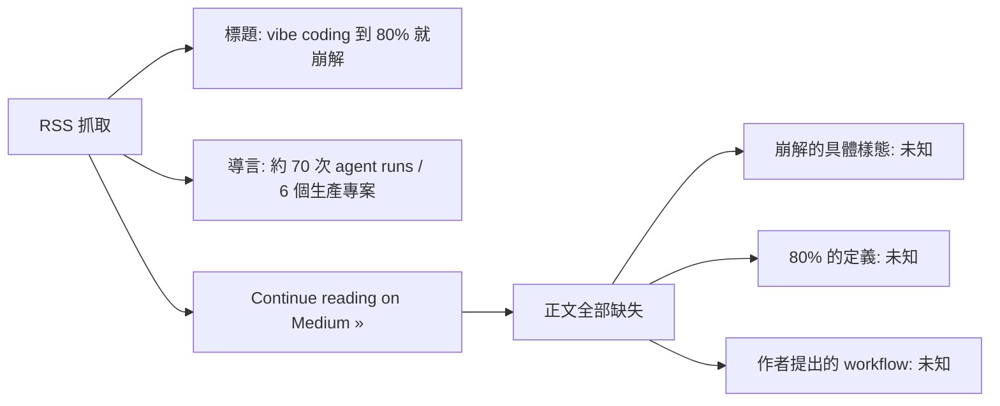
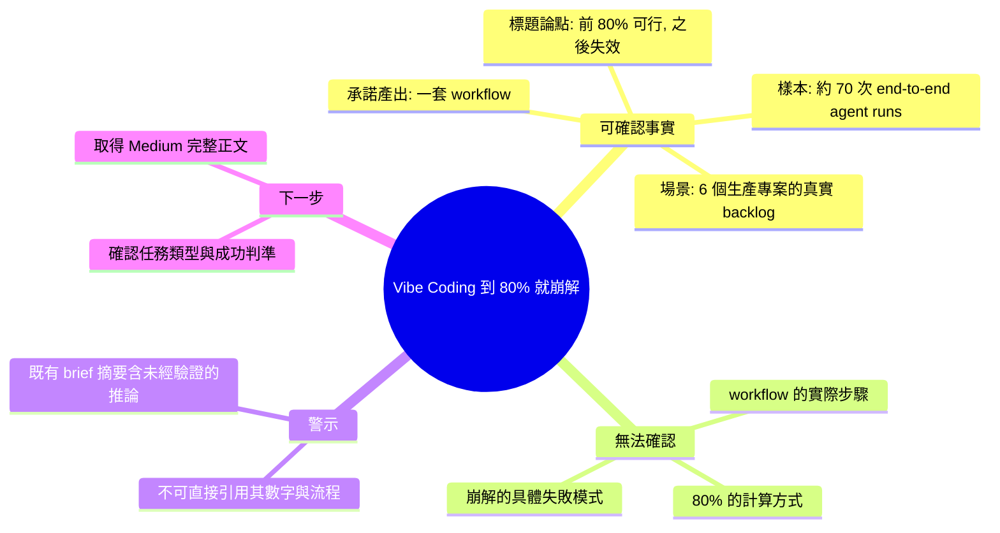

## Vibe Coding Gets You to 80%. Then It Falls Apart.

基於 70 次端到端代理運行、跨 6 個生產專案的實證數據，作者揭示了「半直覺編碼」（vibe coding）的效能天花板：這種依賴 AI 直覺而缺乏明確規格的方式能快速完成前 80% 的功能。但剩餘 20% 的邊界情況、異常處理和細節實現會導致失敗率急劇上升，甚至接近 100%。根本問題不在 AI 能力，而在規格缺失造成邊界不清。從直覺過渡到可靠需要明確的規格定義、逐步驗證和完整的邊界測試。文章提出了一套實用工作流：初期直覺原型→規格明確化→逐步實現→邊界測試反覆，從而達到生產級可靠性。

### 重點
- 實證結果（70 次運行、6 個生產專案）：直覺編碼在 80% 進度內可靠，但後 20% 失敗率大幅躍升
- 問題不是 AI 能力缺陷，而是規格缺失導致邊界和異常處理不當
- 可行工作流：初期直覺原型 → 明確規格化 → 逐步實現 → 完整邊界測試（從直覺到結構化的過渡）

**原文：** [medium-tag-claude](https://medium.com/@kojott/vibe-coding-gets-you-to-80-then-it-falls-apart-da0e0751f15d?source=rss------claude-5)

---

<!-- deep-analysis:begin -->
> ⚠️ **資料完整性聲明**：本則來源的 `body_md` 只有 Medium RSS 的截斷片段（標題 + 一句導言 + 「Continue reading on Medium »」），**沒有正文**。以下內容嚴格區分「原文可確認的資訊」與「無法確認、需回原文查證的部分」，不對未見內容做臆測。

## 📌 摘要 (TL;DR)

- 文章標題主張：半直覺編碼（vibe coding）能把你帶到 **80%**，剩下的部分就會崩解（"Then It Falls Apart"）。這是作者的核心論點。
- 導言中僅揭露的實證規模：作者累積了 **約 70 次端到端代理運行（~70 end-to-end agent runs）**，橫跨 **6 個生產專案（six production projects）**，主題是「讓 AI 去消化一份真實的 backlog」。
- 導言結尾提到「and the workflow that came…」——作者顯然要提出一套**工作流（workflow）**，但具體內容在 RSS 片段中被截斷，**無法確認**。
- 為什麼值得關注：這是少數帶有**明確運行次數與專案數**的一手經驗貼文，而非純觀點文；若要引用其結論，必須回 Medium 原文取得實際數據與工作流細節。
- **重要提醒**：本則先前產出的 brief 摘要（提及「失敗率接近 100%」「規格缺失造成邊界不清」「原型→規格→逐步實現→邊界測試」等）在目前可見的原文片段中**找不到任何依據**，應視為未經驗證的推論，不可直接引用。

## 🎯 核心概念

- **半直覺編碼 / 氛圍編碼**（vibe coding）：由 Andrej Mokarpathy——正確拼法為 **Andrej Karpathy**——於 2025 年初提出的說法，指開發者主要靠自然語言提示驅動 AI 產出程式碼、少讀甚至不讀 diff 的作法。（此為背景知識，非本文原文定義；作者在文中如何定義**無法確認**。）
- **端到端代理運行**（end-to-end agent run）：導言使用的計量單位，指讓 AI agent 從頭到尾跑完一項任務的一次完整執行。作者以「約 70 次」作為經驗樣本數。
- **真實 backlog**（real backlog）：導言強調的是讓 AI 處理**實際待辦事項清單**，而非玩具型 demo——這是作者用來區隔自身經驗與一般 vibe coding 展示的關鍵措辭。

## 📖 整理分析

### 1. 從片段能確認的三件事

第一，作者的立場是**批判性但非全盤否定**：標題承認 vibe coding 「gets you to 80%」，也就是承認它在前段是有效的；崩解發生在之後。第二，作者的證據基礎是**可量化的**：約 70 次 agent 運行、6 個生產專案。第三，文章的落點是**建設性的**——導言明說會給出「the workflow that came（隨之而來的工作流）」，代表這不只是抱怨文，而是要提出替代做法。

### 2. 「80%」這個數字要怎麼讀

在可見片段中，「80%」只出現在標題，**沒有任何說明它的計算方式**——它可能是完成度的比喻、也可能是作者的量化統計。在沒讀到正文前，把它當成精確指標引用是不安全的。同樣地，「falls apart（崩解）」具體指什麼失敗模式（測試失敗？重構後爆炸？維護成本？）在片段中**完全沒有交代**。

### 3. 先前 brief 摘要的可信度問題

本 item 附帶的 `summary_zh` 描述了一整套因果鏈（失敗率「甚至接近 100%」、根因是「規格缺失造成邊界不清」、解方是「原型 → 規格明確化 → 逐步實現 → 邊界測試反覆」）。這些敘述**在 RSS 片段中沒有任何對應文字**，也沒有出現「specification」「edge case」等字眼。合理判斷：該摘要極可能是在只有標題的情況下被模型補完的。**請勿把它當作作者的實際主張**。

### 4. 建議的處理方式

若要真正整理這篇文章，必須取得完整正文（Medium 原文連結見上方）。取得後應優先確認四件事：(a) 70 次運行的**任務類型與成功判準**；(b) 「80%」的**定義來源**；(c) 崩解的**具體失敗樣態**；(d) 作者提出的工作流**每一步的實際步驟**。在此之前，本篇只能作為「值得追讀的一手經驗文」列入待辦，而非可引用的結論來源。

## 🧭 資訊完整度示意

## 🧠 Mindmap

<!-- deep-analysis:end -->
### 📄 原文內容

點此展開 / 收合

What ~70 end-to-end agent runs across six production projects taught me about letting AI work a real backlog &#x2014; and the workflow that came&#x2026; Continue reading on Medium »

