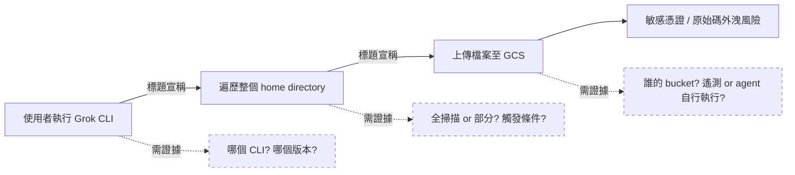
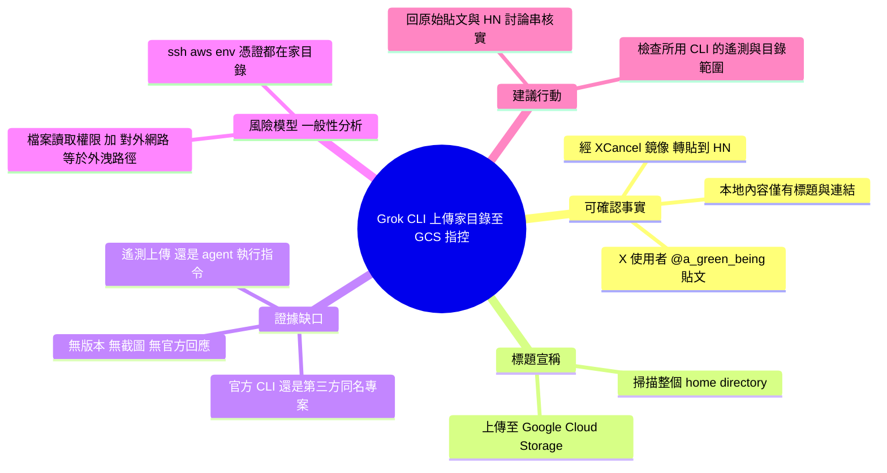

## Grok CLI uploaded the whole home directory to GCS

Grok CLI 工具曝露嚴重安全漏洞，不當地將用戶整個主目錄上傳至 Google Cloud Storage（GCS）。該事件導致敏感文件、配置密鑰、環境變數等個人數據大規模洩露，構成重大隱私風險。漏洞所代表的是 CLI 應用在文件操作權限管理和數據上傳邏輯上的設計缺陷。此類漏洞的存在意味著工具開發者對文件系統訪問的廣泛授權可能缺乏必要的安全審查。該事件影響所有使用 Grok CLI 的用戶，其主目錄可能已被暴露。該報告首先在 Twitter/X 上被披露，經由 XCancel 存檔。

### 重點
- Grok CLI 存在嚴重數據洩露漏洞，直接上傳用戶主目錄至 Google Cloud Storage
- 洩露內容涵蓋敏感信息如密鑰、配置文件、環境變數和個人文件
- 漏洞表明 CLI 工具在文件操作權限與上傳邏輯的設計缺陷，反映安全審查不足

**原文：** [hackernews](https://twitter.com/a_green_being/status/2076598897779020159)

---

<!-- deep-analysis:begin -->
## 📌 摘要 (TL;DR)

- 這則 inbox item 來自 Hacker News，指向 X（Twitter）使用者 `@a_green_being` 的貼文（存檔鏡像：`xcancel.com/a_green_being/status/2076598897779020159`），標題宣稱：**Grok CLI 把整個家目錄（home directory）上傳到 Google Cloud Storage（GCS）**。
- **重要限制**：本次抓取到的 `body_md` 只包含標題與一條 XCancel 連結，**沒有推文正文、沒有截圖、沒有程式碼片段、沒有官方回應**。因此本文能確認的事實僅止於「有人在 X 上提出這項指控，並被轉貼到 HN」。
- 先前 brief 摘要中提到的「配置密鑰、環境變數大規模洩露」「所有 Grok CLI 使用者的家目錄可能已被暴露」等細節，**在本文可取得的內容中並無依據**，屬於未經查證的延伸描述，讀者不應直接採信。
- 若要判斷此事的真實性與影響範圍，必須回到原始貼文與後續討論串（HN thread / xAI 官方回應）核實：具體是哪個 CLI（xAI 官方 Grok CLI，抑或第三方同名開源專案）、哪個版本、是遙測（telemetry）上傳還是 agent 自行執行了 `gsutil`/`gcloud` 之類的指令、上傳到誰控制的 bucket。
- 這件事之所以值得追蹤，在於它命中了目前 CLI 型 coding agent 最敏感的信任面：agent 同時擁有**檔案系統讀取權限**與**網路外送能力**，任何一端失控都等同於資料外洩。

## 🎯 核心概念

- **命令列代理程式 (CLI coding agent)**：在終端機執行、可讀寫本機檔案並執行 shell 指令的 AI 助理（Grok CLI、Claude Code、Codex CLI 等皆屬此類）。
- **家目錄 (home directory)**：`~/`，通常包含 `.ssh`、`.aws`、`.env`、瀏覽器設定、專案原始碼等高敏感內容，是「整個目錄被上傳」之所以嚴重的原因。
- **Google Cloud Storage（GCS）**：Google 的物件儲存服務；資料一旦被上傳到非使用者控制的 bucket，等於離開了本機信任邊界。
- **XCancel**：X（Twitter）的前端鏡像/存檔站，常被用來在不登入的情況下閱讀貼文；本 item 的連結即為此類鏡像。

## 📖 整理分析

### 1. 本文實際包含的內容
原始 `body_md` 只有兩行：一個標題與一個 XCancel 連結。這代表這則 item 是「連結型」貼文（HN 上常見的 link post），**內容主體不在本地**。任何關於漏洞機制、觸發條件、受影響版本、資料量的描述，都必須從原始貼文或討論串取得，本文無法提供。依「寧可空白，不可捏造」原則，這裡不補完不存在的細節。

### 2. 標題所宣稱的事件鏈
就標題字面而言，指控是：使用者在本機執行 Grok CLI → 該工具遍歷了 `~/` 底下的檔案 → 將這些檔案（全部或大量）上傳到 GCS。這條鏈上有三個各自獨立、都需要證據的環節：**（a）是否真的做了全目錄掃描、（b）上傳是否確實發生、（c）上傳目的地是否為第三方控制的 bucket**。目前可取得的資料無法驗證其中任何一環。

### 3. 需要釐清的關鍵歧義
「Grok CLI」一詞本身有歧義：市面上同時存在 xAI 官方的命令列工具，以及社群/第三方以 Grok 模型為後端的同名開源 CLI 專案。這兩者的程式碼、遙測行為與信任層級完全不同，**把指控套用到錯誤的專案就是誤傷**。此外，「上傳到 GCS」也可能有多種成因：官方遙測/除錯上傳、工具鏈的快取或索引功能、或是 agent 在執行任務時自行呼叫了雲端指令——嚴重性差異極大。這些都需要原始貼文才能判定。

### 4. 這類事件的普遍風險模型（一般性分析，非原文內容）
CLI agent 的威脅面在於它同時握有兩把鑰匙：**廣泛的檔案讀取權限**與**對外網路連線能力**。當 agent 被賦予 `~/` 層級的存取範圍，`.ssh/id_rsa`、`.aws/credentials`、`.env`、`.npmrc` 等憑證檔就都在其可讀範圍內；若同時允許它執行任意 shell 指令或內建了雲端上傳邏輯，資料外送就不需要另一個漏洞。這也是為什麼「限制工作目錄範圍」「預設關閉遙測」「對外連線白名單」會是這類工具的基本安全設計。

### 5. 讀者可採取的核實步驟（建議，非原文結論）
在把這則消息當成既成事實之前，合理的做法是：打開原始 X 貼文與 HN 討論串，找出（1）貼文者提供的證據形式（封包側錄？bucket URL？程式碼行號？）、（2）是否有第三方復現、（3）xAI 或該專案維護者是否回應。若你正在使用任何 CLI agent，不論本案真偽，**檢查該工具的遙測設定與可存取的目錄範圍**，本來就是低成本的例行防護。

## 🧭 事件鏈與證據缺口

> 實線＝標題所宣稱的鏈路；虛線＝本文無法驗證、必須回到原始貼文查證的缺口。

## 🧠 Mindmap

<!-- deep-analysis:end -->
### 📄 原文內容

點此展開 / 收合

https:&#x2F;&#x2F;xcancel.com&#x2F;a_green_being&#x2F;status&#x2F;2076598897779020159

