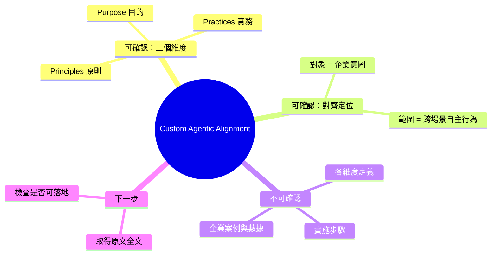

## The Three Dimensions of Custom Agentic Alignment: Purpose, Principles and Practices

文章提出企業級 agentic AI 對齐的三維框架：Purpose（企業意圖）、Principles（行為規範）、Practices（實施機制）。該框架旨在確保自主 agent 在多場景下的一致性行為，而非單一決策或單一應用。通過三維互鎖，實現從企業戰略到具體 agent 執行的對齐。具體案例與實施指南未在摘要中展開。

### 重點
- Agentic alignment 三維框架：Purpose（澄清企業意圖）→ Principles（定義行為邊界）→ Practices（落實執行機制）
- 框架針對多場景自主行為一致性，不是單點決策而是系統性治理
- 適用於企業級 agent 部署，確保自主決策與企業目標的持續對齐

**原文：** [medium-towards-data-science](https://towardsdatascience.com/the-three-dimensions-of-custom-agentic-alignment-purpose-principles-and-practices/)

---

<!-- deep-analysis:begin -->
> ⚠️ **資料完整性聲明**：本則 item 的 `body_md` 只包含標題、一句話副標，以及 Towards Data Science 的 RSS 制式結尾（"The post ... appeared first on Towards Data Science."）。**文章正文未被抓取到**，因此以下整理只能依據可確認的片段，不會補完任何原文未出現的框架定義、案例或數據。要理解完整論述，請前往原文連結。

## 📌 摘要 (TL;DR)

- 文章標題提出一個三維框架，用來做「客製化的代理式對齊」（custom agentic alignment）：**Purpose（目的）、Principles（原則）、Practices（實務）**。
- 副標明確指出框架目標：讓代理式 AI（agentic AI）對齊「企業意圖」（enterprise intent），以確保**跨場景一致的自主行為**（consistent scenario-wide autonomous behavior）。
- 可確認的重點僅止於此：**三個維度的名稱**與**對齊對象是企業意圖、對齊範圍是整個場景而非單一輸出**。
- 目前抓到的內容**沒有**框架各維度的定義、實作步驟、企業案例、評測數據或參考文獻，任何進一步的描述都會是臆測。
- 讀者若關心 agent 治理／企業導入，這篇的切入點值得追讀，但需回原文取得實質內容。

## 🎯 核心概念

以下三個詞出自標題，**原文對它們的定義未包含在可取得的內容中**，此處僅列出詞彙本身，不代作者定義：

- **目的 (Purpose)**：框架第一維，標題所列。原文定義不可得。
- **原則 (Principles)**：框架第二維，標題所列。原文定義不可得。
- **實務 (Practices)**：框架第三維，標題所列。原文定義不可得。
- **代理式對齊 (agentic alignment)**：標題用語，指向「讓自主 agent 的行為符合企業意圖」這個問題面向；副標補充其範圍是 scenario-wide 的自主行為，而非單次回應。

## 📖 整理分析

### 1. 可確認的訊號：對齊的「對象」與「範圍」
副標是唯一帶有論點資訊的句子：*"A framework for aligning agentic AI with enterprise intent to ensure consistent scenario-wide autonomous behavior."* 從中可確認兩件事：對齊的**對象**是 enterprise intent（企業意圖），對齊的**範圍**是 scenario-wide（跨場景）的 autonomous behavior（自主行為）。也就是說，作者關注的不是單次輸出是否安全，而是 agent 在一整個運作場景中的行為一致性。

### 2. 三維框架只有骨架、沒有內容
標題給出 Purpose / Principles / Practices 三個維度，但可取得的內容中**沒有任何一段解釋這三者各自涵蓋什麼、如何互相約束、或如何落到 agent 的系統提示、工具權限、稽核機制上**。先前的 brief 摘要提到「三維互鎖」「從企業戰略到具體 agent 執行」，這屬於摘要階段的推論延伸，並非可從現有片段直接佐證的原文陳述。

### 3. 無法確認的部分（明確列出）
以下項目在現有內容中**完全不存在**，請勿當作已知：各維度的操作型定義、實施步驟或檢核清單、企業導入案例、任何量化數據或評測、與既有 alignment / AI governance 文獻（如 constitutional AI、企業 AI 政策框架）的關係與比較。

### 4. 建議的下一步
若要做內容判讀或引用，需直接讀取原文全文（towardsdatascience.com 該篇），重點檢查三件事：(a) 三個維度是否有可操作的定義；(b) 是否提供可落地的機制（例如政策文件 → agent 系統提示 → 執行期護欄 → 事後稽核的映射）；(c) 是否有真實企業案例或僅停留在概念層。抓不到全文時，本 item 只能定位為「概念性框架的標題級線索」。

## 🧠 Mindmap

<!-- deep-analysis:end -->
### 📄 原文內容

點此展開 / 收合

A framework for aligning agentic AI with enterprise intent to ensure consistent scenario‐wide autonomous behavior. 
 The post The Three Dimensions of Custom Agentic Alignment: Purpose, Principles and Practices appeared first on Towards Data Science .

