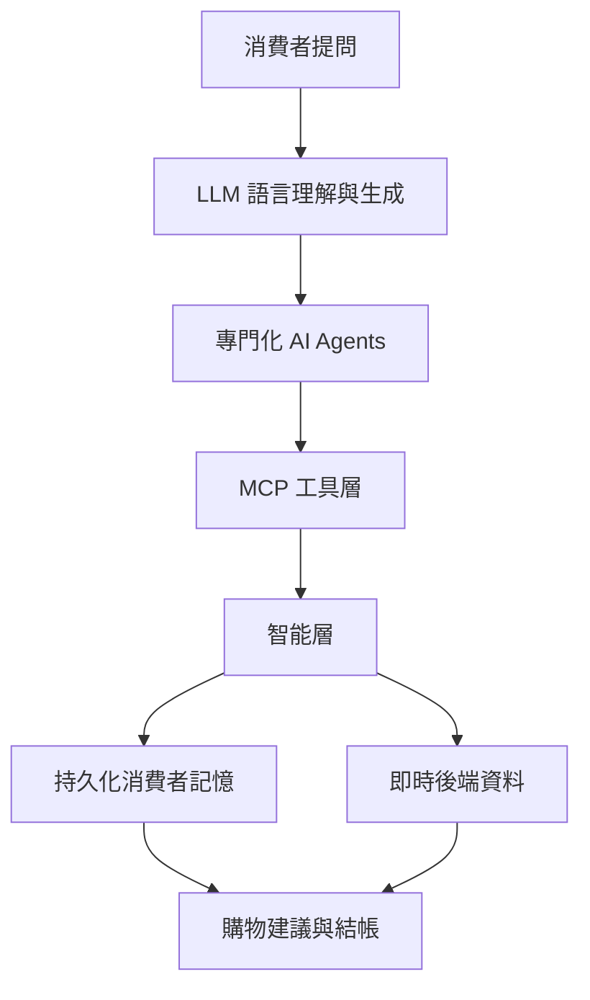
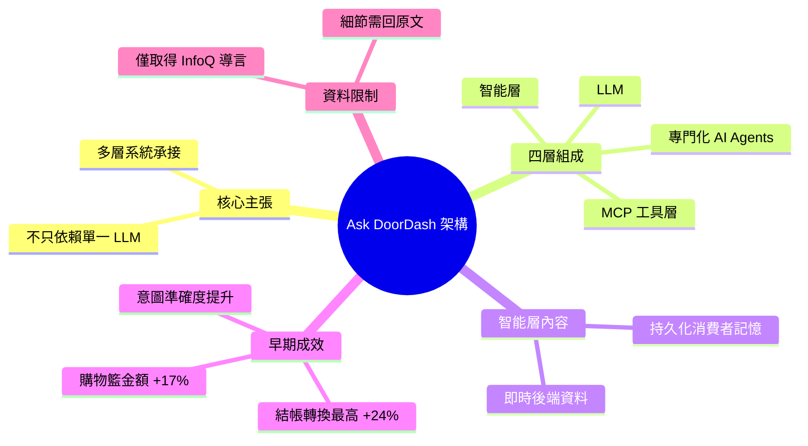

## How DoorDash Built an AI Shopping Assistant That Doesn’t Rely on the LLM Alone

DoorDash 揭露其 Ask DoorDash AI 購物助手的架構設計，結合 LLM、專門化 AI agents、MCP 工具層和智能層（含持久化消費者記憶與即時後端資料），驗證了多層次系統優於單一 LLM 的模式。實際部署結果顯示 checkout 轉換率提升 24%、購物籃平均金額增加 17%，並通過記憶驅動的會話改善意圖準確度。此案例展示了如何透過 agent + MCP + 記憶層構建商業級 AI 系統，對消費電商應用具有直接參考價值。

### 重點
- 系統架構：LLM + 專門化 agents + MCP 工具 + 持久化消費者記憶 + live backend 資料集成
- 量化成果：Checkout 轉換率 +24%、購物籃大小 +17%、intent 準確度改善
- 記憶驅動的會話是透過 live backend 資料實現更精確意圖理解的關鍵

**原文：** [infoq-main](https://www.infoq.com/news/2026/07/doordash-ai-ask-assistant/?utm_campaign=infoq_content&utm_source=infoq&utm_medium=feed&utm_term=global)

---

<!-- deep-analysis:begin -->
> ⚠️ **資料範圍說明**：本篇可取得的原文內容僅有 InfoQ 的新聞導言段（lede），沒有完整內文。以下整理嚴格依據該導言與標題所載事實，未補寫任何未被提及的細節（如 agent 數量、模型供應商、延遲數字等）。需要完整技術細節請回原文。

## 📌 摘要 (TL;DR)

- DoorDash 公開了對話式購物助手 **Ask DoorDash** 的架構設計，核心主張是：**不把整套體驗押在單一大型語言模型（LLM）上**，而是用多層系統來承接。
- 這套系統由四塊組成：LLM、專門化 AI 代理（specialized AI agents）、基於 MCP 的工具層（MCP-based tooling），以及一個包含**持久化消費者記憶**（persistent consumer memory）與**即時後端資料**（live backend data）的智能層（intelligence layer）。
- 早期上線結果（原文用詞為 early results / up to）：結帳轉換率最高提升 **24%**、購物籃金額增加 **17%**、在有記憶支撐的對話 session 中**意圖辨識準確度提升**。
- 對讀者的意義：這是一個消費級電商場景中，「agent + MCP + 記憶層」組合被實際量化出商業指標的案例，可作為同類 AI 產品架構的參考點。
- 文章作者為 **Leela Kumili**，發表於 InfoQ。

## 🎯 核心概念

- **Ask DoorDash**：DoorDash 推出的 AI 驅動對話式購物助手（conversational shopping assistant），本文的主題系統。
- **專門化 AI 代理**（specialized AI agents）：不是一個萬用 LLM 包辦所有任務，而是拆成各司其職的代理。
- **MCP 工具層**（MCP-based tooling）：以 MCP 作為代理呼叫外部工具／資料的標準介面層。
- **智能層**（intelligence layer）：架在 LLM 之上、負責提供上下文的一層，內含消費者記憶與即時後端資料。
- **持久化消費者記憶**（persistent consumer memory）：跨 session 保存的使用者偏好／歷史，用來提升意圖判讀。

## 📖 整理分析

### 1. 論點：LLM 不是全部

標題本身就是這篇的核心命題——「**不只依賴 LLM**」。DoorDash 的做法是把 LLM 當成其中一個元件，而不是整個產品。真正讓助手能正確回答「我要買什麼」的，是外掛在 LLM 周邊的代理、工具與資料層。

### 2. 四層組合：LLM + Agents + MCP + 智能層

依導言所述，系統由四個部分組合而成：LLM 負責語言理解與生成；專門化 AI agents 負責分工處理特定任務；MCP 工具層作為代理存取外部能力的介面；智能層則負責注入上下文。導言未進一步說明各代理的具體職責分工，此處不做延伸推測。

### 3. 智能層：記憶 + 即時資料

智能層被明確拆為兩種資料來源：**持久化消費者記憶**（跨對話保存的使用者脈絡）與**即時後端資料**（live backend data，可理解為庫存／商品／訂單等當下狀態）。前者對應「你是誰、你平常買什麼」，後者對應「現在實際上買得到什麼」。導言指出，有記憶支撐的 session 會帶來更好的意圖準確度。

### 4. 成效數據

原文列出的早期成果為：結帳轉換率**最高提升 24%**、購物籃平均金額**增加 17%**、意圖準確度改善。需要注意的是原文用的是 “up to”（最高／至多），代表這是上界值而非全體平均，解讀時不宜當成穩定的普遍增益。

### 5. 可帶走的參考價值

若你在做電商或工具型的 AI 助手，這個案例提供的是一個「已被商業指標驗證過」的分層樣板：**語言模型 → 代理分工 → MCP 標準化工具存取 → 記憶與即時資料上下文**。導言沒有揭露評測方法、實驗設計或失敗案例，這些是回原文時值得優先確認的部分。

## 🧭 架構圖

> 依原文導言所述的四個組成元件繪製；元件之間的實際呼叫順序原文未明說，此圖僅表達分層關係。

## 🧠 Mindmap

<!-- deep-analysis:end -->
### 📄 原文內容

點此展開 / 收合

DoorDash details the architecture behind Ask DoorDash, its AI-powered conversational shopping assistant, combining LLMs, specialized AI agents, MCP-based tooling, and an intelligence layer with persistent consumer memory and live backend data. Early results show up to 24% higher checkout conversion, 17% larger baskets, and improved intent accuracy using memory-backed sessions. By Leela Kumili

