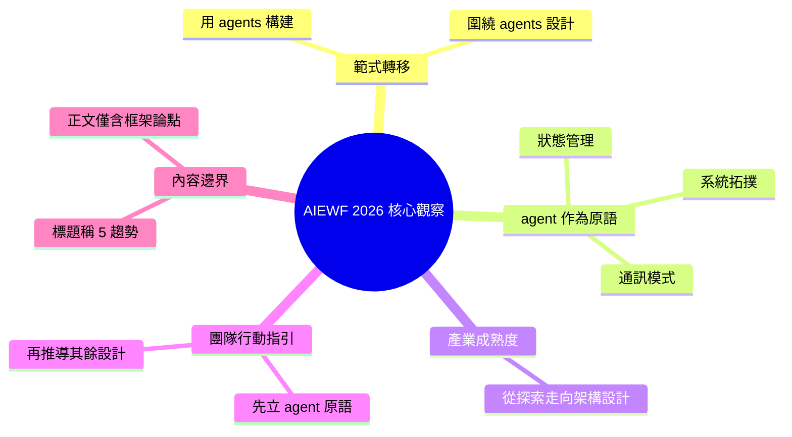

## 5 Trends That Defined AI Engineering at World’s Fair 2026

Latent Space 在 AI Engineering World's Fair 2026 上觀察到行業發展的重要轉變。具體而言，AI 工程進入新階段：從「使用 agents 構建系統」（agents 作為工具）演進至「圍繞 agents 設計系統」（agents 作為系統核心原語）。此範式轉變意味著架構思維的升級：agents 不再是嵌入式元件，而是系統拓撲、通訊模式、狀態管理的設計中心。這反映了 agent-centric 方法論的成熟，業界對 agentic systems 已從初期探索進入架構設計階段。該觀察對正在規劃 AI 系統的團隊具有指導意義。

### 重點
- AI 工程範式轉變：從『用 agents 構建』升級至『圍繞 agents 設計系統架構』
- agents 現為系統核心原語而非工具；需重新思考系統拓撲、通訊、狀態管理
- 反映 agentic systems 方法論成熟，從探索階段進入架構設計階段

**原文：** [latent-space](https://www.latent.space/p/aiewf26trends)

---

<!-- deep-analysis:begin -->
## 📌 摘要 (TL;DR)

- Latent Space 發表 AI Engineering World's Fair 2026（AIEWF26）的年度觀察文章，標題點名「定義本屆大會的 5 個趨勢」。
- 提供的原文內容僅含開場核心論點：本屆大會標誌 AI 工程進入新階段——**圍繞 agents 設計系統**（building systems around agents），而非只是**用 agents 構建**（building with agents）。
- 這代表架構思維的升級：agents 從嵌入在既有系統中的工具/元件，轉為系統設計的核心原語（primitive）。
- ⚠️ 內容說明：本次可取得的原文正文僅有上述框架論點，並未包含 5 個趨勢的具體條列。為避免臆測，以下分析聚焦於這個核心命題本身，不虛構未出現在原文的趨勢內容。

## 🎯 核心概念

- **用 agents 構建**（building with agents）：把 agents 當成嵌入在既有系統裡的一項工具或功能模組，系統主體仍是傳統架構。
- **圍繞 agents 設計系統**（building systems around agents）：把 agents 當成系統的核心原語，系統拓撲、通訊模式、狀態管理都以 agent 為中心來設計。
- **AI Engineering World's Fair**（AIEWF）：由 Latent Space 主辦、面向 AI 工程實務者的年度大會，此文報導的是 2026 年版本。

## 📖 整理分析

### 1. 核心命題：一次範式轉移

原文的唯一明確論點是：在今年的 AIE World's Fair 上，「AI 工程進入了一個新階段」。這個新階段的定義，是從「用 agents 構建」演進到「圍繞 agents 構建系統」。作者把它定位為整個產業對 agentic systems 認知的成熟——從初期把 agent 當附加能力，走向把 agent 視為系統設計的起點。

### 2. 「用」與「圍繞」的架構差異

兩者的差別在於 agent 在系統中的地位。在「用 agents 構建」時，agent 是被呼叫的工具，掛在傳統控制流之下；在「圍繞 agents 設計系統」時，agent 反過來成為系統結構的中心，開發者需要圍繞它重新思考通訊模式（元件之間如何協作）、狀態管理（多輪、多 agent 的上下文如何保存）與整體拓撲。這正是先前 brief 摘要所點出的重點：agents 不再是嵌入式元件，而是設計中心。

### 3. 對規劃 AI 系統團隊的意涵

若這個觀察成立，代表正在導入 agentic 架構的團隊，決策順序應該改變：不是先設計系統、再想哪裡塞一個 agent，而是先確立 agent 作為原語，再往外推導其餘設計。這對架構取捨、可觀測性與狀態設計都有連帶影響，也是這篇報導對讀者最直接的行動指引。

### 4. 內容邊界（誠實提醒）

標題承諾的是「5 個趨勢」，但本次可取得的正文並未列出這五項具體內容。若需要完整的五大趨勢清單與各自論據，須回到原文（latent.space/p/aiewf26trends）閱讀，本整理不對缺失的部分進行補完或推測。

## 🧠 Mindmap

<!-- deep-analysis:end -->
### 📄 原文內容

點此展開 / 收合

At this year's AIE World&#8217;s Fair, AI engineering entered a new phase: building systems around agents, rather than just building with agents.

