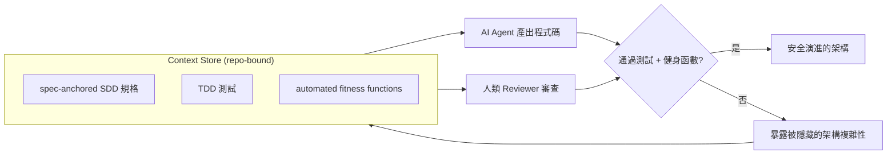
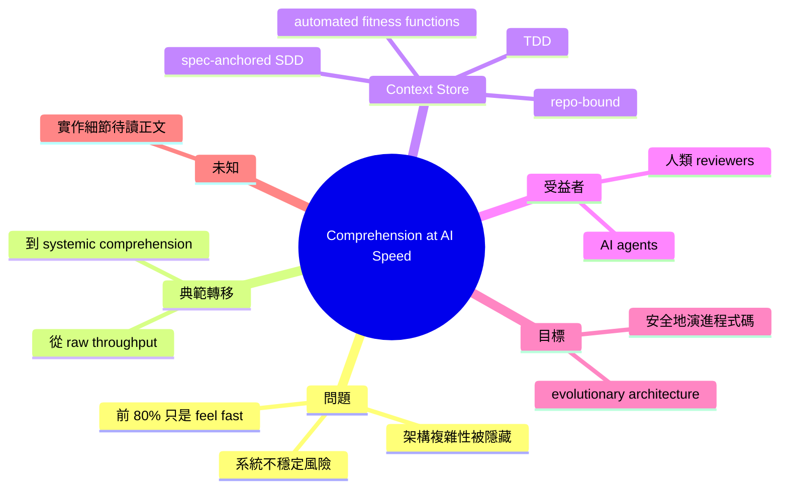

## Article: Comprehension at AI Speed: Building a Context Store for Evolutionary Architecture

論文指出 AI 加速開發前80%但隱匿架構複雜性後患。提出 Context Store 模式——統一規格錨定、SDD、TDD 與自動化健身函數的知識倉庫——作為 AI 代理與人類 reviewer 安全協作進化程式碼的基礎。該架構以「系統理解」取代「吞吐量優先」，解決 AI 開發的根本風險：過快演進而失控。Stella Berhe、Stephan Bragner、Vikram Maran、Anand Jayaraman 著。

### 重點
- Context Store 將規格、SDD、TDD、健身函數統一為 repo 內知識庫，成為 AI agent 與人類的共同理解基礎
- 轉移開發心態：從「AI 吞吐量」到「系統架構理解」，前期防止累積技術債
- 實現 AI agent 與人工審查的安全協作進化，避免過快演進導致系統脆弱

**原文：** [infoq-main](https://www.infoq.com/articles/ai-speed-context-store-architecture/?utm_campaign=infoq_content&utm_source=infoq&utm_medium=feed&utm_term=global)

---

<!-- deep-analysis:begin -->
> ⚠️ **資料範圍說明**：本次取得的原文內容只有 InfoQ 的文章摘要段落（abstract），沒有正文全文。以下整理**僅根據該摘要中明確出現的主張**，加上對其中既有公開術語（SDD、TDD、fitness function、evolutionary architecture）的標準定義。凡屬我的延伸推論，皆已標註「推論」。文中不會出現原文未提供的數字、案例或章節。

## 📌 摘要 (TL;DR)

- 文章由 **Stella Berhe、Stephan Bragner、Vikram Maran、Anand Jayaraman** 四人合著，刊於 InfoQ，主題是「在 AI 速度下維持理解力」（Comprehension at AI Speed）。
- 核心論點：AI 讓開發的**前 80% 感覺很快**（makes the first 80% of development feel fast），但它會**隱藏架構複雜性**，等到問題浮現時已經太遲（hides architectural complexity until it's too late）。
- 對策方向：工程領導者必須從追求**原始吞吐量（raw throughput）**，轉向追求**系統性理解（systemic comprehension）**，以避免系統不穩定。
- 提出的具體模式：把「以規格為錨的 SDD」「TDD」「自動化健身函數」三者整合成一個**綁在 repo 裡的 Context Store**（repo-bound "Context Store"）。
- 目的：讓 **AI agent 與人類 reviewer** 都能在同一份共享脈絡上，安全地演進（evolve）程式碼。

## 🎯 核心概念

- **情境倉庫（Context Store）**：文章提出的核心模式，一個與程式碼庫綁定（repo-bound）的知識儲存體，統一收納規格、測試與架構約束，供人與 AI 共用。
- **規格驅動開發（Spec-Driven Development，簡稱 SDD）**：以可執行 / 可驗證的規格作為開發起點與判準；原文強調它是「以規格為錨」（spec-anchored）的。
- **測試驅動開發（Test-Driven Development，簡稱 TDD）**：先寫測試再寫實作，用測試定義正確行為。
- **健身函數（fitness function）**：源自《Building Evolutionary Architectures》的既有術語，指可自動執行、用來持續量測系統是否仍符合架構特性（如效能、耦合度、安全性）的檢查。原文主張把它**自動化**並納入 Context Store。
- **演進式架構（evolutionary architecture）**：允許架構隨需求持續受控變化，而非一次定案；健身函數是其守門機制。
- **系統性理解（systemic comprehension）**：原文用來對比「吞吐量」的目標——重點不是產出多少程式碼，而是團隊是否仍理解整個系統。

## 📖 整理分析

### 1. 「前 80% 很快」是一種假象

摘要的第一個判斷非常明確：AI **讓前 80% 的開發「感覺」快**（feel fast），而不是「真的」快。原文把代價指向後段——被隱藏起來的架構複雜性，會在後期才引爆，導致**系統不穩定（system instability）**。這是整篇文章的問題陳述（problem statement）。

### 2. 目標從吞吐量換成理解力

作者對工程領導者（engineering leaders）的處方是一次**度量標準的替換**：不要再用「產出速度 / 吞吐量」當北極星，而要改用「團隊是否理解這個系統」。這句話的隱含前提是：AI 產碼速度已經不是瓶頸，**人類（與 reviewer）的理解頻寬**才是瓶頸。（此前提為推論，原文摘要未直接展開。）

### 3. Context Store：把三種既有實踐綁在一起

這是文章的方法核心。它不是發明新技術，而是**整併三個已存在的工程實踐**：

1. **spec-anchored SDD** — 提供「應該做什麼」的權威來源；
2. **TDD** — 提供「行為是否正確」的可執行驗證；
3. **automated fitness functions** — 提供「架構是否仍健康」的持續守門。

三者統一到單一 Context Store 後，AI agent 與人類 reviewer 讀的是**同一份脈絡**，而不是各自臆測。

### 4. 為什麼要「repo-bound」

原文特別用了 repo-bound 這個修飾詞：Context Store 綁在 repo 裡，而不是散落在 wiki、Jira 或某個人的腦袋。（推論）這樣做的直接好處是：它與程式碼一起 version、一起 review、一起演進，AI agent 在 repo 內就能取得完整脈絡，不需要外部檢索也不會拿到過期資訊。

### 5. 這篇文章沒有告訴我們的事

以目前可取得的摘要而言，**尚無法確定**：Context Store 的實際檔案結構 / 格式、健身函數的具體實作範例、是否有真實團隊的量化成效數據，以及它與 agent 工具鏈（如各家 coding agent）的整合細節。這些需要回讀 InfoQ 原文正文才能補齊，本整理不做臆測。

## 🧭 架構圖（依摘要重建）

> 以下流程為根據摘要文字重建的概念圖，非原文附圖。

## 🧠 Mindmap

<!-- deep-analysis:end -->
### 📄 原文內容

點此展開 / 收合

AI makes the first 80% of development feel fast, but hides architectural complexity until it's too late. To prevent system instability, engineering leaders must shift from raw throughput to systemic comprehension. By unifying spec-anchored SDD, TDD, and automated fitness functions into a repo-bound "Context Store," teams can ensure AI agents and human reviewers evolve code safely. By Stella Berhe, Stephan Bragner, Vikram Maran, Anand Jayaraman

