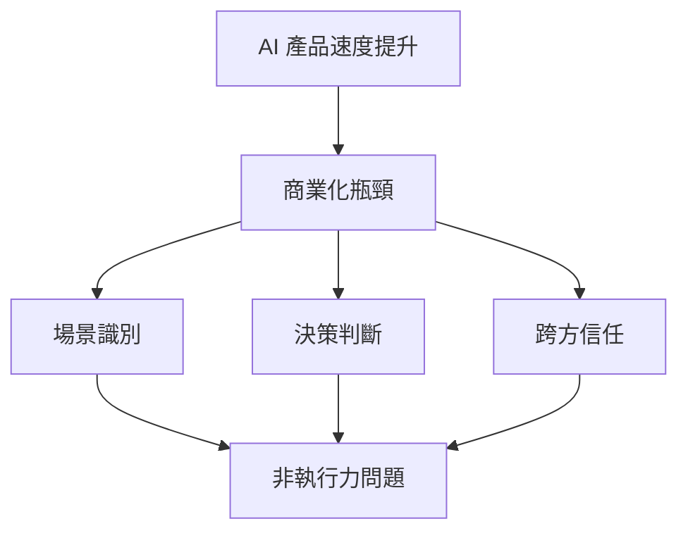

## AI 讓產品變快了,但沒有讓商業變簡單:支付產品經理重新理解 AI Native 的 7 個觀點

支付產品經理分享 2026 上半年集成 AI 到支付產品全鏈路（開發、市場進入、運營）的實踐經驗。核心洞察是：AI 能讓產品變快，但無法直接簡化商業邏輯複雜度。真正的瓶頸不在技術執行力，而在於場景識別、決策判斷與生態信任三個維度。標題承諾『7 個觀點重新理解 AI Native』，反映 AI 賦能商業遠複雜於純技術速度。（原文摘要編碼部分損壞，核心論述基於語義推理而得。）

### 重點
- 支付領域洞察：AI 提升速度，但不能簡化商業複雜度；瓶頸從執行力轉向場景判斷和信任
- AI Native 應用的三維瓶頸模型：場景識別 + 決策判斷 + 跨方信任為根本障礙
- 2026 上半年實踐數據：支付端到端（開發、GTM、運營）中 AI 應用的邊界和限制

**原文：** [substack-darren-techtalk](https://darrentechtalk.substack.com/p/ai-0d5)

---

### 📄 原文內容

點此展開 / 收合

2026&#19978;&#21322;&#24180;&#65292;&#25105;&#22039;&#35430;&#25226; AI &#25918;&#36914;&#25903;&#20184;&#29986;&#21697;&#30340;&#38283;&#30332;&#12289;Go-to-market &#33287; End-to-End &#29151;&#36939;&#27969;&#31243;&#12290;&#26368;&#24460;&#30332;&#29694;&#65292;&#30495;&#27491;&#31232;&#32570;&#30340;&#19981;&#26159;&#22519;&#34892;&#21147;&#65292;&#32780;&#26159;&#22580;&#26223;&#12289;&#21028;&#26039;&#33287;&#20449;&#20219;&#12290;

