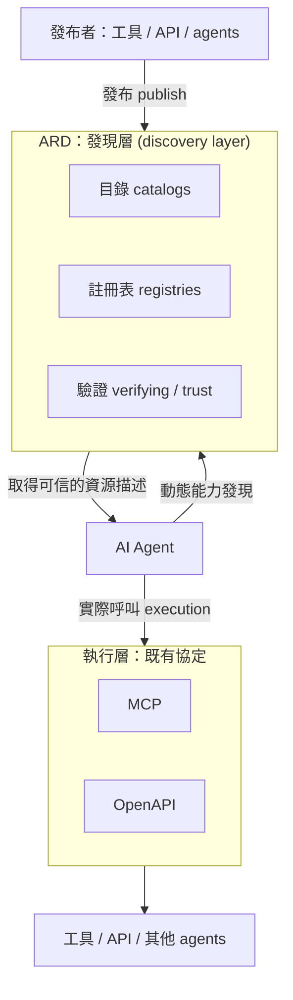
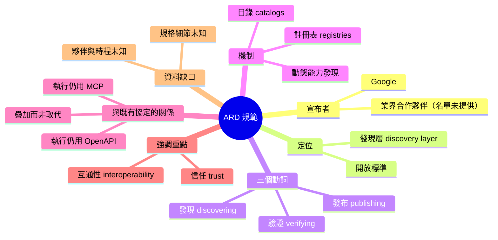

## Google and Industry Partners Announce Agentic Resource Discovery Specification for AI Agents

Google 及業界合作夥伴宣布 Agentic Resource Discovery（ARD）規範，這是一個開放標準，用於發布、發現和驗證 AI 工具、API 和 agents。ARD 的核心機制是在現有協議（MCP、OpenAPI）之上建立發現層，通過目錄與註冊表實現動態能力發現，同時強調信任驗證與互操作性。該規範旨在構建 AI agents 生態系統中的標準化發現與信任基礎設施。

### 重點
- ARD 新開放標準，用於 AI agents、工具、API 的動態發現、驗證與信任機制
- 技術設計：複用 MCP 與 OpenAPI 進行執行層，新增目錄/註冊表層提供發現能力
- 目標：實現 AI agents 跨平台互操作性與信任機制標準化

**原文：** [infoq-main](https://www.infoq.com/news/2026/07/agentic-resource-discovery-spec/?utm_campaign=infoq_content&utm_source=infoq&utm_medium=feed&utm_term=global)

---

<!-- deep-analysis:begin -->
> ⚠️ **資料範圍說明**：本則輸入的 `body_md` 只包含 InfoQ 這篇新聞的導言段（lead paragraph），沒有內文全文。以下整理**僅根據導言中明確出現的事實**展開，並標示哪些屬於背景知識、哪些是原文未提供的空白。不確定的部分不會補完。

## 📌 摘要 (TL;DR)

- Google 與業界合作夥伴（原文寫 industry partners，未列名單）發布 **Agentic Resource Discovery（ARD）規範**，定位是一個**開放標準**（open standard）。
- ARD 的用途有三個動詞：**發布（publishing）、發現（discovering）、驗證（verifying）** AI 工具（tools）、API 與 agents。
- 技術定位是**發現層（discovery layer）**，建立在**目錄（catalogs）與註冊表（registries）**之上，用來做**動態能力發現**（dynamic capability discovery）。
- ARD **不取代執行層**：實際呼叫仍沿用既有協定 —— **MCP** 與 **OpenAPI**；ARD 強調的是**信任（trust）與互通性（interoperability）**。
- 這則 InfoQ 新聞作者為 **Leela Kumili**；發布於 InfoQ 新聞頻道（2026/07）。
- 值得關注的原因：agent 生態目前缺的是「怎麼知道有哪些工具存在、以及能不能信任它」，ARD 想補的正是這一塊 —— 但**細節（規格內容、參與廠商、時程）在本次可取得的內容中並未提供**。

## 🎯 核心概念

- **代理式資源發現（Agentic Resource Discovery，簡稱 ARD）**：本次公布的開放標準，用於發布、發現與驗證 AI 工具、API 與 agents（原文定義）。
- **發現層（discovery layer）**：位於執行協定之上的一層，負責回答「有哪些資源可用、它在哪裡、可不可信」，而不負責「怎麼呼叫」。
- **目錄與註冊表（catalogs and registries）**：ARD 用來承載資源條目的機制；原文指出 discovery layer 是 built on catalogs and registries。
- **動態能力發現（dynamic capability discovery）**：agent 在執行期而非寫死在程式碼中，去查詢自己可以使用哪些能力。
- **MCP（Model Context Protocol）**：既有的模型／工具連接協定（背景知識：由 Anthropic 提出並開源）。原文將其歸類為**執行（execution）**用途的既有協定。
- **OpenAPI**：既有的 HTTP API 描述規格（背景知識）。原文同樣將其歸為執行層既有協定。

## 📖 整理分析

### 1. 這次宣布的內容是什麼

依原文，Google 與合作夥伴共同宣布 ARD 規範，是一份「用於發布、發現與驗證 AI 工具、API 與 agents 的開放標準」。原文只用一段導言概括，**沒有在可取得的內容中列出合作夥伴名稱、規範版本號、授權方式或治理組織**。因此本文不對這些項目做任何推測。

### 2. ARD 解決的是「發現」，不是「執行」

導言把分工講得很清楚：ARD 引入的是 discovery layer，而 **execution 仍然 leveraging existing protocols such as MCP and OpenAPI**。換句話說，ARD 的設計取向是**疊加而非取代** —— 已經用 MCP 暴露工具、或用 OpenAPI 描述 REST API 的服務，理論上不需要換掉既有介面，而是額外被 ARD 的目錄／註冊表索引起來。這種「分層而不打架」的定位，是判斷一個新標準能否被既有生態接受的關鍵指標。

### 3. 目錄 / 註冊表 + 動態發現

原文提到 discovery layer is built on **catalogs and registries**，用來 enable **dynamic capability discovery**。這意味著 agent 的工具清單從「開發期硬編碼」轉向「執行期查詢」：agent 先向目錄／註冊表查詢有哪些能力可用，再透過 MCP / OpenAPI 去實際呼叫。至於註冊表的資料模型、查詢介面、是中心化或去中心化託管，**導言未說明**，無法在此展開。

### 4. 信任與驗證（verifying）是被特別點名的

三個動詞裡的 **verifying**，以及結尾的 **emphasizing trust and interoperability**，顯示 ARD 不只是「一份 YAML 清單」。一旦 agent 會在執行期動態拉取外部能力，「這個工具是不是它宣稱的那個發布者」就成了安全前提（否則就是把 supply-chain 攻擊面直接接進 agent 的 tool loop）。原文明示 trust 是重點，但**具體採用哪種驗證機制（簽章、DNS 驗證、身分憑證等）在可取得的內容中沒有提到**，此處不做臆測。

### 5. 讀者可以怎麼看待這件事

可確定的訊號有兩個：其一，主要雲廠商正把 agent 生態的競爭焦點從「協定本身」推向「發現與信任基礎設施」；其二，MCP 與 OpenAPI 在這份規範中被當成**既有事實標準**引用，而非競爭對象。若要判斷 ARD 的實際影響力，需要進一步查證的是：參與廠商名單、規範是否進入某個標準組織、以及是否有可執行的參考實作 —— 這三點**本次資料皆無法回答**。

## 🧭 架構圖

以下圖僅根據導言明述的分層關係繪製（ARD＝發現層；MCP／OpenAPI＝執行層），未加入原文未提及的元件：

## 🧠 Mindmap

---

**未能確定的項目（需回原文或官方規範查證）**：參與的合作夥伴名單、規範的版本與託管位置、註冊表的資料格式與查詢介面、驗證／簽章機制、與 MCP registry 等既有努力的關係、是否有參考實作與採用時程。
<!-- deep-analysis:end -->
### 📄 原文內容

點此展開 / 收合

Google and industry partners announced Agentic Resource Discovery (ARD) Specification, an open standard for publishing, discovering, and verifying AI tools, APIs, and agents. ARD introduces a discovery layer built on catalogs and registries, enabling dynamic capability discovery while leveraging existing protocols such as MCP and OpenAPI for execution and emphasizing trust and interoperability. By Leela Kumili

