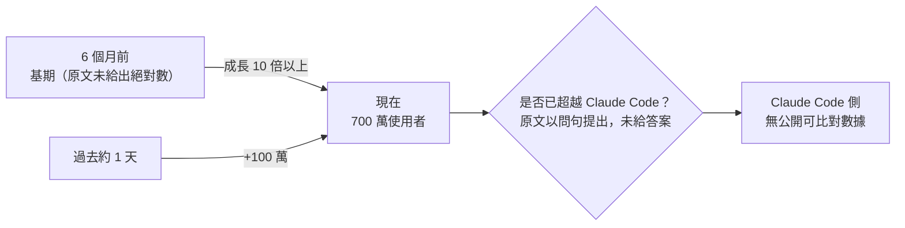
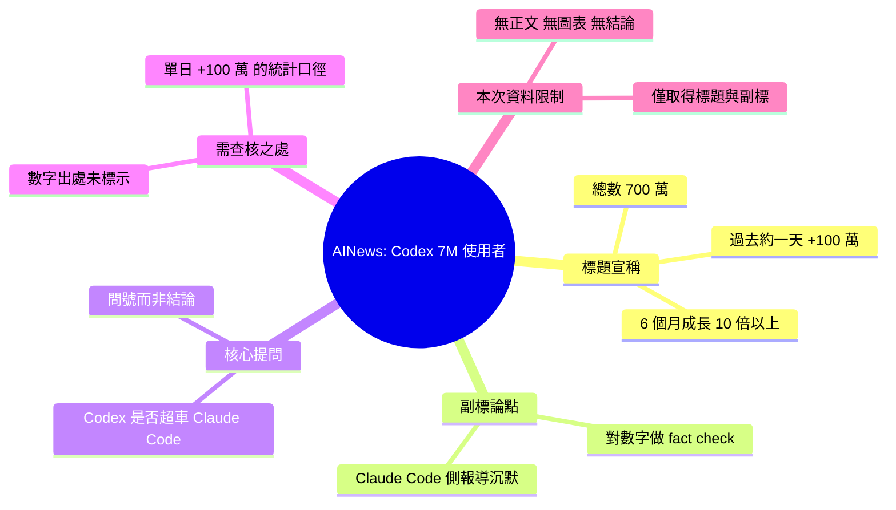

## [AINews] Codex usage up >10x in 6 months to 7M users, +1M in the past ~day; did Codex overtake Claude Code??

Latent Space 報導 OpenAI Codex 過去 6 個月使用量增長超過 10 倍，用戶數達 700 萬，且過去 24 小時新增約 100 萬用戶。文章標題暗示此激增可能意味著 Codex 與 Claude Code 的市場份額動態發生轉變，作者在文中以「驗證一些數字對比 Claude Code 報告沉寂的狀況」表示對比觀察。原文詳細分析內容有限。

### 重點
- OpenAI Codex 6 個月內使用量成長 10 倍，用戶總數達 700 萬
- 過去 24 小時新增約 100 萬用戶，增長速度顯著加速
- 文章隱指 Claude Code 的市場表現相對平靜，可能存在市場份額流向 Codex 的跡象

**原文：** [latent-space](https://www.latent.space/p/ainews-codex-usage-up-10x-in-6-months)

---

<!-- deep-analysis:begin -->
## 📌 摘要 (TL;DR)

- 這是 **AINews**（由 Latent Space / swyx 團隊發送的 AI 新聞電子報）在「淡日」（a quiet day）發出的一期，標題直指 **OpenAI Codex 使用量在 6 個月內成長超過 10 倍，來到 700 萬使用者**，且「過去約一天內就新增 100 萬」。
- 標題以問號提出全文的核心懸念：**Codex 是否已經超車 Claude Code？**（did Codex overtake Claude Code??）
- 副標說明本期的動機：趁著新聞淡日，「fact check 一些數字，對照 Claude Code 方面報導的一片沉默」（fact check some numbers against the sound of silence of Claude Code reporting）——也就是說，Codex 有公開數字，Claude Code 這邊沒有可比對的公開數字。
- **重要限制：本次抓取到的原文內容僅有標題與這一句副標**，沒有正文、沒有圖表、沒有數據來源引用。以下整理只針對「可確認的部分」展開，不對缺漏處做任何補完。

## 🎯 核心概念

- **Codex**：OpenAI 的程式碼代理／編碼助理產品線，本期數字的主角。
- **Claude Code**：Anthropic 的終端機程式碼代理，被拿來與 Codex 做市佔對比的對象。
- **AINews**：Latent Space 上的 AI 每日新聞彙整電子報，本篇即該系列的一期（標題前綴 `[AINews]`）。
- **事實查核（fact check）**：作者在副標中明確使用的動詞，代表本期的取態是「檢驗這些數字站不站得住腳」，而不是單純轉述成長故事。

## 📖 整理分析

### 1. 標題給出的三個具體數字

可從標題直接確認的宣稱有三項：**(a)** 使用量 6 個月內成長 **超過 10 倍**；**(b)** 使用者總數達到 **700 萬**；**(c)** 「過去約一天」新增約 **100 萬**。三者都是對 Codex 的描述，標題本身未註明這些數字的出處（OpenAI 官方、第三方統計或社群估算），抓取到的內容中也沒有進一步說明。

### 2. 副標透露的真正論點：不是成長，是「不對稱」

副標的關鍵詞是 **「the sound of silence of Claude Code reporting」**——Claude Code 這一側「報導的沉默」。這句話把文章的重心從「Codex 成長多快」轉移到「**雙方揭露資訊的不對稱**」：一邊持續公布使用者里程碑，另一邊沒有可對照的公開數據，因此標題的「did Codex overtake Claude Code??」才必須用兩個問號——這是**提問，不是結論**。

### 3. 「+1M in the past ~day」是最需要被查核的一項

單日新增 100 萬（相對於總量 700 萬，約佔 14%）是三個數字裡最戲劇性、也最容易因為統計口徑（註冊數 vs. 活躍數、是否含免費層或搭售方案）而失真的一項。作者用 `~day`（約一天）這種模糊時間單位，本身就暗示了數字的粗糙度。原文既然自稱要 fact check，重點大機率落在這裡——但**抓取內容中沒有查核過程與結論，無法確定作者最終的判定**。

### 4. 資料限制與讀者該怎麼看

這則 item 的 `body_md` 只包含標題與一行副標，**沒有正文可供深入整理**。因此：
- 不要把「Codex 超車 Claude Code」當成本文的結論——原文標題用的是問句。
- 標題中的三個數字應視為**該期電子報所引用的宣稱**，而非已經被驗證的事實；其原始出處需回到 Latent Space 原文查證。
- 任何關於 Claude Code 使用者數、市佔率、成長曲線的比較，**在此來源中都不存在**，不應據此推導。

## 🧭 時間線（僅依標題數字）

> 註：若「10 倍以上」與「700 萬」同時成立，可推得 6 個月前約低於 70 萬——**此為算術推論，非原文明述**。

## 🧠 Mindmap

<!-- deep-analysis:end -->
### 📄 原文內容

點此展開 / 收合

a quiet day lets us fact check some numbers against the sound of silence of Claude Code reporting...

