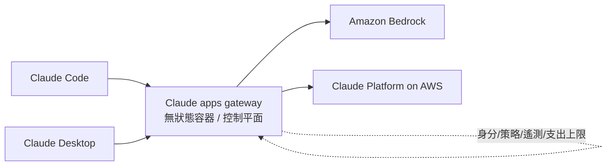
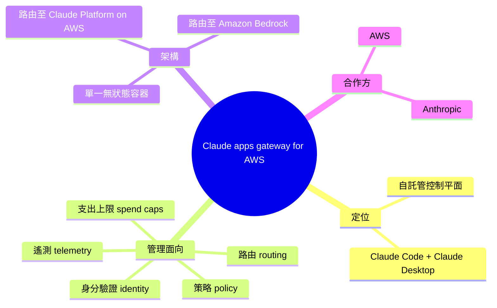

## AWS Ships Claude Apps Gateway as Self-Hosted Control Plane for Claude Code and Claude Desktop

AWS 與 Anthropic 聯合發布 Claude apps gateway，提供自託管的控制平面，集中管理身分驗證、策略、遙測、路由和支出上限，支援 Claude Code 和 Claude Desktop。該 gateway 以無狀態容器形式運行，可將推理工作路由至 Amazon Bedrock 或 AWS 上的 Claude Platform，為企業提供部署 Claude 應用的統一管理入口。

### 重點
- 自託管無狀態容器架構，支援 Claude Code 和 Claude Desktop 統一管理
- 集中式身分驗證、策略控制、支出上限管理和遙測收集
- 兼容 Amazon Bedrock 和 Claude Platform，靈活選擇推理後端

**原文：** [infoq-main](https://www.infoq.com/news/2026/07/claude-apps-gateway-aws/?utm_campaign=infoq_content&utm_source=infoq&utm_medium=feed&utm_term=global)

---

<!-- deep-analysis:begin -->
## 📌 摘要 (TL;DR)

- AWS 與 Anthropic 聯合發布 **Claude apps gateway for AWS**，這是一個自託管（self-hosted）的控制平面（control plane），專為 Claude Code 與 Claude Desktop 的企業部署而設計。
- 這個 gateway 集中管理五大面向：身分驗證（identity）、策略（policy）、遙測（telemetry）、路由（routing）與支出上限（spend caps）。
- 架構上以**單一無狀態容器**（single stateless container）形式運行，可將推理（inference）工作路由到 Amazon Bedrock 或 AWS 上的 Claude Platform。
- 對企業的意義：提供一個統一的管理入口，讓 IT / 平台團隊能在自己的環境中控管員工使用 Claude 應用的存取權、成本與可觀測性。
- 撰稿人為 InfoQ 的 Steef-Jan Wiggers。

> 註：本文為 InfoQ 的一則簡短新聞，原文僅提供發布事實與核心功能列表，未含 benchmark 數據、定價或詳細部署步驟。以下整理在忠於原文的前提下說明各功能定位。

## 🎯 核心概念

- **控制平面 (control plane)**：負責管理、策略與協調的層級，本身不直接處理使用者的最終工作負載，而是決定「誰能用、用什麼、花多少」。
- **自託管 (self-hosted)**：由企業自己在其 AWS 環境內部署與運行，而非交由供應商託管，利於資料與治理主權。
- **無狀態容器 (stateless container)**：容器不保存會話狀態，利於水平擴展與高可用部署。
- **Amazon Bedrock**：AWS 的託管基礎模型服務，是本 gateway 可路由推理請求的目標之一。
- **Claude Platform on AWS**：Anthropic 在 AWS 上提供的 Claude 平台，是另一個路由目標。

## 📖 整理分析

### 1. gateway 定位：企業版的統一入口
Claude apps gateway 的角色是介於「終端使用者的 Claude 應用」與「後端推理服務」之間的控制層。它把原本分散在 Claude Code（開發者的編碼代理）與 Claude Desktop（桌面應用）上的管理需求，集中到一個由企業自己掌控的入口，讓治理不必逐一在每台終端設定。

### 2. 五大集中管理面向
原文明列 gateway 集中處理的五件事：**identity（身分驗證，決定誰能存取）**、**policy（策略，定義允許的行為與限制）**、**telemetry（遙測，收集使用與可觀測性資料）**、**routing（路由，決定請求送往哪個後端）**、**spend caps（支出上限，控制成本不失控）**。這五項合起來，正是企業導入 AI 代理工具時最常見的治理痛點。

### 3. 架構：無狀態容器 + 雙路由後端
gateway 以單一無狀態容器運行，這代表它容易在 AWS 環境中擴展與維運。推理請求可被路由到兩個後端之一：**Amazon Bedrock** 或 **AWS 上的 Claude Platform**。這種雙路由設計讓企業能依合規、成本或可用性需求選擇推理來源。

### 4. 為何是 AWS + Anthropic 聯合發布
這是 AWS 與 Anthropic 的聯合動作，反映雙方在企業市場的合作：Anthropic 提供 Claude 應用與模型，AWS 提供部署、路由與治理的基礎設施。對已在 AWS 生態內的企業而言，可直接沿用既有的 AWS 部署與計費體系來管理 Claude 工具。

## 🧭 架構圖

## 🧠 Mindmap

<!-- deep-analysis:end -->
### 📄 原文內容

點此展開 / 收合

AWS and Anthropic have released the Claude apps gateway for AWS, a self-hosted control plane that centralizes identity, policy, telemetry, routing, and spend caps for Claude Code and Claude Desktop. The gateway runs as a single stateless container and routes inference to Amazon Bedrock or Claude Platform on AWS. By Steef-Jan Wiggers

