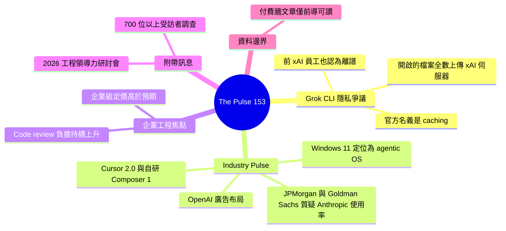

## The Pulse: Grok’s CLI caught uploading all your local files to the cloud

xAI 的 Grok CLI 工具被發現存在嚴重隱私風險。該工具會在未獲明確授權下自動上傳使用者本地檔案至雲端。此一安全漏洞由 Pragmatic Engineer 爆料，引發對 AI 工具權限管理的廣泛關注。同時報導提及企業工程團隊對代碼審查工作量持續增加感到憂慮。開發者對企業級 AI 工具的定價感到意外，實際採用成本遠高於預期。該事件凸顯 AI 工具市場在隱私、成本透明度方面的緊迫改進需求。

### 重點
- Grok CLI 存在隱私漏洞：自動上傳本地檔案至雲端，缺乏使用者授權機制
- 企業 AI 工具定價遠超開發者預期，採用成本陡增成為阻力
- 工程 leader 反馈 code review 工作量持續攀升，人力投入壓力增大

**原文：** [substack-pragmatic-engineer](https://newsletter.pragmaticengineer.com/p/the-pulse-groks-cli-caught-uploading)

---

<!-- deep-analysis:begin -->
## 📌 摘要 (TL;DR)

- Pragmatic Engineer《The Pulse #153》揭露：xAI 的 Grok CLI 被發現以「快取」（caching）為名，悄悄將使用者開啟過的所有本地檔案上傳至 xAI 伺服器；連一位前 xAI 員工都認為這個功能離譜（outrageous）。
- 本期同時點出兩個企業工程議題：工程主管憂心程式碼審查（code review）負擔持續增加，以及企業開發者對企業級 AI 工具定價之高感到意外。
- Industry Pulse 段落涵蓋：Cursor 2.0 與其自研 Composer 1 模型、OpenAI 勢在必行的廣告推進、Windows 11 被定位為「代理式作業系統」（agentic OS）、JPMorgan 與 Goldman Sachs 追問為何自家工程師較少使用 Anthropic 模型。
- 作者另預告與 LaunchDarkly 工程負責人 Smruti Patel 合辦的「2026 工程領導力現況」網路研討會，內容基於 700+ 位受訪者的調查。
- 注意：本文為付費牆（paywall）文章，公開可讀部分僅有前導段落；本整理只根據可驗證的公開內容撰寫，牆後細節不做臆測。

## 🎯 核心概念

- **Grok CLI**：xAI 推出的命令列 AI 工具，本次爭議的主角，被發現會自動上傳本地檔案。
- **快取** (caching)：xAI 對上傳檔案行為給出的官方名義，文章對此提出質疑。
- **代理式作業系統** (agentic OS)：微軟對 Windows 11 的新定位，強調 AI agent 深度整合進作業系統。
- **Composer 1**：Cursor 2.0 搭載的自研（in-house）模型。

## 📖 整理分析

### 1. Grok CLI 以「快取」為名上傳檔案

文章主標指出：xAI 的 CLI 工具會把使用者開啟過的所有檔案「悄悄地」（quietly）上傳到 xAI 的伺服器，官方說法是為了 caching。文中特別強調，連一位前 xAI 員工都公開認為這個功能離譜。公開預覽在作者寫到「A reminder that…」（一個提醒）處中斷，完整的技術分析與提醒內容位於付費牆後。這是推論：此事之所以受關注，是因為 AI 編碼工具通常擁有廣泛的本地檔案系統存取權，一旦預設上傳，原始碼與機密設定就有外洩到第三方伺服器的風險。

### 2. Industry Pulse：本期產業雷達

目錄揭示本期涵蓋四則產業動態：(1) Cursor 2.0 發布，搭載自研的 Composer 1 模型；(2) OpenAI 的廣告布局被形容為「inevitable」（勢在必行）；(3) Windows 11 被定位為 agentic OS；(4) JPMorgan 與 Goldman Sachs 內部追問為何較少自家工程師使用 Anthropic 模型。各則的具體分析在付費牆後，無法轉述細節。

### 3. 兩個企業工程焦點：審查負擔與定價落差

副標點出兩個趨勢：其一，工程領導者（engineering leaders）對 code review 工作量「持續增加」感到憂慮——這是推論：此議題與 AI 生成程式碼量上升的大背景相呼應，但公開內容未給出成因說明；其二，企業內的開發者對企業級（enterprise）定價之高感到意外。兩題的具體數據、案例與公司名稱皆在付費牆後，本整理不補完。

### 4. 附帶訊息與資料邊界

文章開頭預告：作者將與 Smruti Patel（LaunchDarkly 工程負責人，Head of Engineering）合辦「The State of Eng Leadership in 2026」網路研討會，內容基於 700+ 位受訪者的調查與多場工程領導者訪談。最後再次說明：本文完整內容需付費訂閱，本整理僅依據公開預覽段落與文章目錄撰寫，未包含牆後論證與數據。

## 🧭 流程圖 / 架構圖

依公開描述整理的 Grok CLI 檔案流向：

## 🧠 Mindmap

<!-- deep-analysis:end -->
### 📄 原文內容

點此展開 / 收合

Also: engineering leaders concerned about continued increase in code review load, devs at enterprises surprised by high enterprise pricing, and more

