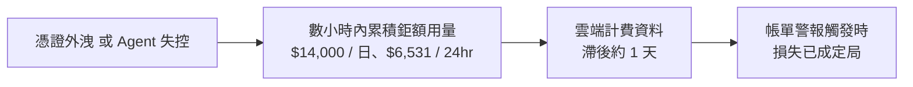
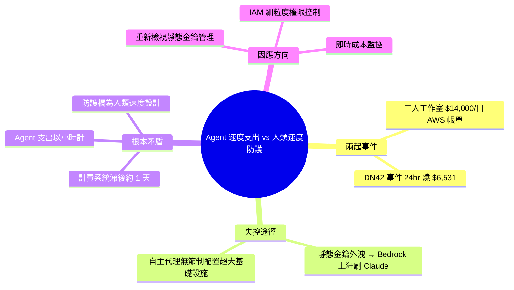

## AI Agents with Cloud Credentials Are Outrunning Billing Guardrails Built for Human-Speed Mistakes

一個三人工作室在一天內收到 $14,000 的 AWS 賬單，原因是攻擊者提取了靜態訪問密鑰並在 Bedrock 上大量運行 Claude 調用。同月早前的 DN42 事件中，自主代理在 24 小時內無節制地配置了 $6,531 的超大基礎設施。從業者警告，雲計費系統通常滯後約一天，遠跟不上 AI Agent 的執行速度，導致現有為人工速度錯誤設計的計費警衛形同虛設。該問題揭示 Agent 部署與雲安全之間的根本性時間不匹配，要求企業重新評估靜態密鑰管理、IAM 細粒度控制與實時成本監控策略。

### 重點
- 實際超支案例：三人工作室遭靜態密鑰洩露引發 $14,000/天 AWS Bedrock Claude 調用；DN42 自主代理過度配置導致 $6,531/24h 支出
- 雲計費滯後約 1 天，無法追上 AI Agent 執行速度，現有計費警衛對 Agent 速度的反應太慢（時間維度差異）
- 靜態訪問密鑰暴露與 Agent 自主權提升組成雙重風險，對 Agent 部署公司提出緊急的安全與成本控制要求

**原文：** [infoq-main](https://www.infoq.com/news/2026/07/ai-agents-billing-guardrails/?utm_campaign=infoq_content&utm_source=infoq&utm_medium=feed&utm_term=global)

---

<!-- deep-analysis:begin -->
## 📌 摘要 (TL;DR)

- 一間三人工作室在**一天內**收到 $14,000 的 AWS 帳單：攻擊者提取了靜態存取金鑰（static access keys），並在 Amazon Bedrock 上大量執行 Claude 模型調用。
- 2026 年 5 月的 DN42 事件中，一個自主代理（autonomous agent）在 24 小時內無節制地配置了價值 $6,531 的超大規格基礎設施。
- 從業者警告：雲端計費系統的資料**滯後約一天**，而 AI Agent 的支出是以分鐘、小時為單位累積，等帳單警報觸發時損失已成定局。
- 核心論點：現有的計費防護欄（billing guardrails）是為「人類速度的錯誤」設計的，面對 Agent 速度的支出形同虛設。
- 本文由 InfoQ 的 Steef-Jan Wiggers 報導，指向企業需重新檢視靜態金鑰管理、IAM 細粒度控制與即時成本監控。

## 🎯 核心概念

- **靜態存取金鑰** (static access keys)：長期有效、不會自動輪換的雲端憑證；一旦外洩，攻擊者可持續呼叫付費 API 直到被人工發現。
- **計費防護欄** (billing guardrails)：雲端平台的預算警報與帳單監控機制，本文指出其資料延遲約一天，跟不上 Agent 的執行速度。
- **自主代理** (autonomous agent)：能自行決策並執行雲端操作（如配置基礎設施）的 AI Agent，出錯時不會像人類一樣停下來檢查。

## 📖 整理分析

### 1. 事件一：金鑰外洩，一天燒掉 $14,000

一間僅三人的工作室（agency）遭遇攻擊：攻擊者提取了他們的 AWS 靜態存取金鑰，隨後在 Amazon Bedrock 上大量執行 Claude 的推論調用（invocations）。等到帳單資訊浮現時，單日費用已累積到 $14,000。這類攻擊的關鍵不是漏洞多高深，而是靜態憑證 + 按量計費的 LLM API 組合，讓「燒錢速度」遠超過帳務系統的反應速度。

### 2. 事件二：DN42 自主代理 24 小時配置 $6,531 基礎設施

同年 5 月的 DN42 事件展示了另一種失控模式：不是外部攻擊，而是自主代理本身在無人節制的情況下，於 24 小時內配置（provision）了 $6,531 的超大規格（oversized）基礎設施。這說明即使憑證沒有外洩，把雲端操作權限交給 Agent、卻沿用人類速度的審查機制，同樣會產生鉅額損失。

### 3. 根本問題：計費延遲 vs. Agent 執行速度的時間錯配

從業者指出，雲端計費系統的資料通常滯後約一天（roughly a day behind）。過去這個延遲可以接受，因為人類犯錯的速度慢——開錯一台機器、忘了關資源，一天內的損失有限。但 AI Agent（或拿到憑證的攻擊者搭配自動化腳本）可以在數小時內執行數以千計的付費操作，帳單警報觸發時，錢已經花完了。這是 Agent 部署與雲端安全之間的**結構性時間錯配**，不是調整預算門檻就能解決的。

### 4. 對企業的意涵

依據本文摘要所指的方向，企業需要重新評估三件事：（1）**靜態金鑰管理**——長期有效的存取金鑰是這類事件的直接入口；（2）**IAM 細粒度控制**——限制 Agent 與服務帳號能觸及的資源範圍與用量上限；（3）**即時成本監控**——在計費資料之外，建立更接近即時的用量訊號，才能在 Agent 速度的支出面前及時止血。（註：原文提供的內文較精簡，此節為依據來源摘要的整理，未包含原文可能引用的更多從業者細節。）

## 🧭 流程圖 / 架構圖

兩起事件共同呈現的時間錯配：

## 🧠 Mindmap

<!-- deep-analysis:end -->
### 📄 原文內容

點此展開 / 收合

A three-person agency received a $14,000 AWS bill in one day after attackers extracted static access keys and burned Claude invocations on Bedrock. Combined with May's DN42 incident, where an autonomous agent provisioned $6,531 of oversized infrastructure in 24 hours, practitioners warn that cloud billing lags roughly a day behind agent-speed spend. By Steef-Jan Wiggers

