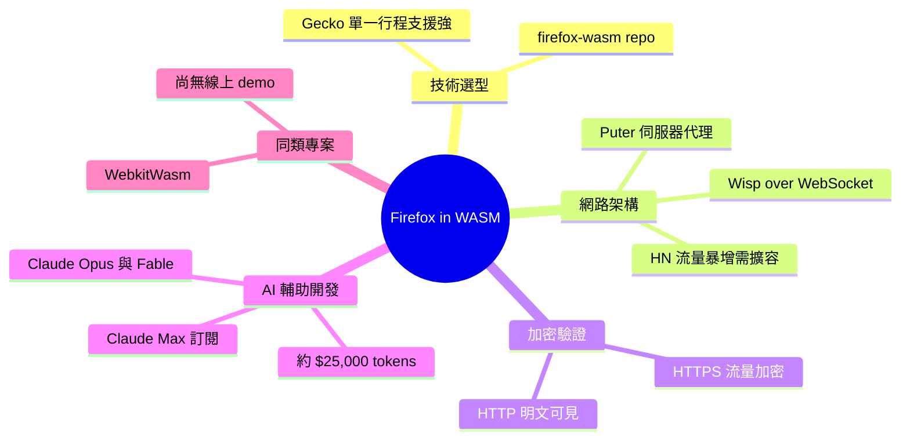

## Firefox in WebAssembly

Puter 項目成功將 Firefox 編譯為 WebAssembly。使整個瀏覽器能在另一個瀏覽器中運行。團隊投入約 $25,000 的 Claude Opus 與 Fable tokens 透過 Claude Max 訂閱完成此複雜工程任務。選擇 Firefox/Gecko 因其優秀的 single-process 架構避免 multi-process 複雜性。所有流量透過 Wisp 協議經 WebSocket 代理穿過 Puter 伺服器，支援端到端加密。Hacker News 熱議期間伺服器需擴展以應對流量激增。

### 重點
- Puter 投入 $25,000 Claude Opus + Fable tokens 成功編譯 Firefox 到 WebAssembly，展示 AI 輔助複雜工程的實際成本基準
- 技術選擇：Firefox/Gecko 因 single-process 支援被選中，降低編譯複雜性與架構風險
- 架構：Wisp protocol over WebSocket 代理所有流量，支援 E2E 加密；伺服器可擴展設計應對流量峰值

**原文：** [simon-willison](https://simonwillison.net/2026/Jul/16/firefox-in-webassembly/#atom-everything)

---

<!-- deep-analysis:begin -->
## 📌 摘要 (TL;DR)

- Puter 團隊將 Firefox 編譯成 WebAssembly，讓一個完整的瀏覽器可以在另一個瀏覽器裡執行——Simon Willison 實測在 Chrome 中跑 WASM 版 Firefox 開啟自己的部落格。
- 選擇 Firefox/Gecko 引擎的關鍵原因：它對單一行程（single-process）模式有很好的支援。
- 開發過程動用了估計約 **$25,000 美元**的 Claude Opus 與 Fable tokens，透過 Claude Max 訂閱方案完成。
- 因為瀏覽器內的程式碼無法任意開網路連線，所有流量必須透過 Wisp 協定（Wisp protocol）封裝在 WebSocket 中，經 Puter 的伺服器代理轉發。
- Simon 實際檢查 WebSocket 訊息驗證了端到端加密（end-to-end encryption）宣稱：HTTPS 網站流量確實加密，而 `http://www.example.com/` 的請求與回應則是明文。

## 🎯 核心概念

- **Wisp 協定** (Wisp protocol)：一種基於 WebSocket 的代理協定，用來把瀏覽器內程式的所有網路流量隧道化，繞過瀏覽器不能開任意網路連線的限制。
- **單一行程架構** (single-process)：瀏覽器引擎在單一行程內運作的模式；Gecko 對此支援良好，是 Puter 選擇 Firefox 而非其他引擎的主因。
- **端到端加密** (end-to-end encryption)：即使流量經過 Puter 伺服器代理，HTTPS 內容對代理方仍不可見。

## 📖 整理分析

### 1. 瀏覽器裡的瀏覽器

Puter 專案把整個 Firefox 編譯成 WebAssembly，使其能在任何現代瀏覽器的頁面中執行。Simon Willison 形容這「absurdly cool」，並展示了三層嵌套的畫面：他的部落格，跑在 Firefox 裡，Firefox 跑在 WebAssembly 裡，WebAssembly 跑在 Chrome 裡。原始碼公開在 firefox-wasm repo。

### 2. 為什麼是 Firefox/Gecko

團隊選擇 Firefox/Gecko 的原因是它有很強的單一行程支援。這對 WASM 移植是實務上的關鍵——現代瀏覽器普遍走多行程設計，而在 WebAssembly 環境中，單一行程模式讓整個移植工程可行得多。

### 3. 網路架構：Wisp over WebSocket 代理

瀏覽器中執行的程式碼無法開啟任意網路連線，因此 WASM 版 Firefox 的所有對外流量都必須透過 Wisp 協定封裝在 WebSocket 中，經由 Puter 的伺服器代理出去。Simon 指出這種代理成本高昂——專案登上 Hacker News 引發討論時，團隊不得不擴充伺服器來承接暴增的流量。

### 4. 加密宣稱的實測驗證

Puter 宣稱這套架構支援端到端加密，Simon 沒有照單全收，而是自己檢查了 WebSocket 訊息：造訪他自己的 HTTPS 網站時流量是加密的，而對 `http://www.example.com/` 的請求與回應則以明文傳輸——驗證了加密宣稱屬實，代理伺服器看不到 HTTPS 內容。

### 5. AI 輔助開發成本與同類專案

這項複雜的移植工程估計消耗了約 $25,000 的 Claude Opus 與 Fable tokens，並利用 Claude Max 訂閱方案來降低實際支出。文末也提到類似專案 theogbob/WebkitWasm——把 WebKit 編譯成 WASM，但目前沒有可公開存取的線上 demo。

## 🧭 流程圖 / 架構圖

## 🧠 Mindmap

<!-- deep-analysis:end -->
### 📄 原文內容

點此展開 / 收合

Firefox in WebAssembly 
This is absurdly cool: Puter compiled Firefox to WebAssembly such that the whole browser runs in another browser. 
 Here's my blog, running in Firefox, running in WebAssembly, running in Chrome: 
 
 They chose Firefox/Gecko because it has strong single-process support. The project took an estimated $25,000 of Claude Opus and Fable tokens, taking advantage of a Claude Max subscription plan. 
 The demo funnels all traffic over a WebSocket protocol (using the Wisp protocol ) through Puter's server - a requirement to get this kind of thing to work because code running in browsers can't open arbitrary network connections. 
 (That proxying sounds expensive! The team had to scale the servers up to handle the traffic during the Hacker News conversation about the project.) 
 Puter claim this supports end-to-end encryption and that looks to be true - I inspected the WebSocket messages and traffic to my own HTTPS site was encrypted whereas requests and responses to http://www.example.com/ were in cleartext. 
 Here's the repo for firefox-wasm . theogbob/WebkitWasm is a similar project that compiles WebKit to WASM, but that one doesn't currently have an accessible online demo.

 Via Hacker News 

 Tags: browsers , firefox , ai , webassembly , generative-ai , llms , ai-assisted-programming , claude , claude-mythos-fable

