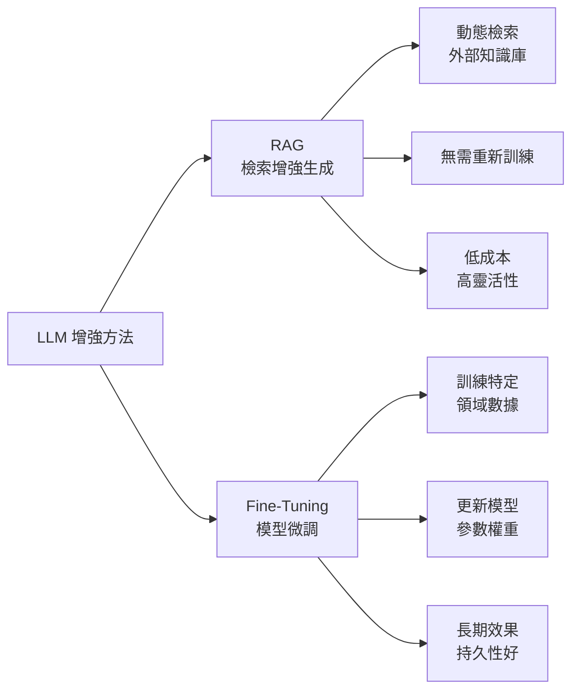

## RAG mi, Fine-Tuning mi? Büyük Dil Modellerini Geliştirmenin İki Farklı Yaklaşımı

文章比較 RAG（檢索增強生成）和 Fine-Tuning 兩種增強大型語言模型效能的方法。RAG 通過動態檢索外部知識庫補充 LLM 上下文，無需重新訓練模型，適合知識密集且頻繁變化的任務。Fine-Tuning 則在特定領域數據上持續訓練，改進模型參數以適應特定風格和專業知識，長期效果更穩定。兩種方法各有優劣：RAG 成本低、靈活性高但可能增加延遲，Fine-Tuning 需要初期投入但性能持久。選擇哪種方法取決於應用場景的知識變化速度、成本約束和性能要求。

### 重點
- RAG：動態檢索外部知識庫，無需重新訓練，適合知識變化頻繁的場景
- Fine-Tuning：在特定領域數據上訓練，改進模型參數權重和風格適應性
- 決策標準：RAG 成本低靈活性高（短期應用），Fine-Tuning 長期效果持久（穩定性好）

**原文：** [medium-tag-llm](https://medium.com/@hilal.bht34/rag-mi-fine-tuning-mi-b%C3%BCy%C3%BCk-dil-modellerini-geli%C5%9Ftirmenin-i%CC%87ki-farkl%C4%B1-yakla%C5%9F%C4%B1m%C4%B1-4e143c786347?source=rss------large_language_models-5)

---

### 📄 原文內容

點此展開 / 收合

---large_language_models-5"
author: "Hilal Bahat"
published_at: 2026-07-17T16:22:00+00:00
fetched_at: 2026-07-17T22:58:06.945238+00:00
content_hash: "7ecfa9c27a4eead50509a65ca4adb4c1efce36e9a005e4f1bb69b99fa579e087"
lang: en
caption_quality: None
raw: true
topics: []
---

# RAG mi, Fine-Tuning mi? Büyük Dil Modellerini Geliştirmenin İki Farklı Yaklaşımı

B&#xfc;y&#xfc;k dil modellerini belirli alanlarda daha ba&#x15f;ar&#x131;l&#x131; hale getirmenin iki temel y&#xf6;ntemi olan RAG ve Fine-Tuning&#x2019;i &#xe7;al&#x131;&#x15f;ma prensipleri&#x2026; Continue reading on Medium »

