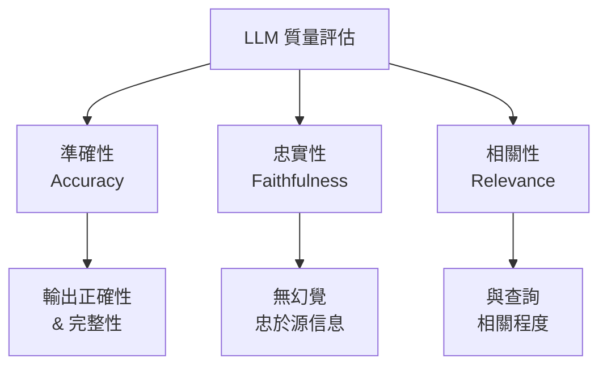

## How to Measure LLM Accuracy, Faithfulness, and Relevance

文章介紹如何從三個核心維度評估 LLM 輸出質量：Accuracy（準確性）、Faithfulness（忠實性）和 Relevance（相關性）。Accuracy 評估輸出內容的正確性和完整性；Faithfulness 檢測幻覺現象和對源信息的遵循度；Relevance 評估輸出與用戶查詢或任務的相關程度。作者提供了清晰的度量標準、實用的檢查方法和簡單的評分規則，可直接應用於產品驗收、基準測試或持續監控。這個三維度框架幫助開發者客觀量化 LLM 質量，避免主觀評估偏差。

### 重點
- Accuracy：評估輸出內容的正確性與完整性
- Faithfulness：檢測幻覺、評估對源信息的忠實度
- Relevance：評估與查詢/任務的相關程度；文章包含具體評分規則和檢查清單

**原文：** [medium-tag-llm](https://medium.com/@QuarkAndCode/how-to-measure-llm-accuracy-faithfulness-and-relevance-51561429dbe0?source=rss------large_language_models-5)

---

### 📄 原文內容

點此展開 / 收合

---large_language_models-5"
author: "QuarkAndCode"
published_at: 2026-07-17T15:22:48+00:00
fetched_at: 2026-07-17T22:58:07.011601+00:00
content_hash: "428160dabccc3d3e3d8eee1e2972281a3fe4a15c7d1b9972d123e95382429758"
lang: en
caption_quality: None
raw: true
topics: []
---

# How to Measure LLM Accuracy, Faithfulness, and Relevance

Learn how to evaluate LLM accuracy, faithfulness, and relevance with clear metrics, practical checks, and a simple scoring rubric for&#x2026; Continue reading on Medium »

