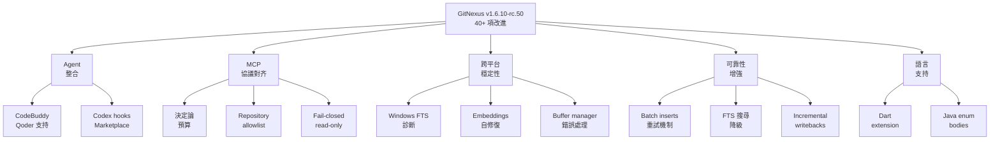

## Release Candidate v1.6.10-rc.50

GitNexus v1.6.10-rc.50 發布了 40+ 項改進。在 Agent 整合方面，新增 CodeBuddy 和 Qoder 編程 agent 支持，以及完整的 Codex hooks、plugin marketplace 和設置流程。跨平台穩定性上進行了系統性改進，包括 Windows FTS 依賴診斷、embeddings 自修復、buffer manager 錯誤處理和 C++ SIGABRT 崩潰修復。MCP 協議對齐方面落地了決定論系列，包括 response budgets、repository allowlist、fail-closed read-only 模式等設計決策。可靠性增強包括 embeddings batch inserts 支持重試、FTS 搜尋降級而非中止、incremental dirty state 診斷和大型 incremental writebacks 可靠提交。此外還擴展了 Dart extension types 和 Java enum constant bodies 的語言支持。綜合來看，該 RC 代表了 GitNexus 在 AI agent 整合、MCP 協議穩定性和 DevOps 運維體驗上的重大進展。

### 重點
- 新增 CodeBuddy、Qoder agent 集成與完整 Codex 支持（hooks、marketplace、setup）
- MCP 決定論系列落地：response budgets、repository allowlist、fail-closed read-only 模式
- Windows 跨平台穩定性系統性改進：FTS 診斷、embeddings 自修復、SIGABRT 崩潰修復、incremental writebacks 可靠提交

**原文：** [gitnexus-releases](https://github.com/abhigyanpatwari/GitNexus/releases/tag/v1.6.10-rc.50)

---

### 📄 原文內容

點此展開 / 收合

# Release Candidate v1.6.10-rc.50

Automated release candidate build from main .\n\n npm: npm install gitnexus@rc \n Version: 1.6.10-rc.50 \n Target base: 1.6.10 (rc #50 )\n Source commit (main): 1260000 \n Release commit (versioned tree): 7e32bf5 \n\nRelease candidates are pre-stable builds intended for early testing. Stable releases remain on the latest dist-tag. 

 What's Changed 
 📝 Other Changes 
 
 feat(setup): add CodeBuddy and Qoder coding-agent integrations by @magyargergo in #2368 
 feat: full Codex support — hooks, plugin marketplace, and setup ( #2328 , supersedes #1131 ) by @magyargergo in #2369 
 fix: proxy-blocked installs survive onnxruntime-node postinstall and self-heal embeddings ( #2370 ) by @magyargergo in #2372 
 fix: surface real FTS extension LOAD errors and self-heal broken extension files ( #2374 ) by @magyargergo in #2375 
 fix(lbug/mcp): exact symbol content + 0-based line storage with 1-based MCP display ( #2377 , #2379 ) by @magyargergo in #2380 
 fix(fts): diagnose Windows FTS missing-dependency load failures ( #2374 , Phase 1) by @magyargergo in #2383 
 fix: report custom HTTP embedding endpoint failures instead of huggingface download errors ( #2385 ) by @magyargergo in #2386 
 fix(lbug): recognize Windows missing-shadow error so serve repo-switch recovers ( #2382 ) by @magyargergo in #2387 
 fix: resolve imported/composed FastAPI route path constants ( #2391 ) by @magyargergo in #2393 
 fix(ci): shard platform-sensitive matrix + spawn built CLI to fix Windows cross-platform timeout by @magyargergo in #2394 
 fix(hook): emit MCP query hint when server owns DB lock ( #2396 ) by @magyargergo in #2397 
 feat: gate Icebug community engine prototype by @azizur100389 in #2376 
 fix(web): improve repository dropdown search by @evander-wang in #2381 
 fix: surface incremental dirty state diagnostics by @koriyoshi2041 in #2410 
 fix: make large incremental writebacks commit reliably ( #2409 ) by @magyargergo in #2425 
 fix(cli): actionable diagnostics for non-4K page-size buffer manager failures by @vlisitskii in #2424 
 fix(tree-sitter): recover declarations after embedded NUL bytes by @magyargergo in #2430 
 fix(web): use repo path identity in switcher by @koriyoshi2041 in #2420 
 fix: stop Napi::Error SIGABRT on analyze — index C++ type lookups, terminate workers only at JS-safe points ( #2432 ) by @magyargergo in #2436 
 ci: update setup composites to setup-node v6 by @100yenadmin in #2451 
 fix(cli): make Claude skills discoverable by @magyargergo in #2434 
 chore(deps): npm audit fix — resolve @babel/core and brace-expansion advisories by @bong-water-water-bong in #2444 
 docs: document shared-first contributor setup by @100yenadmin in #2448 
 fix(mcp): context resource reads stale lastCommit/stats after out-of-process analyze ( #2438 ) by @magyargergo with @Copilot in #2439 
 feat: land determinism and MCP policy series ( #2458 #2482 #2464 #2465 #2478 #2480 #2462 #2460 ) by @magyargergo in #2511 
 feat(mcp): normalize impact and context parameter aliases by @100yenadmin in #2462 
 feat(mcp): add fail-closed read-only mode by @100yenadmin in #2464 
 feat(mcp): enforce repository allowlist and default by @100yenadmin in #2465 
 fix(communities): canonicalize projection order by @100yenadmin in #2478 
 fix(scope): stabilize graph lookup collisions by @100yenadmin in #2480 
 fix(scan): canonicalize traversal without order-sensitive bindings by @100yenadmin in #2482 
 feat(eval): require bearer auth for remote binding by @100yenadmin in #2458 
 feat(mcp): add deterministic response budgets by @100yenadmin in #2460 
 fix: land cache, CLI, and embeddings series ( #2476 #2470 #2455 #2468 ) by @magyargergo in #2512 
 fix(embeddings): make HTTP generation resumable by @100yenadmin in #2468 
 fix(cli): fail cypher errors loudly by @100yenadmin in #2470 
 fix(cache): bound parsedfile generations by @100yenadmin in #2476 
 fix(embeddings): fall back to text-bearing file nodes by @100yenadmin in #2455 
 test(embeddings): cover File-row deletion by @100yenadmin in #2513 
 ci: sync plugin manifests on version bumps and widen the Windows shard watchdog by @magyargergo in #2515 
 feat(taint): expand TS/JS sink model by @azizur100389 in #2490 
 feat(wiki): allow explicit HTTP LLM hosts by @azizur100389 in #2491 
 fix(mcp): avoid top-level api_impact schema combinators by @koriyoshi2041 in #2489 
 fix(embeddings): make batch inserts retry-safe by @koriyoshi2041 in #2453 
 test(cli): lock native load guard for analyze by @koriyoshi2041 in #2442 
 fix(scope-resolution): resolve callable reference flows ( #2437 ) by @magyargergo in #2522 
 fix(analyze): degrade FTS search instead of aborting analyze on index-build failure by @magyargergo in #2548 
 fix(scope-resolution): stop platform builtins resolving to unrelated same-file symbols by @magyargergo in #2549 
 fix(lbug): bound the LadybugDB buffer pool instead of the native 80%-of-RAM default by @magyargergo in #2560 
 fix(dart): extract extension type symbols by @azizur100389 in #2539 
 feat(java): model enum constant bodies as first-class instances; JLS 13.1 anonymous naming by @magyargergo in #2558 
 
 New Contributors 
 
 @vlisitskii made their first contribution in #2424 
 @100yenadmin made their first contribution in #2451 
 @bong-water-water-bong made their first contribution in #2444 
 
 Full Changelog : v1.6.9...v1.6.10-rc.50

