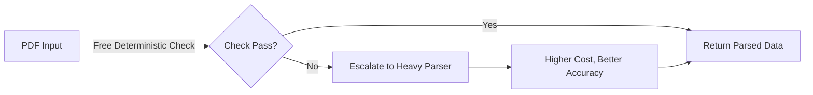

## Loop Engineering with Adaptive PDF Parsing: Start Cheap, Pay for a Heavier Parser Only When the Page Needs It

Towards Data Science 企業文檔智慧系列文章（第 1 卷第 10A 期）探討了企業級 PDF 解析系統的成本優化策略，提出了「級聯升級」（escalation cascade）工程模式。核心思想是先使用免費的確定性檢查（deterministic checks）進行初步篩查，及早標記出解析失敗的文檔，只在必要時才升級到成本較高的專業解析引擎。這種分層策略避免了對所有文檔統一使用高成本解析器的浪費，而是按需選用適當層級的解析工具。該文提供了具體的檢驗流程和觸發升級的判斷標準，此策略特別適用於大規模文檔摘取流程。

### 重點
- 級聯升級策略：免費確定性檢查先做初步判斷，失敗時再升級到付費解析器
- 避免統一使用高成本解析器，按需分層解析實現成本最優化
- 適用於大規模企業文檔摘取流程，在保持準確性前提下顯著降低成本

**原文：** [medium-towards-data-science](https://towardsdatascience.com/loop-engineering-with-adaptive-pdf-parsing-start-cheap-pay-for-a-heavier-parser-only-when-the-page-needs-it/)

---

### 📄 原文內容

點此展開 / 收合

# Loop Engineering with Adaptive PDF Parsing: Start Cheap, Pay for a Heavier Parser Only When the Page Needs It

Enterprise Document Intelligence [Vol.1 #10A] - The escalation cascade and the free, deterministic checks that flag a failed parse before you pay for a deeper one 
 The post Loop Engineering with Adaptive PDF Parsing: Start Cheap, Pay for a Heavier Parser Only When the Page Needs It appeared first on Towards Data Science .

