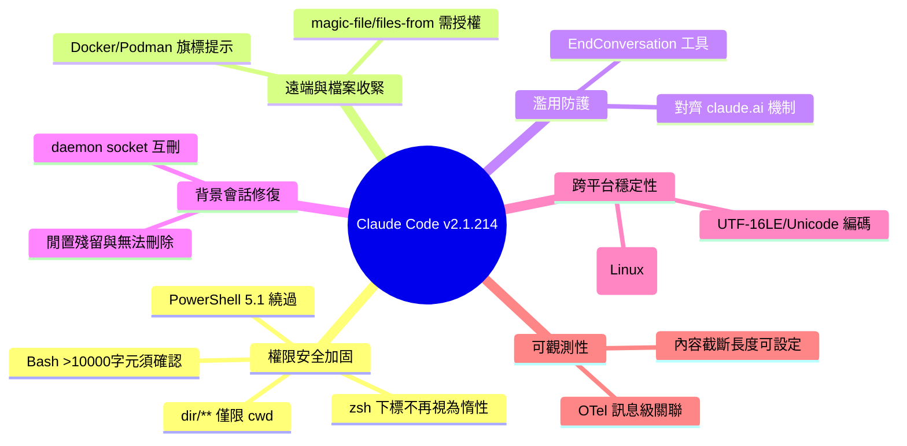

## v2.1.214

Claude Code v2.1.214 發布包含 40+ 項修復和改進。核心安全加固：(1) 修復權限檢查漏洞包括 dir/** 規則作用範圍誤擴大、Windows PowerShell 5.1 繞過、Bash >10000字符命令自動執行、zsh 變數下標在 [[]] 中被誤判為惰性文本等；(2) 新增 EndConversation 工具應對濫用用戶和 jailbreak 嘗試；(3) 新增 Docker/Podman 遠程連接標誌（--url、--connection、--identity）的權限提示。穩定性修復：修復背景會話生命週期管理、PowerShell 5.1 UTF-16LE 編碼問題、Python Unicode 處理錯誤、流媒體超時問題。多平台（Windows、Linux）和 shell（Bash、PowerShell、zsh）覆蓋。

### 重點
- 修復多個權限檢查漏洞：dir/** 作用範圍誤擴大、超過 10,000 字符命令自動執行、Bash file-descriptor redirect 分析失誤、zsh 變數下標在 [[]] 被誤判為惰性文本
- 新增 EndConversation 工具應對濫用用戶和 jailbreak 嘗試（與 claude.ai 2025 年同步發布功能）
- 新增 Docker/Podman 命令權限提示涵蓋遠程連接標誌（--url、--connection、--identity）；修復 PowerShell UTF-16LE 編碼、背景會話無法清理、stream-json 超時等穩定性問題

**原文：** [claude-code-releases](https://github.com/anthropics/claude-code/releases/tag/v2.1.214)

---

<!-- deep-analysis:begin -->
## 📌 摘要 (TL;DR)

- Claude Code **v2.1.214** 是一次以「安全加固」為主軸的維護版本，包含 40+ 項修復與變更，重點在權限檢查（permission checks）、背景會話生命週期與跨平台（Windows / PowerShell / zsh）穩定性。
- 權限系統堵住多個繞過漏洞：`Edit(src/**)` 這類單段 `dir/**` 規則不再誤放行樹狀結構中任意位置的巢狀目錄；Windows PowerShell 5.1 的檢查繞過被修復；超過 **10,000 字元** 的 Bash 指令一律改為跳出確認而非自動執行。
- 新增 **EndConversation** 工具，讓 Claude 能主動結束對高度濫用用戶或越獄（jailbreak）嘗試的對話，與 claude.ai 自 2025 年起的做法一致。
- 針對 Docker / Podman 遠端連線旗標（`--url`、`--connection`、`--identity`）新增權限提示，過去這些會直接執行而無提示。
- 大量修復背景會話（background session）的守護程序（daemon）殘留、無法刪除、socket 互刪等生命週期問題，並改善 OpenTelemetry 遙測欄位與訊息級關聯。

## 🎯 核心概念

- **EndConversation 工具**：新工具，允許模型在遇到極端濫用或越獄嘗試時結束整個 session，屬 Anthropic「end-subset-conversations」研究的落地。
- **fail closed（失敗即拒絕）**：安全設計原則——當權限分析器無法確定指令是否安全時，預設走「拒絕 / 跳出確認」而非「放行」。本版多處採用此策略。
- **背景會話守護程序（background daemon）**：負責在終端機離線後維持背景 session 的常駐程序，本版修復多個其生命週期與 control socket 相關的 bug。
- **subagentStatusLine**：自訂子代理（subagent）狀態列的資料負載，本版新增 reasoning effort 欄位，讓自訂代理列能顯示模型與思考強度。

## 📖 整理分析

### 1. 權限檢查的多重繞過修復
本版最大宗是權限系統的漏洞封堵。單段 `dir/**` 的 allow 規則（如 `Edit(src/**)`）原本會誤放行整棵樹中任意位置的 `dir/` 巢狀寫入，現在只限 `<cwd>/dir`。同步修復：Windows PowerShell 5.1 session 的檢查繞過；Bash 對「檔案描述符重導向」（file-descriptor redirect）改採 fail closed；超過 10,000 字元的 Bash 指令一律跳出確認；`[[ ]]` 比較中的 zsh 變數下標與修飾詞不再被當作惰性文字；某些可暗藏危險選項、指令替換或反斜線路徑的 `help` / `man` 指令不再自動放行。

### 2. 遠端連線與檔案指令的權限收緊
Docker 指令（含 Podman 的 docker shim）若帶有 daemon 重導向旗標（`--url`、`--connection`、`--identity` 及 Podman 遠端模式）現在會跳出權限提示，這些過去會無提示直接執行。使用 `-m` / `--magic-file` 或 `-f` / `--files-from` 的檔案指令，也從「自動視為唯讀而放行」改為需要授權。此外，遠端 session 上原本可能在本機確認對話框出現前就先行的權限提示，也已修正。

### 3. EndConversation 與濫用防護
新增 EndConversation 工具，Claude 可對「高度濫用用戶或越獄嘗試」主動結束對話——此機制在 claude.ai 上自 2025 年起已存在，詳見 Anthropic 的 end-subset-conversations 研究。這代表命令列版本也對齊了官方在安全與濫用邊界上的處置能力。

### 4. 背景會話生命週期與跨平台穩定性
背景會話一連串問題被修復：被取代的守護程序在關閉時刪掉繼任者的 control socket（導致下個 client 誤殺健康的替代 daemon）；以 `←` 或 `/background` 停放後閒置的 session 會無限期占用 daemon 與 worker；已完成的背景 session 在服務閒置後無法透過 `claude rm` 或代理視圖移除；從非 git 資料夾派發的 session 無法刪除。Windows / PowerShell 端則修復：PowerShell 5.1 下 `>` 與 `>>` 寫出 UTF-16LE 檔案導致其他工具無法以 UTF-8 讀取；Python 讀非 UTF-8 標準輸入的 `UnicodeDecodeError`、非 ASCII 輸出的 `UnicodeEncodeError`；`pkill -f` 誤殺 CLI 自身進程（Linux）。

### 5. 遙測、記憶檔與其他改進
可觀測性方面新增：OpenTelemetry log 事件加入 `message.uuid`、`client_request_id`、`tool_source` 以支援訊息級關聯與工具溯源；新增 `CLAUDE_CODE_OTEL_CONTENT_MAX_LENGTH` 可設定 60 KB 內容截斷上限。其他值得注意的修復包括：`--settings` 指向裝置檔或超過 2 MiB 的檔案時改為啟動即報錯以避免記憶體無上限成長；企業代理下 Windows 串流的「Socket is closed」錯誤；exit code 2 的 hook 在其 stdout JSON schema 驗證失敗時未如文件所述阻擋的問題；以及透過 `--settings` 啟用的外掛未載入（自 v2.1.181 起的迴歸）等。

## 🧠 Mindmap

<!-- deep-analysis:end -->
### 📄 原文內容

點此展開 / 收合

What's changed 
 
 Fixed single-segment dir/** allow rules like Edit(src/**) auto-approving writes to nested dir/ directories anywhere in the tree instead of only &lt;cwd&gt;/dir 
 Fixed a permission-check bypass affecting commands run in Windows PowerShell 5.1 sessions 
 Fixed Bash permission checks to fail closed on file-descriptor redirect forms that bash parses differently than the permission analyzer 
 Fixed Bash permission checks misjudging very long commands — commands over 10,000 characters now always prompt instead of running automatically 
 Fixed Bash permission checks treating zsh variable subscripts and modifiers in [[ ]] comparisons as inert text — these commands now prompt for approval 
 Fixed Bash permission checks to no longer auto-approve certain help and man commands that could run unsafe options, command substitutions, or backslash paths 
 Fixed permission prompts on remote sessions that could proceed before the local confirmation dialog 
 Added the EndConversation tool: Claude can end sessions with highly abusive users or jailbreak attempts, as on claude.ai since 2025 — see https://www.anthropic.com/research/end-subset-conversations 
 Added a periodic progress heartbeat for long-running tool calls that previously went silent 
 Added an ISO modified timestamp to memory file frontmatter 
 Added message.uuid , client_request_id , and tool_source attributes to OpenTelemetry log events for message-level correlation and tool provenance 
 Added CLAUDE_CODE_OTEL_CONTENT_MAX_LENGTH to configure the 60 KB truncation limit on OpenTelemetry content attributes 
 Added reasoning effort to the subagentStatusLine payload, so custom agent rows can render model and effort 
 Added permission prompts for docker commands (including the Podman docker shim) carrying daemon-redirect flags ( --url , --connection , --identity , and Podman's remote mode) that previously ran without one 
 Fixed a crash when a GrowthBook feature evaluates to null, and a bug where a malformed flag payload could wipe the cached feature flags 
 Fixed Bash tool killing the Claude session when a pkill -f pattern accidentally matched the CLI's own process (Linux) 
 Fixed unbounded memory growth when --settings points at a device file or multi-GB file; oversized (&gt;2 MiB) settings files now fail at startup with a clear error 
 Fixed streaming turns failing with "Socket is closed" behind corporate proxies on Windows 
 Fixed stream-json output truncation at exit for slow-reading SDK/pipeline consumers; the exit drain now scales with queued bytes instead of a flat 2s cap 
 Fixed scheduled tasks refusing their own configured prompt as untrusted input — the fired prompt is now delivered as the session's assigned task 
 Fixed PowerShell tool commands hanging until timeout when a child process waited on standard input (Windows) 
 Fixed Python scripts under the PowerShell tool crashing with UnicodeDecodeError when reading non-UTF-8 data from standard input (Windows) 
 Fixed Python scripts run via the PowerShell tool crashing with UnicodeEncodeError on non-ASCII output, and PowerShell 7 error messages containing raw ANSI escape sequences (Windows) 
 Fixed the PowerShell tool reporting where.exe , fc.exe , and diff.exe as errors when they return a valid negative answer (Windows) 
 Fixed &gt; and &gt;&gt; under the PowerShell tool on Windows PowerShell 5.1 writing UTF-16LE files that other tools couldn't read as UTF-8 
 Fixed a displaced background daemon deleting its successor's control socket on shutdown, which made the next client kill the healthy replacement daemon 
 Fixed background sessions parked with ← or /background and left idle keeping the background daemon and a worker process alive indefinitely 
 Fixed completed background sessions being impossible to remove via claude rm or the agent view once the background service had gone idle 
 Fixed background sessions dispatched from a non-git folder being impossible to delete from the agents view 
 Fixed reopening a stopped background session failing to restore its saved conversation when an unreadable folder exists in the session store 
 Fixed the Remote Control "session ready" push notification firing for sessions where Remote Control was not explicitly enabled 
 Fixed /install-github-app and the /mcp settings menu being blocked in agent-view sessions — they're now refused only in background sessions with no terminal attached 
 Fixed plugins enabled via the --settings CLI flag not loading (regression since v2.1.181) 
 Fixed feature flags going stale in long-running sessions after the OAuth token rotates 
 Fixed /ultrareview refusing to run in repos with no merge base — it now offers to review all tracked files 
 Fixed claude update and claude doctor hanging silently, and the /status System diagnostics section going blank, when a shell-config path is a directory 
 Fixed memory frontmatter values being silently truncated at an inline # when memory files are saved 
 Fixed session cost and token telemetry double-counting on streams that emit multiple cumulative message_delta frames 
 Fixed a spurious "check your network" warning that appeared while the advisor was thinking 
 Fixed hooks with exit code 2 not blocking as documented when the hook's stdout JSON fails schema validation 
 Fixed OTel log events emitted outside the turn's async context missing the interaction span's trace context 
 Fixed MCP transient errors during prompts/resources refresh clearing the server's slash commands and resources 
 Improved the claude rc workspace-trust error in the home directory to say trust there is never saved and to suggest running from a project directory 
 Changed single-segment dir/** hook if: conditions to match only &lt;cwd&gt;/dir ; write **/dir/** for any-depth matching. deny / ask permission rules keep their any-depth match. 
 Changed file commands using -m / --magic-file or -f / --files-from to require permission instead of being auto-allowed as read-only 
 Changed keep-alive connection pooling to disable after a stale-connection error, so retries open a fresh socket 
 Changed SessionStart hooks to report source "fork" when a session begins as a fork instead of "resume"

