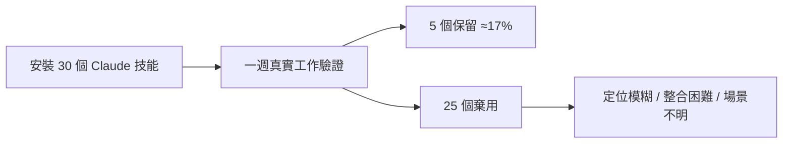
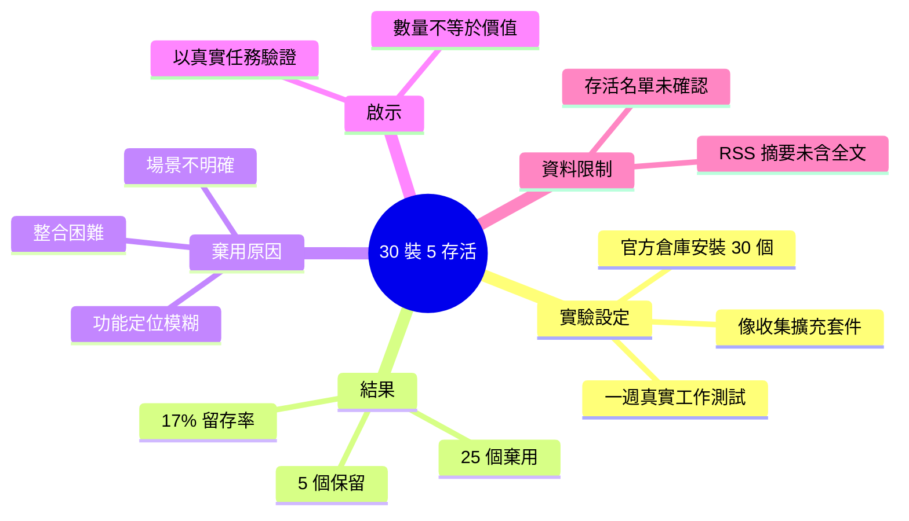

## I Installed 30 Claude Skills. 5 Survived a Week of Real Work

Medium 文章記錄了作者的實驗過程：在一週內從官方倉庫安裝 30 個 Claude 技能，並在真實工作場景中實際測試。結果只有 5 個技能被保留使用（17% 留存率），餘下 25 個因各種原因被棄用。該文章揭示了 Claude 技能生態系統中理論吸引度與實際應用價值的鴻溝，對評估技能採納策略和生態成熟度具有參考意義。低留存率反映了當前許多技能存在功能定位模糊、集成困難或使用場景不明確等問題。

### 重點
- 從官方倉庫安裝 30 個 Claude 技能進行為期一週的真實工作測試
- 僅 5 個技能存活並被持續使用（17% 留存率），25 個技能被棄用
- 反映技能生態中炒作與實際應用價值的落差，多數技能存在功能定位或集成問題

**原文：** [medium-tag-claude](https://medium.com/codetodeploy/i-installed-30-claude-skills-5-survived-a-week-of-real-work-62012dbfd7c7?source=rss------claude-5)

---

<!-- deep-analysis:begin -->
## 📌 摘要 (TL;DR)

- 作者在一週內從官方倉庫安裝了 **30 個 Claude 技能（Claude Skills）**，並在真實工作場景中實測，記錄哪些真正被留用。
- 一週後只有 **5 個技能存活**，留存率約 **17%（5/30）**，其餘 25 個被棄用。
- 核心論點：Claude 技能生態存在「理論吸引力」與「實際使用價值」之間明顯的落差。
- 棄用原因指向**功能定位模糊、整合到既有工作流困難、使用場景不明確**等問題。
- 給讀者的提醒：安裝數量不等於實用價值，技能的採納應以真實工作反覆驗證為準。
- ⚠️ 本則為 RSS 導流摘要，原文正文未完整抓取，以下分析僅根據**標題、開頭段落與既有 brief**，不虛構具體的存活技能名單與細節。

## 🎯 核心概念

- **Claude 技能（Claude Skills）**：Anthropic 生態中的可重用能力模組，透過指令檔（如 SKILL.md）讓 Claude 在需要時載入特定工作流程、工具或知識。
- **留存率（retention rate）**：安裝後在真實使用中被持續保留的比例，本文的觀察值為 5/30 ≈ 17%。

## 📖 整理分析

### 1. 實驗設定：像收集擴充套件一樣裝技能
作者自述「像別人收集瀏覽器擴充套件那樣（the way other people collect browser extensions）」安裝技能，一週內從官方倉庫拉了 30 個。這種「先裝再說」的囤積心態，正是本文要拿真實工作來檢驗的對象。

### 2. 結果：僅 17% 留存
經過一週的實際工作後，只有 5 個技能留下、25 個被移除。5/30 的留存率說明：多數技能在演示情境看似有用，一旦放進日常任務就無法持續產生價值。

### 3. 棄用的三類原因
依 brief 歸納，被淘汰的技能主要因為：功能定位模糊（不知道何時該用）、整合到既有工作流困難、以及使用場景不明確。這反映技能生態仍處早期，許多項目停留在「看起來有用」而非「真的好用」。

### 4. 對採納策略的啟示
安裝數量並非有效指標，真正的篩選來自真實任務的反覆驗證。評估一個技能時，應優先問它是否解決**具體、高頻**的工作痛點，而非它的概念是否吸引人。

### 5. 內容限制說明
原文為導向 CodeToDeploy 全文的付費/導流摘要，正文未完整提供，因此「究竟是哪 5 個技能存活、各自棄用的具體細節」無法從現有資料確認，本文不作臆測。若需完整清單，請參閱原文。

## 🧭 流程圖

## 🧠 Mindmap

<!-- deep-analysis:end -->
### 📄 原文內容

點此展開 / 收合

I spent a week installing Claude skills the way other people collect browser extensions. Thirty of them, pulled from official repositories&#x2026; Continue reading on CodeToDeploy »

